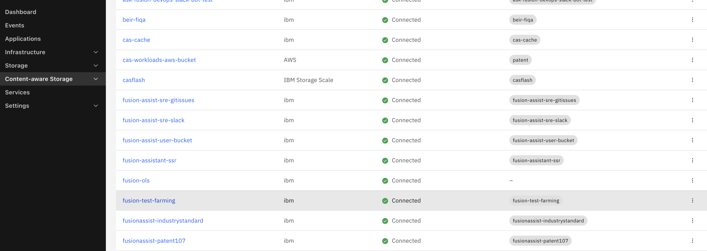

# fusion_cas — IBM Fusion CAS retriever plug-in for NVIDIA AI-Q

This repository contains two Python files that add IBM Storage Fusion CAS
(Content Augmented Search) as a knowledge source in
[NVIDIA AI-Q](https://github.com/NVIDIA-AI-Blueprints/aiq).

Once installed, the AI-Q UI shows a **Knowledge Base** toggle that routes
queries directly to your Fusion CAS vector store — no extra pods, no mapper
service, no separate deployment.

---

## What you need

| Item | Notes |
|---|---|
| Git, Docker, kubectl, helm v3 | Standard developer toolchain |
| NVIDIA NGC API key | For pulling AI-Q images and the Helm chart |
| Tavily API key | For web search — get one free at [app.tavily.com](https://app.tavily.com) |
| IBM Fusion CAS running | Accessible from the Kubernetes cluster |
| Fusion CAS vector store | Documents already indexed; find the name in the Fusion UI: **CAS → Data Stores** (exact name shown, case-sensitive) |
| Fusion CAS bearer token | With search access to the vector store |
| Kubernetes cluster | EKS, GKE, AKS, OpenShift, or Kind for local dev |

---

## Step 1 — Clone the AI-Q repository

```bash
git clone https://github.com/NVIDIA-AI-Blueprints/aiq.git
cd aiq
```

---

## Step 2 — Copy the two new files

Create the `fusion_cas` package directory and copy the two files from this
repository into it.

```bash
mkdir -p sources/knowledge_layer/src/fusion_cas

cp /src/__init__.py \
   sources/knowledge_layer/src/fusion_cas/__init__.py

cp /src/adapter.py \
   sources/knowledge_layer/src/fusion_cas/adapter.py
```

**What these files do:**

- `adapter.py` — registers `_type: fusion_cas` with NAT's type registry and
  implements `FusionCASRetriever`, which calls:
  `POST {FUSION_CAS_URL}/cas/api/v1/vector_stores/{store}/search`
- `__init__.py` — re-exports the public symbols so Python treats the directory
  as a package.

---

## Step 3 — Edit three existing files

### 3a. `sources/knowledge_layer/pyproject.toml`

**Add `"knowledge_layer.fusion_cas"` to the packages list:**

```toml
[tool.setuptools]
packages = [
    "knowledge_layer",
    "knowledge_layer.llamaindex",
    "knowledge_layer.foundational_rag",
    "knowledge_layer.opensearch",
    "knowledge_layer.azure_ai_search",
    "knowledge_layer.fusion_cas",      # ← add this line
]
```

**Add a new optional-dependency group:**

```toml
[project.optional-dependencies]
fusion_cas = [
    "requests>=2.28.0",
    "urllib3>=2.7.0,<3",
]
```

**Update the `all` group to include it:**

```toml
all = [
    "knowledge-layer[llamaindex,foundational_rag,opensearch,azure_ai_search,fusion_cas]",
]
```

After editing `pyproject.toml`, regenerate the lock file from the repo root:

```bash
uv lock
```

This updates `uv.lock` to include the `fusion-cas` extra in the dependency
resolution. The lock file must be committed alongside `pyproject.toml` — the
Docker build runs `uv sync --frozen` which will fail if the lock file is out of
sync with `pyproject.toml`.

---

### 3b. `sources/knowledge_layer/src/register.py`

Four additions in this file.

#### Addition 1 — Eager import

Add this block after the existing imports, immediately before
`logger = logging.getLogger(__name__)`.

Without this, the decorators in `adapter.py` never fire, so NAT does not
recognise `_type: fusion_cas` in the YAML and rejects the config at startup.

```python
try:
    import knowledge_layer.fusion_cas  # noqa: F401
except ImportError:
    pass
```

#### Addition 2 — Add `"nat_retriever"` to BackendType

Find:

```python
BackendType = Literal["llamaindex", "foundational_rag", "opensearch", "azure_ai_search"]
```

Change to:

```python
BackendType = Literal["llamaindex", "foundational_rag", "opensearch",
                      "azure_ai_search", "nat_retriever"]
```

Without this Pydantic rejects `backend: nat_retriever` in the YAML before
the server starts.

#### Addition 3 — Add `fusion_cas_retriever` field to `KnowledgeRetrievalConfig`

Add after the last existing `Field(...)` in the class. Without it, Pydantic
treats the YAML key as an unknown field and raises a validation error.

```python
fusion_cas_retriever: str | None = Field(
    default=None,
    description=(
        "Name of the retriever entry in the retrievers: section "
        "(e.g. 'fusion_cas_store'). Required when backend='nat_retriever'."
    ),
)
```

Also add a validator inside `validate_backend_config` alongside the existing
`elif backend == ...` blocks:

```python
elif backend == "nat_retriever":
    if not self.fusion_cas_retriever:
        raise ValueError(
            "backend='nat_retriever' requires fusion_cas_retriever to be set. "
            "Add 'fusion_cas_retriever: <retriever-name>' to the config."
        )
```

#### Addition 4 — Add the `nat_retriever` execution path in `knowledge_retrieval()`

Add this block at the very start of the `knowledge_retrieval` async generator,
immediately after `top_k = config.top_k`. The `return` skips all other backend
code.

```python
if config.backend == "nat_retriever":
    nat_retriever = await _builder.get_retriever(config.fusion_cas_retriever)
    logger.info(
        "Knowledge retrieval initialized: backend=nat_retriever, retriever=%s, top_k=%d",
        config.fusion_cas_retriever,
        top_k,
    )

    async def search_nat(query: str) -> str:
        """Search for documents relevant to the query.

        Args:
            query (str): Natural language query.

        Returns:
            str: Formatted excerpts with citations.
        """
        logger.info("Knowledge search (nat_retriever): query='%s...'", query[:100])
        try:
            from nat.retriever.models import RetrieverOutput
            from aiq_agent.knowledge.schema import Chunk, ContentType, RetrievalResult

            raw: RetrieverOutput = await nat_retriever.search(query=query, top_k=top_k)
            chunks = []
            for i, doc in enumerate(raw.results):
                meta = doc.metadata or {}
                filename = meta.get("filename", "unknown")
                page_number = meta.get("page_number")
                citation = f"{filename}, p.{page_number}" if page_number else filename
                chunks.append(
                    Chunk(
                        chunk_id=str(meta.get("file_id") or f"nat-{i}"),
                        content=doc.page_content or "",
                        file_name=filename,
                        page_number=page_number,
                        score=float(meta.get("score", 0.0)),
                        content_type=ContentType.TEXT,
                        display_citation=citation,
                    )
                )
            result = RetrievalResult(
                success=True, chunks=chunks, query=query, backend="nat_retriever"
            )
            formatted = _format_results(result, query)
            logger.info("Knowledge search (nat_retriever) returned %d chunks", len(chunks))
            return formatted
        except Exception as e:
            logger.error("Knowledge search (nat_retriever) failed: %s", e)
            return f"Error searching knowledge base: {e}"

    yield FunctionInfo.from_fn(
        search_nat,
        description=(
            "Search the knowledge base for relevant documents. "
            "Use this to find information from ingested PDFs, documents, and other files. "
            f"Returns up to {top_k} relevant excerpts with citations."
        ),
    )
    return   # skip all other backend code below
```

---

### 3c. `deploy/helm/deployment-k8s/values.yaml`

Two changes required.

**Change 1 — Switch the default config file** from LlamaIndex to the Fusion CAS
config. Find:

```yaml
CONFIG_FILE: configs/config_web_default_llamaindex.yml
```

Change to:

```yaml
CONFIG_FILE: configs/config_web_frag.yml
```

**Change 2 — Wire the Fusion CAS token from the secret** so the Helm chart
injects it into the pod as an environment variable. Add `secretEnv` under
`aiq.apps.backend`, after the `env:` block:

```yaml
      secretEnv:
        FUSION_CAS_TOKEN: FUSION_CAS_TOKEN
```

The chart reads `secretEnv` and renders each entry as a `valueFrom.secretKeyRef`
pointing at the `aiq-credentials` secret. This is how `FUSION_CAS_TOKEN` gets
into the pod without being hardcoded anywhere.

> **Alternative:** if you pass all config via `--set` in the Helm command (as
> shown in Step 8), you do not need to edit `values.yaml` directly — the
> `--set` flags override it at deploy time. Editing `values.yaml` is the
> recommended approach when you commit the deployment config to source control.

---

### 3d. `configs/config_web_frag.yml`

**Add a `retrievers:` section** immediately before the `functions:` section:

```yaml
retrievers:
  fusion_cas_store:
    _type: fusion_cas
    fusion_url: ${FUSION_CAS_URL:-}
    vector_store: ${FUSION_VECTOR_STORE:-}   # see note below on how to find this
    token: ${FUSION_CAS_TOKEN:-}
    verify_ssl: ${FUSION_VERIFY_SSL:-true}   # set false for self-signed certs
    top_k: 5
    timeout: 120
```

> **Finding your vector store name:**
> In the Fusion UI navigate to **CAS → Data Stores**. The name shown there is
> the exact value to use for `FUSION_VECTOR_STORE`. It is case-sensitive —
> copy it exactly as displayed.



In above example, i have used vector-store name 'fusion-test-farming'


**Replace the `knowledge_search` function entry** inside `functions:`:

```yaml
knowledge_search:
  _type: knowledge_retrieval
  backend: nat_retriever
  fusion_cas_retriever: fusion_cas_store   # must match the retrievers: key above
  top_k: 5
```

**Change the knowledge source id** inside `data_source_registry`:

```yaml
- id: fusion_cas          # MUST NOT be "knowledge_layer" — see note below
  name: "Knowledge Base"
  description: "Search the IBM Fusion CAS knowledge base."
  tools:
    - knowledge_search
```

> **Why not `id: knowledge_layer`?**
> The AI-Q UI hard-codes a filter that strips any source with that id and
> treats it as a file-upload flag, not a selectable search source. Any other
> id (e.g. `fusion_cas`) appears as a normal toggle in the UI.

### 3c. Create deploy/helm/deployment-k8s/fusion-config-override.yaml:


Instead of passing indexed array overrides with --set for backend volumes[] and volumeMounts[], create a small Helm values override file in the cloned AI-Q repository. This is more reliable because Helm list indexing can replace or corrupt existing list entries such as the default postgres-init volume.

```yaml
cat > deploy/helm/deployment-k8s/fusion-config-override.yaml <<'EOF'
aiq:
  fusionConfig:
    enabled: false
  apps:
    backend:
      volumes:
        - name: postgres-init
          configMap:
            name: aiq-postgres-init
        - name: aiq-config-frag
          configMap:
            name: aiq-config-frag
      volumeMounts:
        - name: aiq-config-frag
          mountPath: /app/configs/config_web_frag.yml
          subPath: config_web_frag.yml
          readOnly: true
EOF
```yaml

This override file does two things:

preserves the default backendpostgres-initvolume required by the init container
adds a single-file ConfigMap mount forconfig_web_frag.yml


---

## Step 4 — Build the Docker image

The `deploy/Dockerfile` already runs `pip install knowledge-layer[all]`, which
now includes the `fusion_cas` extra. **No Dockerfile changes are needed.**

```bash
# From the AI-Q repository root
docker build --target release \
  -t <your-registry>/aiq-agent:fusion-cas \
  -f deploy/Dockerfile .

docker push <your-registry>/aiq-agent:fusion-cas
```

---

## Step 5 — Create the namespace and secrets

```bash
kubectl create namespace ns-aiq --dry-run=client -o yaml | kubectl apply -f -
```

Create the main credentials secret. This is mounted automatically by the Helm
chart as `envFrom.secretRef`:

```bash
kubectl create secret generic aiq-credentials -n ns-aiq \
  --from-literal=NVIDIA_API_KEY="$NGC_API_KEY" \
  --from-literal=TAVILY_API_KEY="$TAVILY_API_KEY" \
  --from-literal=DB_USER_NAME="aiq" \
  --from-literal=DB_USER_PASSWORD="aiq_dev" \
  --from-literal=FUSION_CAS_TOKEN="<your-fusion-cas-bearer-token>"
```

Create the NGC image pull secret (needed for the frontend and postgres images):

```bash
kubectl create secret docker-registry ngc-secret -n ns-aiq \
  --docker-server=nvcr.io \
  --docker-username='$oauthtoken' \
  --docker-password=$NGC_API_KEY
```

### Getting a long-lived OpenShift service account token

If your Fusion CAS cluster uses OpenShift and you need a non-expiring token:

```bash
oc create sa remote-aiq-client -n <fusion-cas-namespace>

oc create rolebinding remote-aiq-client-view \
  --clusterrole=view \
  --serviceaccount=<fusion-cas-namespace>:remote-aiq-client \
  -n <fusion-cas-namespace>

export FUSION_CAS_TOKEN=$(oc create token remote-aiq-client \
  -n <fusion-cas-namespace> --duration=8760h)
```

Then patch the secret if it already exists:

```bash
kubectl patch secret aiq-credentials -n ns-aiq \
  --type='merge' \
  -p '{"stringData": {"FUSION_CAS_TOKEN": "'"$FUSION_CAS_TOKEN"'"}}'
```

---

## Step 6 — Pull the Helm chart

Pull chart version **2.1.0** from NGC:

```bash
helm pull https://helm.ngc.nvidia.com/nvidia/blueprint/charts/aiq2-web-2.1.0.tgz \
  --username='$oauthtoken' \
  --password=$NGC_API_KEY

# Verify
helm show chart aiq2-web-2.1.0.tgz
```

---

## Step 7 — Create the config ConfigMap

The config file lives inside the image. Mount an updated copy over it using a
ConfigMap so you do not need to rebuild the image every time the config changes.

```bash
kubectl create configmap aiq-config-frag \
  --from-file=config_web_frag.yml=configs/config_web_frag.yml \
  -n ns-aiq \
  --dry-run=client -o yaml | kubectl apply -f -
```

Re-run this command whenever you edit `config_web_frag.yml`.

---

## Step 8 — Deploy with Helm

```bash
helm upgrade --install aiq deploy/helm/deployment-k8s/ -n ns-aiq \
  -f deploy/helm/deployment-k8s/fusion-config-override.yaml \
  --set aiq.apps.backend.image.repository=<your-registry>/aiq-agent \
  --set aiq.apps.backend.image.tag=fusion-cas \
  --set aiq.apps.backend.image.pullPolicy=Always \
  --set 'aiq.apps.frontend.imagePullSecrets[0].name=ngc-secret' \
  --set 'aiq.apps.postgres.imagePullSecrets[0].name=ngc-secret' \
  --set aiq.apps.backend.env.FUSION_CAS_URL="$FUSION_CAS_URL" \
  --set aiq.apps.backend.env.FUSION_VECTOR_STORE="$FUSION_VECTOR_STORE" \
  --set aiq.apps.backend.env.FUSION_VERIFY_SSL="false"
```

> **`volumes[1]` index:** `volumes[0]` is already `postgres-init` in the
> chart's default values. The config ConfigMap must go at index `1`.
> Set `FUSION_VERIFY_SSL=true` for clusters with valid TLS certificates.

---

## Step 9 — Verify

### 9a. Check pods are running

```bash
kubectl get pods -n ns-aiq
```

Expected output:

```
NAME                            READY   STATUS    RESTARTS   AGE
aiq-backend-xxx                 1/1     Running   0          30s
aiq-frontend-xxx                1/1     Running   0          30s
aiq-postgres-xxx                1/1     Running   0          30s
```

### 9b. Confirm the config has the correct source id

```bash
kubectl exec -n ns-aiq deploy/aiq-backend -- \
  grep -A1 "id:" configs/config_web_frag.yml
```

Expected output:

```
id: web_search
id: fusion_cas
```

### 9c. Test the backend API

Open a port-forward to the backend in one terminal and leave it running:

```bash
kubectl port-forward svc/aiq-backend 8000:8000 -n ns-aiq
# Forwarding from 127.0.0.1:8000 -> 8000
```

In a second terminal, confirm both data sources are returned:

```bash
curl -s http://localhost:8000/v1/data_sources | python3 -m json.tool
```

Expected — two entries, `web_search` and `fusion_cas`:

```json
[
  {
    "id": "web_search",
    "name": "Web Search",
    "default_enabled": true,
    ...
  },
  {
    "id": "fusion_cas",
    "name": "Knowledge Base",
    "default_enabled": true,
    ...
  }
]
```

Test a knowledge search against Fusion CAS:

```bash
curl -s -X POST http://localhost:8000/v1/chat \
  -H "Content-Type: application/json" \
  -d '{
    "messages": [{"role": "user", "content": "What is irrigation?"}],
    "data_sources": ["fusion_cas"]
  }' | python3 -m json.tool
```

Expected — an answer with citations from your Fusion CAS vector store:

```json
{
  "choices": [
    {
      "message": {
        "content": "Irrigation is ... [1]\n\n## Sources\n- [1] farmerbook.pdf, p.21 (Internal)\n",
        "role": "assistant"
      }
    }
  ]
}
```

### 9d. Access the frontend UI

Open a port-forward to the frontend (use `oc` on OpenShift, `kubectl` elsewhere):

```bash
# OpenShift
oc port-forward svc/aiq-frontend 3000:3000 -n ns-aiq

# Standard Kubernetes
kubectl port-forward svc/aiq-frontend 3000:3000 -n ns-aiq
# Forwarding from 127.0.0.1:3000 -> 3000
```

Open **http://localhost:3000** in your browser.

The right-hand panel shows two source toggles — **Web Search** and
**Knowledge Base**. Both are on by default. Toggle off Web Search and submit a
query to verify that only Fusion CAS is used. The response should cite
documents from your vector store.

> Hard-refresh the browser (Cmd/Ctrl+Shift+R) if the Knowledge Base toggle
> does not appear — the UI caches the data sources list on load.

---

## Environment variables

| Variable | Required | Description |
|---|---|---|
| `FUSION_CAS_URL` | Yes | Base URL, e.g. `https://ibm-cas-ibm-cas.apps.<cluster>` |
| `FUSION_VECTOR_STORE` | Yes | Vector store name (case-sensitive, must match Fusion UI) |
| `FUSION_CAS_TOKEN` | Yes | Bearer token for API authentication |
| `FUSION_CAS_TOKEN_FILE` | No | Path to a file containing the token |

---


## What is not supported

The `fusion_cas` retriever provides **search only**. Fusion CAS manages its
own ingestion pipeline. The following AI-Q Knowledge API features are not
available:

- Document upload via the AI-Q UI (`POST /v1/collections/{name}/documents`)
- Collection listing via the AI-Q UI (`GET /v1/collections`)
- Collection deletion via the AI-Q UI (`DELETE /v1/collections/{name}`)

To ingest new documents, use the IBM Fusion CAS administration interface directly.
