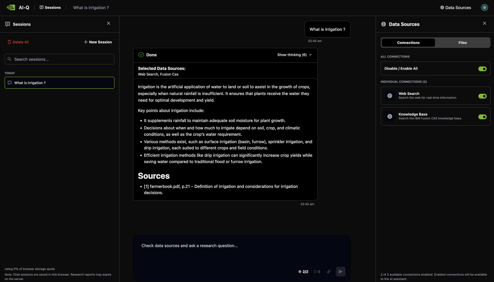
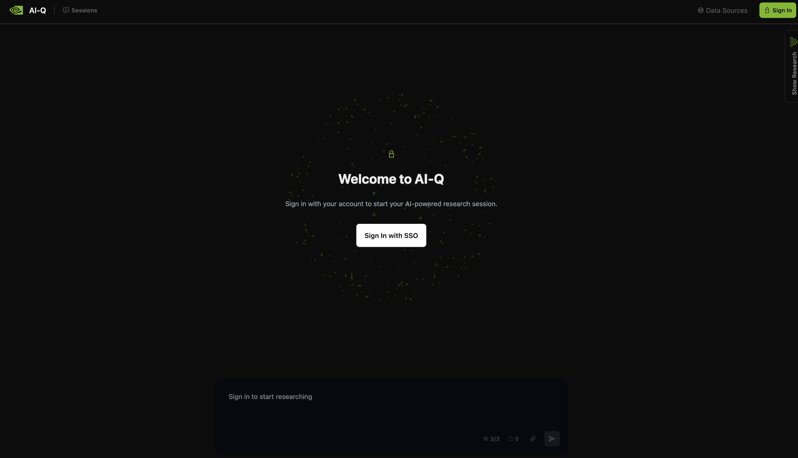
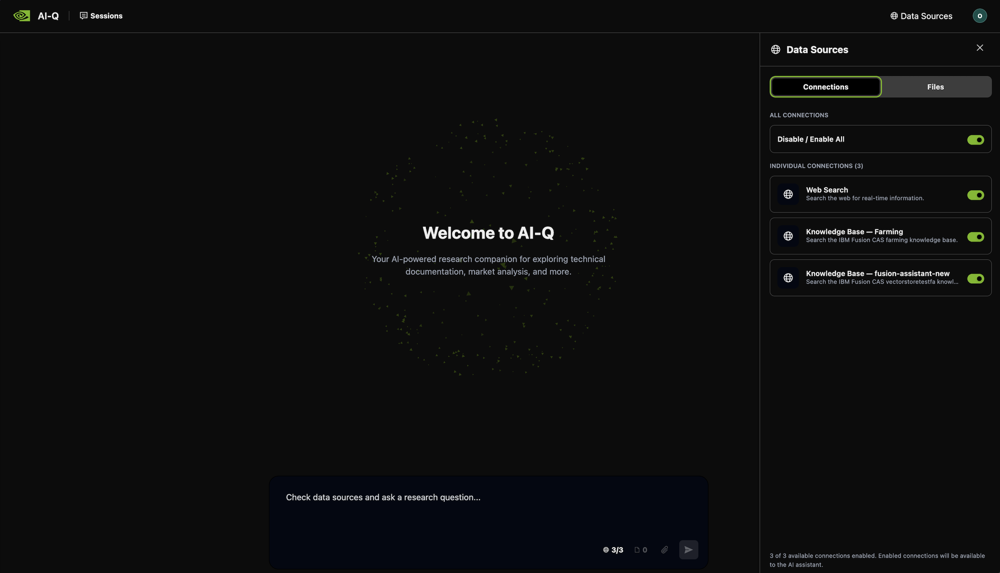
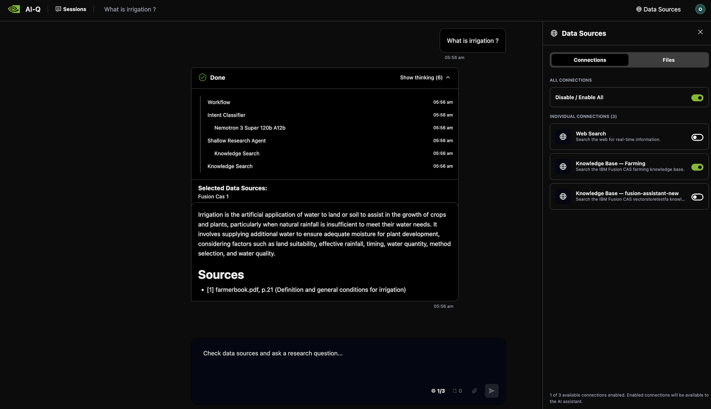
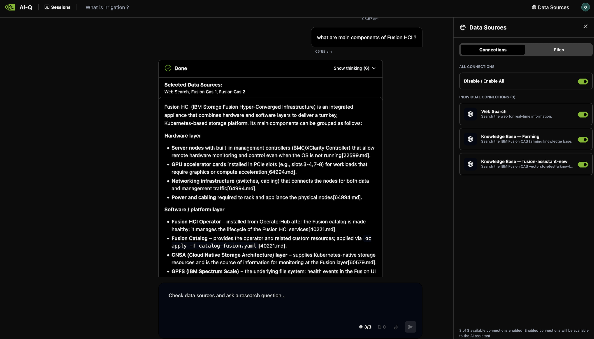

# Connecting IBM Fusion CAS to NVIDIA AI-Q on OpenShift — v2

This repository contains the scripts and source files needed to add IBM Storage
Fusion CAS (Content Augmented Search) as a knowledge source in
[NVIDIA AI-Q](https://github.com/NVIDIA-AI-Blueprints/aiq) running on OpenShift.

Once installed, the AI-Q UI shows per-store **Knowledge Base** toggles that route
queries directly to your Fusion CAS vector stores in parallel — no extra pods, no
mapper service, no separate deployment.

---

## Quick start (TL;DR)

```bash
# 1. Fill in credentials
cp fusion-cas-aiq/templates/aiq-fusion.env.example fusion-cas-aiq/aiq-fusion.env
vi fusion-cas-aiq/aiq-fusion.env        # set all values

# 2. Clone the AI-Q repo and set the path
git clone https://github.com/NVIDIA-AI-Blueprints/aiq.git /path/to/aiq
export AIQ_REPO_DIR=/path/to/aiq        # must match AIQ_REPO_DIR in aiq-fusion.env

# 3. Patch → review → push
./fusion-cas-aiq/scripts/run-all.sh --only patch
cd $AIQ_REPO_DIR && git diff
git checkout -b cas-aiq && git add -p && git commit -m "feat: add IBM Fusion CAS v2" && git push origin cas-aiq

# 4. Build, deploy, verify
./fusion-cas-aiq/scripts/run-all.sh --from build
```

---

## What you need

| Item | Notes |
|---|---|
| Git, Docker or Podman, `kubectl`/`oc`, `helm` v3 | Standard developer toolchain |
| `uv` (Python package manager) | Used by the patch script to regenerate the lock file — install with `pip install uv` or see [docs.astral.sh/uv](https://docs.astral.sh/uv) |
| NVIDIA NGC API key | For pulling AI-Q base images |
| Tavily API key | For web search — get one free at [app.tavily.com](https://app.tavily.com) |
| IBM Fusion CAS running | Accessible from the OpenShift cluster |
| Fusion CAS vector stores | Documents already indexed; find names in the Fusion UI: **CAS → Data Stores** (exact names shown, case-sensitive) |
| Fusion CAS bearer token | With search access to the vector stores |
| OpenShift cluster | The scripts assume `oc` is available; `kubectl`-only clusters need the OpenShift-specific steps skipped |

---

## Repository layout

```
fusion-cas-aiq/
├── aiq-fusion.env.example   # copy → aiq-fusion.env, fill in all values
├── src/
│   ├── adapter.py           # FusionCASRetriever — multi-store, parallel fan-out
│   ├── __init__.py          # package re-export
│   └── openshift-oidc.ts    # OpenShift OIDC NextAuth provider for the frontend
├── templates/
│   ├── config_web_frag.yml.template   # AI-Q config (${ENV_VAR} refs, not resolved)
│   └── fusion-config-override.yaml   # Helm values override (no secrets)
└── scripts/
    ├── run-all.sh                   # master orchestration runner (with safety leak scanner)
    ├── 01-patch-aiq.sh              # patch + copy files into the aiq repo
    ├── 02-build-push-image.sh       # build backend + frontend images
    ├── 03-setup-secrets-and-token.sh  # create namespace, Secret, ConfigMap, OAuthClient
    ├── 04-deploy-helm.sh            # helm upgrade --install + Route
    └── 05-verify-deployment.sh      # smoke-test pods, API, and UI
```

---

## Deployment Workflow Options

You can deploy using either the **Master Script (`run-all.sh`)** (recommended) or execute each step individually.

### Option A: Master Script Runner (`run-all.sh`)

[`run-all.sh`](scripts/run-all.sh) automates the sequence while maintaining strict security checks:

```bash
# Phase 1: Patch the AI-Q repo (runs automated secret leak scan & opens review prompt)
./fusion-cas-aiq/scripts/run-all.sh --only patch

# Phase 2: Review changes, commit, and push branch in your AI-Q repository
cd $AIQ_REPO_DIR
git diff
git checkout -b $AIQ_GIT_REF
git add -p
git commit -m "feat: add IBM Fusion CAS integration v2"
git push origin $AIQ_GIT_REF

# Phase 3: Resume automated build, secrets creation, helm deploy, and verification
./fusion-cas-aiq/scripts/run-all.sh --from build
```

> 🔒 **Built-in Security Protections in `run-all.sh`:**
> - Scans your AI-Q repo to ensure `*.env` files, credentials, or certificates are **never tracked or staged**.
> - Scans the `git diff` for plain-text tokens (`FUSION_CAS_TOKEN`, API keys, etc.) and halts immediately if detected.
> - Verifies that changes are committed and pushed before triggering an OpenShift BuildConfig build.

---

### Option B: Step-by-Step Manual Execution

Follow the numbered steps below.

---

## Step 1 — Fill in `aiq-fusion.env`

Copy the example and fill in every value. **Never commit this file** — it is
gitignored.

```bash
cp fusion-cas-aiq/templates/aiq-fusion.env.example fusion-cas-aiq/aiq-fusion.env
vi fusion-cas-aiq/aiq-fusion.env
```

| Variable | Description |
|---|---|
| `AIQ_REPO_DIR` | Local path to your freshly cloned aiq repo |
| `AIQ_COMMIT` | Pinned git SHA (`525ba8f0f3d0593dcf43ae917c2bf4f2ae13a8a5`) — integration changes are built on top of this commit |
| `IMAGE_REGISTRY` | Container registry host/path to push built images to |
| `IMAGE_NAMESPACE` | Image namespace / project (e.g. `ns-aiq`) |
| `BACKEND_IMAGE_TAG` | Tag for the backend image (default: `fusion-cas`) |
| `FRONTEND_IMAGE_TAG` | Tag for the frontend image (default: `openshift-auth`) |
| `NGC_API_KEY` | NVIDIA NGC API key |
| `TAVILY_API_KEY` | Tavily API key |
| `FUSION_CAS_URL` | IBM Fusion CAS endpoint URL |
| `FUSION_CAS_TOKEN` | `sha256~...` — OpenShift console → Copy login command |
| `FUSION_VERIFY_SSL` | `true` or `false` (use `false` for self-signed certs) |
| `FUSION_VECTOR_STORE_1` | Exact store name from Fusion UI → CAS → Data Stores |
| `FUSION_VECTOR_STORE_1_LABEL` | Display label shown in the AI-Q UI (e.g. `Farming`) |
| `FUSION_VECTOR_STORE_2` | Second store name. **If you only have one store**, set this to the same value as `FUSION_VECTOR_STORE_1` — the deduplication in `adapter.py` ensures it is only queried once. |
| `FUSION_VECTOR_STORE_2_LABEL` | Display label for the second store (e.g. `Farming Docs`) |
| `CLUSTER_DOMAIN` | OpenShift apps domain, e.g. `apps.mycluster.ibm.com` |
| `AIQ_NAMESPACE` | Kubernetes namespace for AI-Q (default `ns-aiq`) |
| `AIQ_GIT_URI` | Git URI of your fork of the aiq repo (for OpenShift BuildConfig) |
| `AIQ_GIT_REF` | Branch/tag/SHA to build from (e.g. `cas-aiq`) |

---

## Step 2 — Clone the AI-Q repository

```bash
git clone https://github.com/NVIDIA-AI-Blueprints/aiq.git /path/to/aiq
```

Set `AIQ_REPO_DIR` to the directory you just cloned into. This must match the
value in `aiq-fusion.env` and must be exported in your shell before running any
subsequent script:

```bash
export AIQ_REPO_DIR=/path/to/aiq    # adjust to your actual path
```

Set `AIQ_COMMIT` in `aiq-fusion.env` to `525ba8f0f3d0593dcf43ae917c2bf4f2ae13a8a5` (all changes and patches have been built on top of this commit). Script `01-patch-aiq.sh` will automatically checkout and pin the repo to this commit using `$AIQ_COMMIT`.

---

## Step 3 — Patch the aiq repo

The patch script handles **all** file changes in one shot.

```bash
source fusion-cas-aiq/aiq-fusion.env
./fusion-cas-aiq/scripts/01-patch-aiq.sh
```

What it does:

| Action | Detail |
|---|---|
| Pins repo to `AIQ_COMMIT` | Reproducible builds |
| Copies `adapter.py` → `sources/knowledge_layer/src/fusion_cas/adapter.py` | Multi-store retriever |
| Copies `__init__.py` → `sources/knowledge_layer/src/fusion_cas/__init__.py` | Package declaration |
| Copies `openshift-oidc.ts` → frontend providers | OpenShift OIDC auth |
| Patches `pyproject.toml` | Adds `fusion_cas` package + optional-dep group |
| Patches `register.py` — 4 additions | See §3b below |
| Patches `chat_researcher/register.py` | Sets `_active_data_sources` ContextVar before agent invocation |
| Patches `providers/index.ts` | Swaps disabled-auth → OpenShift OIDC provider |
| Patches `config.ts` | Two JWT callback fixes for OpenShift tokens |
| Copies `config_web_frag.yml.template` → `configs/config_web_frag.yml` | Config with `${ENV_VAR}` refs (gitignored) |
| Patches `deploy/helm/deployment-k8s/values.yaml` | Adds `CONFIG_FILE` + `secretEnv` key names |
| Copies `fusion-config-override.yaml` | Helm values override (no secrets, safe to commit) |
| Runs `uv lock` | Updates lock file for the new `fusion_cas` extra |
| **Does NOT** `git add`, `git commit`, or `git push` | Manual review gate |

### Step 3a — Review and push the patches manually

```bash
cd $AIQ_REPO_DIR
git diff                              # review all changes
git checkout -b $AIQ_GIT_REF         # create branch
git add -p                           # stage interactively
# Do NOT stage configs/config_web_frag.yml — it is gitignored
git commit -m "feat: add IBM Fusion CAS integration v2"
git push origin $AIQ_GIT_REF
```

> ⚠️ **Never stage `configs/config_web_frag.yml`.**
> This file is expanded with real env-var values and staging it would expose
> credentials. It is added to `.gitignore` automatically by the patch script.
> If `git add -p` or `git status` shows it highlighted, **stop immediately**,
> verify the `.gitignore` entry was added correctly, and run
> `git rm --cached configs/config_web_frag.yml` if it was accidentally staged.

---

## What the patches change — reference

The sections below document exactly what each patch does, for audit and
manual-apply purposes. If you use `01-patch-aiq.sh` you do not need to apply
these by hand.

### 3b. `sources/knowledge_layer/pyproject.toml`

**Add `"knowledge_layer.fusion_cas"` to the packages list:**

```toml
[tool.setuptools]
packages = [
    "knowledge_layer",
    "knowledge_layer.llamaindex",
    "knowledge_layer.foundational_rag",
    "knowledge_layer.opensearch",
    "knowledge_layer.azure_ai_search",
    "knowledge_layer.fusion_cas",      # ← add this line
]
```

**Add a new optional-dependency group:**

```toml
[project.optional-dependencies]
fusion_cas = [
    "requests>=2.28.0",
    "urllib3>=2.7.0,<3",
]
```

**Update the `all` group to include it:**

```toml
all = [
    "knowledge-layer[llamaindex,foundational_rag,opensearch,azure_ai_search,fusion_cas]",
]
```

After editing `pyproject.toml`, regenerate the lock file:

```bash
uv lock
```

The Docker build runs `uv sync --frozen` — the lock file must be committed
alongside `pyproject.toml` or the build fails.

---

### 3c. `sources/knowledge_layer/src/register.py`

Four additions in this file.

#### Addition 1 — Eager import + `_active_data_sources` ContextVar

Add this block after the existing imports, immediately before
`logger = logging.getLogger(__name__)`.

Without the eager import the decorators in `adapter.py` never fire, so NAT
does not recognise `_type: fusion_cas` in the YAML.  
Without the ContextVar declaration `search_nat` (Addition 4) raises
`NameError: name '_active_data_sources' is not defined`.

```python
from contextvars import ContextVar

try:
    import knowledge_layer.fusion_cas  # noqa: F401
except ImportError:
    pass

# Holds the list of data-source IDs the user enabled in the AI-Q UI
# (e.g. ["fusion_cas_1", "fusion_cas_2"]). search_nat reads this to
# tell FusionCASRetriever which stores to query in parallel.
# Value is None when not set — all configured stores are searched.
_active_data_sources: ContextVar[list[str] | None] = ContextVar(
    "knowledge_retrieval_data_sources", default=None
)
```

#### Addition 2 — Add `"nat_retriever"` to BackendType

Find:

```python
BackendType = Literal["llamaindex", "foundational_rag", "opensearch", "azure_ai_search"]
```

Change to:

```python
BackendType = Literal[
    "llamaindex",
    "foundational_rag",
    "opensearch",
    "azure_ai_search",
    "nat_retriever",
]
```

Without this Pydantic rejects `backend: nat_retriever` in the YAML before
the server starts.

#### Addition 3 — Add `fusion_cas_retriever` field to `KnowledgeRetrievalConfig`

Add after the last existing `Field(...)` in the class:

```python
fusion_cas_retriever: str | None = Field(
    default=None,
    description="Name of the retriever entry in the retrievers: section.",
)
```

Also add a validator inside `validate_backend_config` alongside the existing
`elif backend == ...` blocks:

```python
elif backend == "nat_retriever":
    if not self.fusion_cas_retriever:
        raise ValueError(
            "backend='nat_retriever' requires fusion_cas_retriever to be set. "
            "Add 'fusion_cas_retriever: <retriever-name>' to the config."
        )
```

#### Addition 4 — Add the `nat_retriever` execution path in `knowledge_retrieval()`

Add immediately after `top_k = config.top_k`, before `_get_retriever(config)`.
The `return` skips all other backend code.

```python
if config.backend == "nat_retriever":
    nat_retriever = await _builder.get_retriever(config.fusion_cas_retriever)
    logger.info(
        "Knowledge retrieval initialized: backend=nat_retriever, retriever=%s, top_k=%d",
        config.fusion_cas_retriever,
        top_k,
    )

    async def search_nat(query: str) -> str:
        """Search for documents relevant to the query."""
        logger.info("Knowledge search (nat_retriever): query='%s...'", query[:100])
        try:
            from nat.retriever.models import RetrieverOutput
            from aiq_agent.knowledge.schema import Chunk, ContentType, RetrievalResult

            # Pass UI-selected source IDs so the retriever fans out only to
            # enabled stores in parallel (one HTTP call per store).
            active_sources = _active_data_sources.get()
            search_kwargs: dict = {"query": query, "top_k": top_k}
            if active_sources is not None:
                search_kwargs["enabled_source_ids"] = active_sources

            raw: RetrieverOutput = await nat_retriever.search(**search_kwargs)
            chunks = []
            for i, doc in enumerate(raw.results):
                meta = doc.metadata or {}
                filename = meta.get("filename", "unknown")
                page_number = meta.get("page_number")
                citation = f"{filename}, p.{page_number}" if page_number else filename
                chunks.append(
                    Chunk(
                        chunk_id=str(meta.get("file_id") or f"nat-{i}"),
                        content=doc.page_content or "",
                        file_name=filename,
                        page_number=page_number,
                        score=float(meta.get("score", 0.0)),
                        content_type=ContentType.TEXT,
                        display_citation=citation,
                    )
                )
            result = RetrievalResult(
                success=True, chunks=chunks, query=query, backend="nat_retriever"
            )
            formatted = _format_results(result, query)
            logger.info("Knowledge search (nat_retriever) returned %d chunks", len(chunks))
            return formatted
        except Exception as e:
            logger.error("Knowledge search (nat_retriever) failed: %s", e)
            return f"Error searching knowledge base: {e}"

    yield FunctionInfo.from_fn(
        search_nat,
        description=(
            "Search the knowledge base for relevant documents. "
            "Use this to find information from ingested PDFs, documents, and other files. "
            f"Returns up to {top_k} relevant excerpts with citations."
        ),
    )
    return   # skip all other backend code below
```

---

### 3d. `src/aiq_agent/agents/chat_researcher/register.py`

The agent layer must set `_active_data_sources` before invoking the graph so
`search_nat` knows which stores the user enabled. Without this patch all
configured stores are always queried regardless of the UI toggle.

Add immediately before `state = ChatResearcherState(`:

```python
# Propagate the UI-selected data-source IDs to the knowledge_retrieval
# function via a ContextVar.
try:
    from knowledge_layer.register import _active_data_sources as _kr_data_sources  # noqa: PLC0415

    _kr_token = _kr_data_sources.set(data_sources)
    _kr_set = True
except ImportError:
    _kr_token = None
    _kr_set = False
```

Add inside the `finally:` block, after `reset_session_registry(token)`:

```python
if _kr_set and _kr_token is not None:
    _kr_data_sources.reset(_kr_token)
```

---

### 3e. `deploy/helm/deployment-k8s/values.yaml`

**Change 1 — Switch the default config file:**

```yaml
CONFIG_FILE: configs/config_web_frag.yml
```

**Change 2 — Wire secrets from `aiq-credentials`** by adding `secretEnv` under
`aiq.apps.backend`:

```yaml
secretEnv:
  FUSION_CAS_TOKEN: FUSION_CAS_TOKEN
  NVIDIA_API_KEY: NVIDIA_API_KEY
  TAVILY_API_KEY: TAVILY_API_KEY
  DB_USER_NAME: DB_USER_NAME
  DB_USER_PASSWORD: DB_USER_PASSWORD
```

The chart renders each `secretEnv` entry as a `valueFrom.secretKeyRef` pointing
at the `aiq-credentials` secret. Cluster-specific values (`FUSION_CAS_URL`,
store names, OAuth URLs) are also sourced from the secret — they are added via
`fusion-config-override.yaml` rather than `values.yaml`.

---

### 3f. `configs/config_web_frag.yml`

This file is copied from
[`templates/config_web_frag.yml.template`](templates/config_web_frag.yml.template)
by `01-patch-aiq.sh`. It is gitignored in the aiq repo and deployed as a
Kubernetes ConfigMap by `03-setup-secrets-and-token.sh`.

Key sections:

**`retrievers:` section** — one retriever backing all stores:

```yaml
retrievers:
  fusion_cas_store:
    _type: fusion_cas
    fusion_url: ${FUSION_CAS_URL:-}
    vector_stores:
      - ${FUSION_VECTOR_STORE_1:-}
      - ${FUSION_VECTOR_STORE_2:-}
    source_id_store_map:
      fusion_cas_1: ${FUSION_VECTOR_STORE_1:-}
      fusion_cas_2: ${FUSION_VECTOR_STORE_2:-}
    token: ${FUSION_CAS_TOKEN:-}
    verify_ssl: ${FUSION_VERIFY_SSL:-true}
    top_k: 5
    timeout: 120
```

`source_id_store_map` keys must match the `id` fields in
`data_source_registry.sources` below.

> **Finding your vector store names:**
> In the Fusion UI navigate to **CAS → Data Stores**. The name shown there
> is the exact value to use. It is case-sensitive — copy it exactly as
> displayed.



**`knowledge_search` function** inside `functions:`:

```yaml
knowledge_search:
  _type: knowledge_retrieval
  backend: nat_retriever
  fusion_cas_retriever: fusion_cas_store   # must match the retrievers: key above
  top_k: 5
```

**`data_sources` registry** — one entry per store, all pointing at the same
`knowledge_search` tool:

```yaml
data_sources:
  _type: data_source_registry
  sources:
    - id: web_search
      name: "Web Search"
      description: "Search the web for real-time information."
      tools:
        - web_search_tool
        - advanced_web_search_tool

    - id: fusion_cas_1          # must match source_id_store_map key
      name: "Knowledge Base — ${FUSION_VECTOR_STORE_1_LABEL}"
      description: "Search the ${FUSION_VECTOR_STORE_1_LABEL} knowledge base."
      tools:
        - knowledge_search

    - id: fusion_cas_2          # must match source_id_store_map key
      name: "Knowledge Base — ${FUSION_VECTOR_STORE_2_LABEL}"
      description: "Search the ${FUSION_VECTOR_STORE_2_LABEL} knowledge base."
      tools:
        - knowledge_search
```

> **Why not `id: knowledge_layer`?**
> The AI-Q UI hard-codes a filter that strips any source with that id and
> treats it as a file-upload flag. Any other id (e.g. `fusion_cas_1`) appears
> as a normal toggle in the UI.

---

### 3g. `deploy/helm/deployment-k8s/fusion-config-override.yaml`

Copied from [`templates/fusion-config-override.yaml`](templates/fusion-config-override.yaml)
by `01-patch-aiq.sh`. This file is safe to commit — it contains no secrets or
hardcoded cluster values.

It does four things:

1. Disables the upstream `fusionConfig` mount (avoids a `Not a directory` error).
2. Adds the `aiq-config-frag` ConfigMap volume + `subPath` mount for `config_web_frag.yml`.
3. Adds the `aiq-oauth-ca` ConfigMap volume + mount for the OAuth CA certificate.
4. Injects all cluster-specific and secret env vars into the backend and frontend
   pods via `secretEnv` (sourced from `aiq-credentials`).

```yaml
aiq:
  fusionConfig:
    enabled: false

  apps:
    frontend:
      env:
        REQUIRE_AUTH: 'true'
        SECURE_COOKIES: 'true'
        NODE_EXTRA_CA_CERTS: /etc/ssl/oauth-ca/ca.crt
      secretEnv:
        NEXTAUTH_SECRET: NEXTAUTH_SECRET
        OAUTH_CLIENT_SECRET: OAUTH_CLIENT_SECRET
        OAUTH_ISSUER: OAUTH_ISSUER
        OAUTH_CLIENT_ID: OAUTH_CLIENT_ID
        NEXTAUTH_URL: NEXTAUTH_URL
      volumes:
        - name: aiq-oauth-ca
          configMap:
            name: aiq-oauth-ca
      volumeMounts:
        - name: aiq-oauth-ca
          mountPath: /etc/ssl/oauth-ca
          readOnly: true

    backend:
      env:
        CONFIG_FILE: configs/config_web_frag.yml
      secretEnv:
        FUSION_CAS_TOKEN: FUSION_CAS_TOKEN
        NVIDIA_API_KEY: NVIDIA_API_KEY
        TAVILY_API_KEY: TAVILY_API_KEY
        FUSION_CAS_URL: FUSION_CAS_URL
        FUSION_VERIFY_SSL: FUSION_VERIFY_SSL
        FUSION_VECTOR_STORE_1: FUSION_VECTOR_STORE_1
        FUSION_VECTOR_STORE_2: FUSION_VECTOR_STORE_2
        FUSION_VECTOR_STORE_1_LABEL: FUSION_VECTOR_STORE_1_LABEL
        FUSION_VECTOR_STORE_2_LABEL: FUSION_VECTOR_STORE_2_LABEL
        DB_USER_NAME: DB_USER_NAME
        DB_USER_PASSWORD: DB_USER_PASSWORD
      volumes:
        - name: postgres-init
          configMap:
            name: aiq-postgres-init
        - name: aiq-config-frag
          configMap:
            name: aiq-config-frag
      volumeMounts:
        - name: aiq-config-frag
          mountPath: /app/configs/config_web_frag.yml
          subPath: config_web_frag.yml
          readOnly: true
```

---

## Step 4 — Build and push images

Uses OpenShift BuildConfig (recommended) or local Docker/Podman as fallback.

```bash
source fusion-cas-aiq/aiq-fusion.env
./fusion-cas-aiq/scripts/02-build-push-image.sh
```

**OpenShift BuildConfig path** (used when `oc` is available and `AIQ_GIT_URI`
is set): creates `BuildConfig` resources for both `aiq-agent` (backend) and
`aiq-frontend`, starts both builds, and streams logs.

**Local build fallback** (used when `oc` or `AIQ_GIT_URI` is not set):

```bash
# From the AI-Q repository root
docker build --target release \
  -t <registry>/<namespace>/aiq-agent:fusion-cas \
  -f deploy/Dockerfile .
docker push <registry>/<namespace>/aiq-agent:fusion-cas

docker build \
  -t <registry>/<namespace>/aiq-frontend:openshift-auth \
  -f frontends/ui/deploy/Dockerfile frontends/ui
docker push <registry>/<namespace>/aiq-frontend:openshift-auth
```

> The `deploy/Dockerfile` already runs `pip install knowledge-layer[all]`
> which now includes the `fusion_cas` extra. No Dockerfile changes are needed.

---

## Step 5 — Create namespace, Secrets, and ConfigMaps

```bash
source fusion-cas-aiq/aiq-fusion.env
./fusion-cas-aiq/scripts/03-setup-secrets-and-token.sh
```

Creates:

| Resource | Type | Contents |
|---|---|---|
| `aiq-credentials` | Secret | `FUSION_CAS_TOKEN`, `NVIDIA_API_KEY`, `TAVILY_API_KEY`, `FUSION_CAS_URL`, `FUSION_VERIFY_SSL`, `FUSION_VECTOR_STORE_1/_2` + labels, `DB_USER_NAME`, `DB_USER_PASSWORD`, `NEXTAUTH_SECRET`, `OAUTH_CLIENT_SECRET`, `OAUTH_ISSUER`, `OAUTH_CLIENT_ID`, `NEXTAUTH_URL` |
| `ngc-secret` | docker-registry Secret | NGC image pull secret for `nvcr.io` |
| `aiq-oauth-ca` | ConfigMap | OAuth CA certificate (from OpenShift) |
| `aiq-config-frag` | ConfigMap | `config_web_frag.yml` (all `${...}` refs, no real values) |
| `aiq-nextauth` | OAuthClient | OpenShift OAuth client for the frontend |


---

## Step 6 — Deploy with Helm

```bash
source fusion-cas-aiq/aiq-fusion.env
./fusion-cas-aiq/scripts/04-deploy-helm.sh
```

The script runs:

```bash
helm upgrade --install aiq deploy/helm/deployment-k8s/ \
  -n $AIQ_NAMESPACE \
  -f deploy/helm/deployment-k8s/fusion-config-override.yaml \
  --set aiq.apps.backend.image.repository=<registry>/<namespace>/aiq-agent \
  --set aiq.apps.backend.image.tag=fusion-cas \
  --set aiq.apps.frontend.image.repository=<registry>/<namespace>/aiq-frontend \
  --set aiq.apps.frontend.image.tag=openshift-auth \
  --set 'aiq.apps.frontend.imagePullSecrets[0].name=ngc-secret' \
  --set 'aiq.apps.postgres.imagePullSecrets[0].name=ngc-secret'
```

All secrets and cluster-specific values are sourced from the `aiq-credentials`
Kubernetes Secret — nothing appears in Helm release state or `helm history`.
After the Helm release, the script creates an OpenShift Route for the frontend:

```
https://aiq-frontend-<namespace>.<CLUSTER_DOMAIN>
```

> The upstream AI-Q Helm chart has no Route template — `route.enabled` in
> `values.yaml` is silently ignored. The script creates the Route via
> `oc apply` explicitly.

---

## Step 7 — Verify

```bash
source fusion-cas-aiq/aiq-fusion.env
./fusion-cas-aiq/scripts/05-verify-deployment.sh
```

Checks pod readiness, Route/Service port alignment, `/v1/data_sources` response,
and a live chat query.


```bash
kubectl get pods -n ns-aiq
```

Expected output:

```
NAME                            READY   STATUS    RESTARTS   AGE
aiq-backend-xxx                 1/1     Running   0          30s
aiq-frontend-xxx                1/1     Running   0          30s
aiq-postgres-xxx                1/1     Running   0          30s
```

---

## Step 8 — Exploring the AI-Q Experience

Once the deployment has been successfully verified, open the AI-Q frontend:

```
https://aiq-frontend-ns-aiq.<CLUSTER_DOMAIN>
```

### 8a. Sign In Using OpenShift OAuth

1. Select **Sign In** on the AI-Q landing page.
2. AI-Q redirects you to OpenShift OAuth, where you authenticate using your
   standard enterprise OpenShift credentials.
3. After successful authentication you are redirected back to the AI-Q
   interface.



### 8b. Select Knowledge Sources

The AI-Q interface displays the configured data sources in the
**Data Sources** panel on the right-hand side. For example:

| Toggle | Description |
|---|---|
| ☑ Web Search | Live web retrieval |
| ☑ Farming Knowledge | Fusion CAS vector store — farming domain |
| ☑ Product Documentation | Fusion CAS vector store — product docs |



Each source can be independently enabled or disabled per query.

### 8c. Query a Specific Knowledge Base

To query only the **Farming Knowledge** store:

1. Disable all other sources except **Farming Knowledge**.
2. Submit the query:

   ```
   What is irrigation?
   ```

AI-Q retrieves information from the corresponding Fusion CAS vector store and
generates a response with document citations.



### 8d. Query Product Documentation

To query only the **Fusion Documentation** store:

1. Enable **Fusion Documentation** (disable other stores if you want an
   isolated response).
2. Submit the query:

   ```
   What are the main components of Fusion HCI?
   ```

The request is routed to the Fusion Documentation vector store and the
response will include cited source chunks from that collection.



---

## Security checklist

- [ ] `aiq-fusion.env` is gitignored and has never been committed
  (`git log --all -- aiq-fusion.env` returns nothing)
- [ ] `configs/config_web_frag.yml` is gitignored in the aiq repo
  (`git check-ignore -v configs/config_web_frag.yml`)
- [ ] No secrets in git history (`git log --all -S "sha256~" -- .` returns nothing)
- [ ] Tokens and URLs only exist in the `aiq-credentials` Kubernetes Secret —
  never in any committed file or Helm release state
- [ ] `run-all.sh` secret scanner passed with 0 detected leaks

---

## Environment variables

| Variable | Required | Description |
|---|---|---|
| `FUSION_CAS_URL` | Yes | Base URL, e.g. `https://ibm-cas-ibm-cas.apps.<cluster>` |
| `FUSION_CAS_TOKEN` | Yes | Bearer token for API authentication |
| `FUSION_VERIFY_SSL` | No | `true` (default) or `false` for self-signed certificates |
| `FUSION_VECTOR_STORE_1` | Yes | First vector store name (case-sensitive, must match Fusion UI) |
| `FUSION_VECTOR_STORE_1_LABEL` | No | Display label in the AI-Q UI (default: `Store 1`) |
| `FUSION_VECTOR_STORE_2` | Yes¹ | Second vector store name |
| `FUSION_VECTOR_STORE_2_LABEL` | No | Display label in the AI-Q UI (default: `Store 2`) |

¹ The config schema currently requires exactly two store entries. If you only
have one store, set `FUSION_VECTOR_STORE_2` to the same value as
`FUSION_VECTOR_STORE_1`. The retriever deduplicates results automatically.

### Adding a third (or more) store

Four places must be updated consistently. Example for a third store named `Docs`:

**`aiq-fusion.env`:**
```bash
FUSION_VECTOR_STORE_3="docs-store-exact-name"
FUSION_VECTOR_STORE_3_LABEL="Docs"
```

**`templates/config_web_frag.yml.template`** — in `retrievers.fusion_cas_store`:
```yaml
vector_stores:
  - ${FUSION_VECTOR_STORE_1:-}
  - ${FUSION_VECTOR_STORE_2:-}
  - ${FUSION_VECTOR_STORE_3:-}        # ← add
source_id_store_map:
  fusion_cas_1: ${FUSION_VECTOR_STORE_1:-}
  fusion_cas_2: ${FUSION_VECTOR_STORE_2:-}
  fusion_cas_3: ${FUSION_VECTOR_STORE_3:-}  # ← add
```

**`templates/config_web_frag.yml.template`** — in `data_sources.sources`:
```yaml
- id: fusion_cas_3                          # ← add
  name: "Knowledge Base — ${FUSION_VECTOR_STORE_3_LABEL}"
  description: "Search the ${FUSION_VECTOR_STORE_3_LABEL} knowledge base."
  tools:
    - knowledge_search
```

**`scripts/03-setup-secrets-and-token.sh`** and **`templates/fusion-config-override.yaml`** — add:
```bash
FUSION_VECTOR_STORE_3
FUSION_VECTOR_STORE_3_LABEL
```
as a new `secretEnv` entry (same pattern as `_1` and `_2`).

---

## Troubleshooting

Most common issues first:

| Symptom | Fix |
|---|---|
| HTTP 401 from Fusion CAS | Token expired — patch `aiq-credentials` and run `kubectl rollout restart deployment/aiq-backend -n ns-aiq` |
| SSL certificate errors | Set `FUSION_VERIFY_SSL=false` in `aiq-fusion.env` and re-run `03-setup-secrets-and-token.sh` |
| No Knowledge Base toggle in UI | Server not restarted with new config — re-run Step 5 (configmap) and Step 6 (helm), then hard-refresh browser |
| Frontend login loop / JWT error | `openshift-oidc.ts` patch not applied or `OAUTH_*` secrets missing from `aiq-credentials` — re-run `01-patch-aiq.sh` and `03-setup-secrets-and-token.sh` |
| `id: knowledge_layer` — toggle never appears | Change source id to anything other than `knowledge_layer` — see §3f |
| `ValidationError: backend` — unknown value `nat_retriever` | `BackendType` literal not updated — apply Addition 2 in §3c and rebuild image |
| `Unknown retriever type: fusion_cas` at startup | Eager import missing — apply Addition 1 in §3c and rebuild image |
| `NameError: _active_data_sources` | ContextVar declaration not injected — check Addition 1 includes the `ContextVar` block, not just the import |
| All stores searched regardless of UI toggle | `chat_researcher/register.py` patch missing — apply §3d and rebuild image |
| `EmptySourceRegistryError`, 0 tools at startup | `data_source_registry` is declared before tool entries in YAML — tools must come first |
| `container create failed: Not a directory` | Do not use `fusionConfig.mountPath` pointing to a file — use `volumeMounts` with `subPath` as in `fusion-config-override.yaml` |
| OpenShift Route not created | `oc` not found during deploy — create the Route manually using the snippet in `04-deploy-helm.sh` |

---

## What is not supported

The `fusion_cas` retriever provides **search only**. Fusion CAS manages its
own ingestion pipeline. The following AI-Q Knowledge API features are not
available:

- Document upload via the AI-Q UI (`POST /v1/collections/{name}/documents`)
- Collection listing via the AI-Q UI (`GET /v1/collections`)
- Collection deletion via the AI-Q UI (`DELETE /v1/collections/{name}`)

To ingest new documents, use the IBM Fusion CAS administration interface directly.
