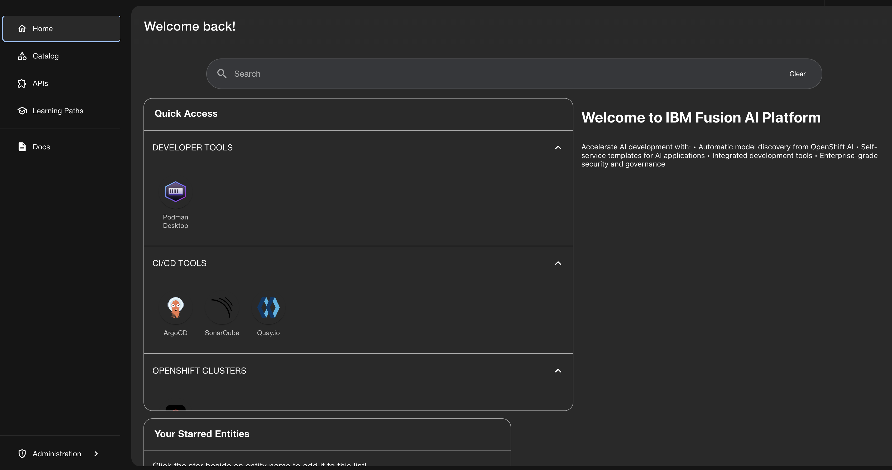
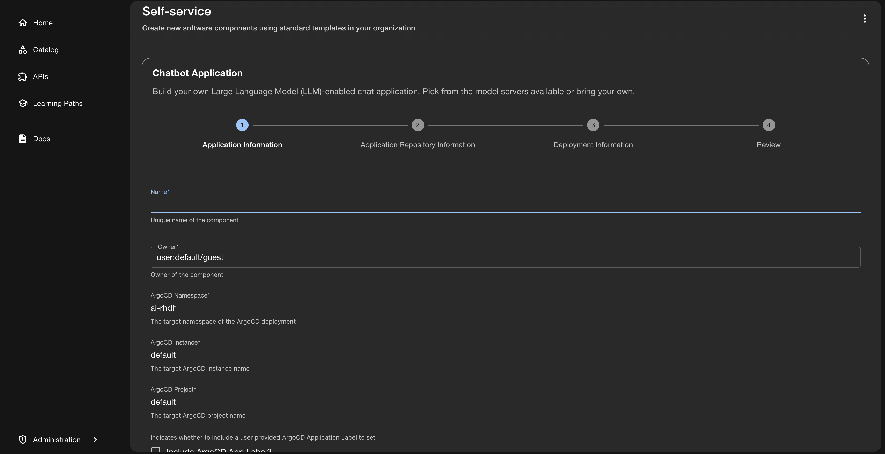

# IBM Fusion Developer Hub Quickstart

Deploy production-ready Red Hat Developer Hub with automatic AI model discovery on OpenShift in under 15 minutes.

> **✅ TESTED ON**: OpenShift 4.15+ (Fusion HCI Cluster)
> **📅 Last Verified**: May 29, 2026

## What you'll get

- **Red Hat Developer Hub** - Enterprise developer portal (Backstage)
- **High Availability** - 3 replicas with automatic failover
- **PostgreSQL HA** - Crunchy PostgreSQL Operator with automated backups
- **IBM Fusion AI Homepage** - Pre-configured with AI capabilities
- **Automatic Model Discovery** - See OpenShift AI models on homepage
- **Production Security** - RBAC, network policies, pod security

### 🎯 Key Feature: Automatic Model Discovery

The homepage automatically discovers and displays:
- ✅ Models deployed via OpenShift AI (KServe)
- ✅ Model endpoints and status
- ✅ Performance metrics
- ✅ Quick access links

## Prerequisites

### Required Components

- **Red Hat OpenShift 4.12+** cluster on IBM Fusion HCI
- **Cluster admin access**
- **Red Hat OpenShift AI (RHOAI)** installed and configured
  - Required for automatic model discovery and AI capabilities
  - Installation guide: [`../../fusion-openshift-ai/docs/01-RHOAI-Installation-Guide.md`](../../fusion-openshift-ai/docs/01-RHOAI-Installation-Guide.md)
- **100GB available storage** (ODF recommended)

### Required CLI Tools

- **`oc` CLI** installed and configured
- **`helm` 3.8+** installed ([install guide](https://helm.sh/docs/intro/install/))

## Deploy the quickstart

### 1. Clone this repository

```bash
git clone https://github.com/IBM/storage-fusion.git
cd storage-fusion/AI/quickstarts/fusion-developerhub
```

### 2. Log in to your OpenShift cluster

```bash
oc login --token=<your-token> --server=<your-server>
```

### 3. Install Helm (if not installed)

```bash
# macOS
brew install helm

# Linux
curl https://raw.githubusercontent.com/helm/helm/main/scripts/get-helm-3 | bash

# Verify
helm version
```

### 4. Configure Cluster Domain and Storage

Before deploying, you need to configure your cluster's wildcard domain and optionally configure storage classes.

```bash
# Edit the production values file
vi examples/quickstart-production-values.yaml
```

#### Update Cluster Domain (Required)

Find and update the `wildcardDomain` to match your OpenShift cluster:

```yaml
global:
  # IMPORTANT: Change this to match your OpenShift cluster domain
  wildcardDomain: apps.your-cluster.example.com  # Update this!
```

To get your cluster domain:
```bash
oc get ingresses.config/cluster -o jsonpath='{.spec.domain}'
```

#### Configure Storage Classes (Optional)

**Important**: Dynamic plugins require a storage class that supports **ReadWriteMany (RWX)** access mode.

If you're using **OpenShift Data Foundation (ODF)**, update the storage configuration for ODF:

```yaml
developerHub:
  storage:
    # For dynamic plugins (requires ReadWriteMany)
    storageClassName: "ocs-storagecluster-cephfs"  # ODF CephFS for RWX
    size: 5Gi

postgresql:
  storage:
    size: 20Gi
    # For PostgreSQL (requires ReadWriteOnce)
    storageClassName: "ocs-storagecluster-ceph-rbd"  # ODF RBD for RWO
```

If you're **NOT using ODF**, specify a storage class that supports ReadWriteMany:

```yaml
developerHub:
  storage:
    # Use any storage class that supports ReadWriteMany (RWX)
    # Examples: nfs-client, glusterfs, etc.
    storageClassName: "nfs-client"  # Replace with your RWX storage class
    size: 5Gi

postgresql:
  storage:
    size: 20Gi
    # Use any storage class that supports ReadWriteOnce (RWO)
    storageClassName: ""  # Leave empty for cluster default
```

**Note**: If you leave `storageClassName` empty (`""`), the cluster's default storage class will be used.

### 5. Deploy Developer Hub

After configuring the cluster domain and storage classes:

```bash
# Deploy with production configuration
helm install fusion-developer-hub \
  ./helm-charts/fusion-developer-hub \
  -n fusion-developer-hub \
  --create-namespace \
  -f examples/quickstart-production-values.yaml \
  --timeout 20m
```

**What happens:**
1. Installs Red Hat Developer Hub Operator (2 min)
2. Installs Crunchy PostgreSQL Operator (2 min)
3. Creates PostgreSQL cluster with HA (5 min)
4. Deploys Developer Hub with 3 replicas (5 min)
5. Configures OpenShift AI model connector (automatic)

### 6. Monitor deployment

```bash
# Watch operator installation
watch oc get csv -n rhdh-operator

# Watch PostgreSQL cluster
watch oc get postgrescluster -n fusion-developer-hub

# Watch Developer Hub
watch oc get backstage -n fusion-developer-hub

# All should show "Succeeded" or "Ready"
```

### 7. Access Developer Hub

```bash
# Get the URL
oc get route -n fusion-developer-hub -o jsonpath='{.items[0].spec.host}'

# Example output:
# backstage-developer-hub-fusion-developer-hub.apps.your-cluster.com
```

Visit the URL in your browser. You'll see the **IBM Fusion AI Platform** homepage:



**Key Features Visible:**
- **Welcome to IBM Fusion AI Platform** - Custom branded homepage
- **Quick Access** section with:
  - Developer Tools (Podman Desktop)
  - CI/CD Tools (ArgoCD, SonarQube, Quay.io)
  - OpenShift Clusters integration
- **Search functionality** for quick navigation
- **Navigation menu** with:
  - Home
  - Catalog (components and APIs)
  - APIs
  - Learning Paths
  - Docs
  - Administration
- **Your Starred Entities** for quick access to favorites
- **Automatic model discovery** from OpenShift AI (when models are deployed)

#### Model Catalog View

Click on **Catalog** in the navigation menu to see all discovered AI models:


**Model Catalog Features:**
- **Automatic Model Discovery** - Models deployed via OpenShift AI appear automatically
- **Filter by Kind** - Component, API, System, etc.
- **Filter by Type** - model-server, service, etc.
- **Search Functionality** - Quick search across all catalog entries
- **Model Details** including:
  - Model name and version (e.g., `model-serving-qwen2-5-72b-instruct`, `model-serving-qwen3-32b-instruct`)
  - Owner and system information
  - Lifecycle stage (development, production, etc.)
  - Tags for categorization (model-qwen, quantization-fp8, validated-patterns, etc.)
  - Authentication requirements
- **Self-service** button for creating new components
- **Personal filters** - Owned and Starred items for quick access

### 🔐 Authentication

The quickstart deploys with **Guest Access** enabled by default for easy testing:

- ✅ **Guest Login**: Works immediately - click "Enter" on the homepage

**Note**: If you see a GitHub login error, this is expected. Use Guest access for testing.

## What's deployed

### Operators
- **Red Hat Developer Hub Operator** - Manages Developer Hub lifecycle
- **Crunchy PostgreSQL Operator** - Manages PostgreSQL HA cluster

### Developer Hub (3 replicas)
- **Image**: Red Hat Developer Hub (latest)
- **Replicas**: 3 (high availability)
- **Resources**: 2Gi memory, 1 CPU per replica
- **Features**:
  - IBM Fusion AI homepage
  - OpenShift AI model connector (enabled by default)
  - Software catalog
  - Self-service templates
  - TechDocs
  - RBAC

### PostgreSQL HA Cluster (3 instances)
- **Primary**: 1 instance (read-write)
- **Replicas**: 2 instances (read-only)
- **Automated Backups**: Daily to ODF
- **Retention**: 30 days
- **Failover**: Automatic

### Security
- Network policies enabled
- Pod security standards enforced
- RBAC configured
- Secrets encrypted

## Configuration

### Production Values (values-production.yaml)

```yaml
global:
  wildcardDomain: apps.your-cluster.com  # Change this!

developerHub:
  replicas: 3  # High availability
  
  # Storage configuration for dynamic plugins
  storage:
    # Storage class for dynamic plugins (ReadWriteMany required)
    # Leave empty to use cluster default
    # If using ODF: ocs-storagecluster-cephfs
    storageClassName: ""
    size: 5Gi
  
  resources:
    requests:
      cpu: 1000m
      memory: 2Gi
    limits:
      cpu: 2000m
      memory: 4Gi
  
  # OpenShift AI Model Connector (enabled by default)
  config:
    homepage:
      enabled: true
      plugins:
        - name: openshift-ai-connector
          enabled: true
          config:
            discoveryInterval: 30s
            namespaces:
              - model-serving
              - maas-runtime

postgresql:
  enabled: true
  instances: 3  # HA cluster
  
  resources:
    requests:
      cpu: 500m
      memory: 1Gi
  
  storage:
    size: 20Gi
    # Storage class for PostgreSQL (ReadWriteOnce is sufficient)
    # Leave empty to use cluster default
    # If using ODF: ocs-storagecluster-ceph-rbd
    storageClassName: ""
  
  backup:
    enabled: true
    schedule: "0 2 * * *"  # Daily at 2 AM
    retention: "30d"

monitoring:
  enabled: true
  prometheus:
    enabled: true

security:
  networkPolicy:
    enabled: true
  podSecurity:
    enabled: true
```

## Next steps

### Create AI Applications with Self-Service Templates

Click on **Self-service** button (top right) to access pre-built application templates:


**Available AI Application Templates:**

1. **Audio to Text Application**
   - Build AI-enabled audio transcription application
   - Technologies: ai, whispercpp, python, asr
   - Pick from available model servers

2. **Chatbot Application**
   - Build Large Language Model (LLM)-enabled chat application
   - Technologies: ai, llamacpp, vllm, python
   - Interactive conversational AI

3. **Code Generation Application**
   - Build LLM-enabled code generation application
   - Technologies: ai, llamacpp, vllm, python
   - Generate code from natural language

4. **Model Server, No Application**
   - Deploy a granite-3.1 8b model with vLLM server
   - Technologies: ai, vllm, modelserver
   - Standalone model serving

5. **Object Detection Application**
   - Identify and locate objects in images using AI
   - Technologies: ai, detr, python
   - Computer vision capabilities

6. **RAG Chatbot Application**
   - Enhance chatbot with Retrieval-Augmented Generation (RAG)
   - Technologies: ai, llamacpp, vllm, python, rag, database
   - Context-aware responses

**Features:**
- **View TechDocs** - Detailed documentation for each template
- **Choose button** - Start creating your application
- **Filter by Categories and Tags** - Find the right template quickly
- **Personal section** - Access your starred templates
- **IBM Fusion section** - All 6 templates available

#### Creating an Application from Template

When you click **Choose** on a template (e.g., Chatbot Application), you'll see a guided wizard:



**4-Step Creation Process:**
1. **Application Information** - Name, owner, and ArgoCD configuration
2. **Application Repository Information** - Git repository settings
3. **Deployment Information** - Deployment configuration
4. **Review** - Review and create

The wizard guides you through creating your AI application with automatic GitOps deployment via ArgoCD.

### Deploy AI Models

To deploy AI models that will be automatically discovered by Developer Hub, see the **Model Serving Guide**:

**📖 Model Deployment Guide**: [`../../fusion-model-serving/README.md`](../../fusion-model-serving/README.md)

This guide covers:
- GitOps-driven model deployment using KServe
- vLLM runtime configuration for LLM serving
- Model serving with Red Hat OpenShift AI
- External access configuration via OpenShift Routes

**How it works:**
1. Deploy models using the model-serving guide
2. Models are automatically discovered by Developer Hub (every 30 seconds)
3. Models appear on the homepage with status, endpoints, and metrics
4. Use models in your AI applications via the catalog

**Monitored namespaces** (configurable in values.yaml):
- `model-serving`
- `maas-runtime`
- `redhat-ods-applications`

### Create an application

1. Visit Developer Hub
2. Click **Create** → **Fusion AI Application**
3. Select a model from dropdown (auto-populated from OpenShift AI)
4. Fill in details
5. Click **Create**

### Monitor the platform

```bash
# Check Developer Hub status
oc get backstage -n fusion-developer-hub

# Check PostgreSQL cluster
oc get postgrescluster -n fusion-developer-hub

# View metrics
oc get servicemonitor -n fusion-developer-hub
```

### Customize homepage

Edit the configuration:

```bash
oc edit backstage fusion-hub -n fusion-develoepr-hub
```

See [docs/homepage-customization.md](docs/homepage-customization.md) for details.

### Upgrade Developer Hub

To upgrade to a newer version or apply configuration changes:

```bash
# Pull latest changes from repository
git pull

# Upgrade with updated values
helm upgrade fusion-developer-hub \
  ./helm-charts/fusion-developer-hub \
  -n fusion-developer-hub \
  -f examples/quickstart-production-values.yaml \
  --timeout 20m

# Monitor the upgrade
watch oc get pods -n fusion-developer-hub
```

**What gets upgraded:**
- Developer Hub application to latest version
- Configuration changes from values file
- Template updates
- Plugin updates

**Note**: The upgrade process performs a rolling update, maintaining availability during the upgrade.

## Troubleshooting

### Operators not installing

Check operator status:

```bash
# Check subscriptions
oc get subscription -n rhdh-operator
oc get subscription -n postgres-operator

# Check install plans
oc get installplan -n rhdh-operator
oc get installplan -n postgres-operator

# If manual approval needed
oc patch installplan <name> -n rhdh-operator --type merge -p '{"spec":{"approved":true}}'
```

### PostgreSQL cluster not ready

Check cluster status:

```bash
# Get cluster details
oc describe postgrescluster developerhub-postgres -n fusion-developer-hub

# Check pods
oc get pods -n fusion-developer-hub -l postgres-operator.crunchydata.com/cluster=developerhub-postgres

# View logs
oc logs -n fusion-developer-hub -l postgres-operator.crunchydata.com/role=master
```

### Developer Hub not starting

Check backstage status:

```bash
# Get backstage details
oc describe backstage developer-hub -n fusion-developer-hub

# Check pods using the correct label
oc get pods -n fusion-developer-hub -l rhdh.redhat.com/app=backstage-developer-hub

# View logs
oc logs -n fusion-developer-hub -l rhdh.redhat.com/app=backstage-developer-hub
```

### Models not appearing on homepage

Check connector configuration:

```bash
# View backstage config
oc get backstage developer-hub -n fusion-developer-hub -o yaml | grep -A 20 "openshift-ai"

# Check rhoai-normalizer container logs in backstage pods
oc logs -n fusion-developer-hub -l rhdh.redhat.com/app=backstage-developer-hub -c rhoai-normalizer

# Check if rhoai-normalizer container is running
oc get pods -n fusion-developer-hub -l rhdh.redhat.com/app=backstage-developer-hub -o jsonpath='{.items[*].spec.containers[*].name}' | grep rhoai-normalizer

# Check all containers in the pod
oc get pods -n fusion-developer-hub -l rhdh.redhat.com/app=backstage-developer-hub -o jsonpath='{.items[0].spec.containers[*].name}'
```

### Clean up and redeploy

```bash
# Uninstall
helm uninstall fusion-developer-hub -n fusion-developer-hub

# Delete namespace (removes all resources)
oc delete namespace fusion-developer-hub

# Redeploy
helm install fusion-developer-hub \
  ./helm-charts/fusion-developer-hub \
  -n fusion-developer-hub \
  --create-namespace \
  -f examples/quickstart-production-values.yaml \
  --timeout 20m
```

## Architecture

```
┌─────────────────────────────────────────────────────────────┐
│  Red Hat Developer Hub Operator                             │
│  (Namespace: rhdh-operator)                                 │
└─────────────────────────────────────────────────────────────┘
                          │
                          │ manages
                          ▼
┌─────────────────────────────────────────────────────────────┐
│  Developer Hub Instance (3 replicas)                        │
│  (Namespace: fusion-hub)                                    │
│  ┌───────────────────────────────────────────────────────┐ │
│  │  OpenShift AI Model Connector                         │ │
│  │  • Discovers models every 30s                         │ │
│  │  • Displays on homepage                               │ │
│  └───────────────────────────────────────────────────────┘ │
└─────────────────────────────────────────────────────────────┘
                          │
                          │ connects to
                          ▼
┌─────────────────────────────────────────────────────────────┐
│  Crunchy PostgreSQL Operator                                │
│  (Namespace: postgres-operator)                             │
└─────────────────────────────────────────────────────────────┘
                          │
                          │ manages
                          ▼
┌─────────────────────────────────────────────────────────────┐
│  PostgreSQL HA Cluster (3 instances)                        │
│  (Namespace: fusion-hub)                                    │
│  • Primary (read-write)                                     │
│  • 2 Replicas (read-only)                                   │
│  • Automated backups to ODF                                 │
└─────────────────────────────────────────────────────────────┘
                          │
                          │ queries
                          ▼
┌─────────────────────────────────────────────────────────────┐
│  OpenShift AI (if installed)                                │
│  • KServe InferenceServices                                 │
│  • Model endpoints                                          │
│  • Model metadata                                           │
└─────────────────────────────────────────────────────────────┘
```

## Production considerations

### High Availability
- ✅ 3 Developer Hub replicas
- ✅ 3 PostgreSQL instances
- ✅ Automatic failover
- ✅ Load balancing

### Backup & Recovery
- ✅ Daily automated backups
- ✅ 30-day retention
- ✅ Point-in-time recovery
- ✅ Backup to ODF

### Security
- ✅ Network policies
- ✅ Pod security standards
- ✅ RBAC
- ✅ Secret encryption

### Monitoring
- ✅ Prometheus metrics
- ✅ Service monitors
- ✅ Health checks
- ✅ Operator status

### Scaling
- ✅ Horizontal pod autoscaling
- ✅ Resource limits
- ✅ Storage expansion
- ✅ Database connection pooling

## Additional resources

### Setup and Configuration
- [Complete Setup Guide](SETUP.md) - Comprehensive setup with all prerequisites
- [Production Deployment Guide](docs/README.md) - Advanced configuration options
- [Homepage Customization](docs/homepage-customization.md) - Customize the UI
- [RHOAI Integration](docs/getting-started/rhoai-integration.md) - Deep dive into AI integration

### AI Platform Components
- [Red Hat OpenShift AI Installation](../../fusion-openshift-ai/docs/01-RHOAI-Installation-Guide.md) - Install RHOAI on Fusion
- [Model Serving Guide](../../fusion-model-serving/README.md) - Deploy and serve AI models
- [GitOps with Argo CD](../../fusion-gitops-argocd/README.md) - GitOps deployment patterns

### Troubleshooting
- [Troubleshooting Guide](docs/troubleshooting/README.md) - Comprehensive troubleshooting
- [PostgreSQL Issues](docs/troubleshooting/postgresql-troubleshooting.md) - Database troubleshooting
- [Readiness Probe 503 Fix](docs/troubleshooting/READINESS_PROBE_503_FIX.md) - Fix common startup issues

## Support

- [GitHub Issues](https://github.com/IBM/storage-fusion/issues)
- [Documentation](../../fusion-developerhub/docs/)
- [Red Hat Developer Hub Docs](https://access.redhat.com/documentation/en-us/red_hat_developer_hub)

---

**Made with ❤️ by the IBM Fusion Team**