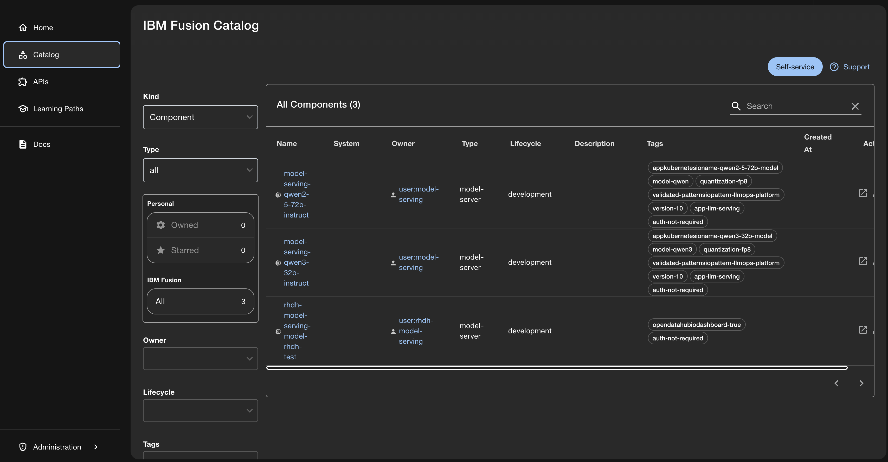
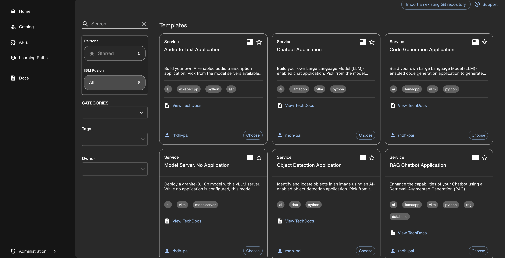

# IBM Fusion Developer Hub Quickstart

A unified developer portal for AI-first development on IBM Fusion HCI. Provides centralized access to AI resources, documentation, NVIDIA blueprints, Fusion quickstarts, and self-service application templates.

## Table of Contents

- [Introduction](#introduction)
- [Installation](#installation)
- [Configure and Customize](#configure-and-customize)
- [Get Started](#get-started)
- [Upgrade](#upgrade)
- [Troubleshooting](#troubleshooting)

## Introduction

### 1.1 What is IBM Fusion Developer Hub?

IBM Fusion Developer Hub is an enterprise-ready developer portal built on Red Hat Developer Hub (Backstage) for AI-first development on IBM Fusion HCI.

**What You Get:**
- Custom AI homepage with automatic model discovery from OpenShift AI
- Integrated Fusion quickstarts, NVIDIA blueprints, and documentation
- Centralized software catalog for AI components and services
- Enterprise security (RBAC, network policies, pod security)
- High availability (3-replica deployment, PostgreSQL HA cluster)
- Pre-built AI application templates (chatbots, RAG, code generation, object detection)

### 1.2 Why Use Fusion Developer Hub?

**Challenges Without It:**
- Scattered tools and documentation across multiple interfaces
- No visibility into deployed AI models
- Manual discovery of resources and capabilities
- Inconsistent application deployments

**Benefits:**
- Single portal for all AI development needs
- Automatic cataloging of deployed models
- Quick access to Fusion docs, NVIDIA blueprints, and quickstarts
- Self-service templates for standardized deployments
- Integrated community resources and tech blogs

### 1.3 Architecture Overview

```
┌─────────────────────────────────────────────────────────────┐
│  Red Hat Developer Hub Operator                             │
│  (Namespace: rhdh-operator)                                 │
└─────────────────────────────────────────────────────────────┘
                          │
                          │ manages
                          ▼
┌─────────────────────────────────────────────────────────────┐
│  Developer Hub Instance (3 replicas)                        │
│  (Namespace: fusion-hub)                                    │
│  ┌───────────────────────────────────────────────────────┐ │
│  │  OpenShift AI Model Connector                         │ │
│  │  • Discovers models every 30s                         │ │
│  │  • Displays on homepage                               │ │
│  └───────────────────────────────────────────────────────┘ │
└─────────────────────────────────────────────────────────────┘
                          │
                          │ connects to
                          ▼
┌─────────────────────────────────────────────────────────────┐
│  Crunchy PostgreSQL Operator                                │
│  (Namespace: postgres-operator)                             │
└─────────────────────────────────────────────────────────────┘
                          │
                          │ manages
                          ▼
┌─────────────────────────────────────────────────────────────┐
│  PostgreSQL HA Cluster (3 instances)                        │
│  (Namespace: fusion-hub)                                    │
│  • Primary (read-write)                                     │
│  • 2 Replicas (read-only)                                   │
│  • Automated backups to ODF                                 │
└─────────────────────────────────────────────────────────────┘
                          │
                          │ queries
                          ▼
┌─────────────────────────────────────────────────────────────┐
│  OpenShift AI (if installed)                                │
│  • KServe InferenceServices                                 │
│  • Model endpoints                                          │
│  • Model metadata                                           │
└─────────────────────────────────────────────────────────────┘
```

### 1.4 Key Features

**High Availability:**
- 3 Developer Hub replicas with automatic failover
- 3 PostgreSQL instances with load balancing

**Security:**
- Network policies and pod security standards
- RBAC and secret encryption

**Backup & Recovery:**
- Daily automated backups with 30-day retention
- Point-in-time recovery to ODF

**Monitoring & Scaling:**
- Prometheus metrics and health checks
- Horizontal pod autoscaling and resource limits

### 1.5 What Gets Deployed

**Operators:**
- Red Hat Developer Hub Operator (manages Developer Hub lifecycle)
- Crunchy PostgreSQL Operator (manages PostgreSQL HA cluster)

**Developer Hub (3 replicas):**
- IBM Fusion AI homepage with OpenShift AI model connector
- Software catalog and self-service templates
- 2Gi memory, 1 CPU per replica

**PostgreSQL HA Cluster (3 instances):**
- 1 primary (read-write), 2 replicas (read-only)
- Daily automated backups to ODF with 30-day retention
- Automatic failover

**Security:**
- Network policies, pod security standards, RBAC, secret encryption

## Installation

Deploy IBM Fusion Developer Hub using either Helm for direct installation or GitOps with ArgoCD for automated, Git-driven deployments. Choose the method that best fits your workflow and infrastructure management approach.

**In this section:**
- [Prerequisites](#prerequisites)
- [2.1 Deploy using Helm](#21-deploy-using-helm)
- [2.2 Deploy using GitOps](#22-deploy-using-gitops)

### Prerequisites

#### Required Components

- **Red Hat OpenShift 4.12+** cluster on IBM Fusion HCI
- **Cluster admin access**
- **Red Hat OpenShift AI (RHOAI)** installed and configured
  - Required for automatic model discovery and AI capabilities (enabled by default)
  - **RHOAI access token secret** (`rhdh-rhoai-connector-token`) - verify this secret exists in your deployment namespace. If not, see [RHOAI Integration Guide](docs/getting-started/rhoai-integration.md) for setup instructions
  - Installation guide: [`../../fusion-openshift-ai/docs/01-RHOAI-Installation-Guide.md`](../../fusion-openshift-ai/docs/01-RHOAI-Installation-Guide.md)
  - **Note:** Model discovery can be disabled if not needed (see [Section 3.4.4](#344-disable-rhoai-model-discovery-optional))
- **100GB available storage** (ODF recommended)

#### Required CLI Tools

- **`oc` CLI** installed and configured
- **`helm` 3.8+** installed ([install guide](https://helm.sh/docs/intro/install/))

### 2.1 Deploy using Helm

#### 2.1.1 Prerequisites

**Required Components:**
- **Red Hat OpenShift 4.12+** cluster on IBM Fusion HCI
- **Cluster admin access**
- **Red Hat OpenShift AI (RHOAI)** installed and configured
  - Required for automatic model discovery and AI capabilities (enabled by default)
  - **RHOAI access token secret** (`rhdh-rhoai-connector-token`) - verify this secret exists in your deployment namespace. If not, see [RHOAI Integration Guide](docs/getting-started/rhoai-integration.md) for setup instructions
  - Installation guide: [`../../fusion-openshift-ai/docs/01-RHOAI-Installation-Guide.md`](../../fusion-openshift-ai/docs/01-RHOAI-Installation-Guide.md)
  - **Note:** Model discovery can be disabled if not needed (see [Section 3.4.4](#344-disable-rhoai-model-discovery-optional))
- **100GB available storage** (ODF recommended)

**Required CLI Tools:**
- **`oc` CLI** installed and configured
- **`helm` 3.8+** installed ([install guide](https://helm.sh/docs/intro/install/))

**Verify Prerequisites:**
```bash
# Check OpenShift version
oc version

# Check RHOAI installation
oc get dsc -n redhat-ods-operator

# Verify RHOAI token secret exists (replace <namespace> with your deployment namespace)
oc get secret rhdh-rhoai-connector-token -n <namespace>

# Check storage classes (must have RWX support)
oc get sc
```

#### 2.1.2 Deployment Steps

**Step 1: Clone Repository**

```bash
git clone https://github.com/IBM/storage-fusion.git
cd storage-fusion/AI/quickstarts/fusion-developerhub
```

**Step 2: Log in to OpenShift**

```bash
# Login to your cluster (replace with your cluster URL)
oc login --server=https://api.your-cluster.com:6443

# Verify you're logged in
oc whoami
```

**Step 3: Install Helm (if not installed)**

```bash
# macOS
brew install helm

# Linux
curl https://raw.githubusercontent.com/helm/helm/main/scripts/get-helm-3 | bash

# Verify installation
helm version
```

**Step 4: Choose Your Environment**

Three pre-configured environments are available:

| Feature | Development | Staging | Production |
|---------|-------------|---------|------------|
| **Values File** | `deploy/helm/environments/dev/values.yaml` | `deploy/helm/environments/staging/values.yaml` | `deploy/helm/environments/prod/values.yaml` |
| **Target Namespace** | `fusion-developer-hub-development` | `fusion-developer-hub-staging` | `fusion-developer-hub` |
| **Developer Hub Replicas** | 1 | 2 | 3 |
| **PostgreSQL Instances** | 1 | 2 | 3 |
| **Network Policies** | Disabled | Enabled | Enabled |
| **Resource Quotas** | Relaxed (8 CPU, 16Gi RAM) | Moderate (16 CPU, 32Gi RAM) | Full (32 CPU, 64Gi RAM) |
| **PostgreSQL Backup** | Disabled | Daily differential | Daily differential + Weekly full |
| **Monitoring** | Disabled | Enabled | Enabled with enhanced metrics |
| **RHOAI Integration** | Enabled | Enabled | Enabled |
| **Authentication** | Guest + OIDC | OIDC | OIDC (production-ready) |
| **Best For** | Rapid testing, development | Pre-production validation | Production workloads |

> **Note:** For GitOps deployments, see the additional **Sync Policy** row in the GitOps section below.

**This example uses the Production environment.** You can choose any environment based on your needs.

**Step 5: Configure the Values File**

**Navigate to your chosen environment directory and open the values file:**

```bash
# For Production (this example)
cd deploy/helm/environments/prod

# For Development: cd deploy/helm/environments/dev
# For Staging: cd deploy/helm/environments/staging

# Open the values file (use your preferred editor: vim, nano, code, etc.)
vim values.yaml
```

You need to make two required changes:

#### Required Change 1: Update Cluster Domain

Find the `wildcardDomain` field (around line 6) and change it to match your OpenShift cluster:

```yaml
global:
  # IMPORTANT: Change this to match your OpenShift cluster domain
  wildcardDomain: apps.<your-cluster-domain>.com  # ← Change to your cluster domain
```

**How to find your cluster domain:**
```bash
oc get ingress.config.openshift.io cluster -o jsonpath='{.spec.domain}'
```

**Example:** If the command returns `apps.mycluster.example.com`, use:
```yaml
wildcardDomain: apps.mycluster.example.com
```

#### Required Change 2: Update Storage Classes

**Important**: Dynamic plugins require a storage class that supports **ReadWriteMany (RWX)** access mode.

Find the storage configuration sections and update them:

**For OpenShift Data Foundation (ODF):**
```yaml
developerHub:
  storage:
    storageClassName: "ocs-storagecluster-cephfs"  # RWX for dynamic plugins
    size: 5Gi

postgresql:
  storage:
    size: 20Gi
    storageClassName: "ocs-storagecluster-ceph-rbd"  # RWO for database
```

**For Non-ODF (NFS, etc.):**
```yaml
developerHub:
  storage:
    storageClassName: "nfs-client"  # Your RWX storage class
    size: 5Gi

postgresql:
  storage:
    size: 20Gi
    storageClassName: ""  # Leave empty for cluster default
```

**How to find available storage classes:**
```bash
oc get storageclass
```

> **Note:** Developer Hub storage requires ReadWriteMany (RWX). PostgreSQL can use ReadWriteOnce (RWO). If you leave `storageClassName` empty (`""`), the cluster's default storage class will be used.

**For customization:** See **Section 3: Configure and Customize** below for detailed customization options.

**Step 6: Deploy Developer Hub**

Return to the quickstart directory and deploy using Helm:

```bash
# Return to quickstart directory
cd ../..

# Deploy with your chosen environment values file
helm install fusion-developer-hub \
  ./deploy/helm \
  -n fusion-developer-hub \
  --create-namespace \
  -f deploy/helm/environments/prod/values.yaml \
  --timeout 20m
```

**For other environments:**
```bash
# Development
helm install fusion-developer-hub \
  ./deploy/helm \
  -n fusion-developer-hub-development \
  --create-namespace \
  -f deploy/helm/environments/dev/values.yaml \
  --timeout 20m

# Staging
helm install fusion-developer-hub \
  ./deploy/helm \
  -n fusion-developer-hub-staging \
  --create-namespace \
  -f deploy/helm/environments/staging/values.yaml \
  --timeout 20m
```

**What Happens During Deployment:**
1. ⏱️ 2 min: Install Red Hat Developer Hub Operator
2. ⏱️ 2 min: Install Crunchy PostgreSQL Operator
3. ⏱️ 5 min: Create PostgreSQL HA cluster (3 instances for production)
4. ⏱️ 5 min: Deploy Developer Hub (3 replicas for production)
5. ⏱️ 1 min: Configure OpenShift AI model connector

#### 2.1.3 Monitor Deployment

```bash
# Watch operator installation
watch oc get csv -n rhdh-operator

# Watch PostgreSQL cluster
watch oc get postgrescluster -n fusion-developer-hub

# Watch Developer Hub
watch oc get backstage -n fusion-developer-hub
```

**Expected Output:**
```
# Operators should show "Succeeded"
NAME                           DISPLAY                    VERSION   REPLACES   PHASE
rhdh-operator.v1.x.x          Red Hat Developer Hub      1.x.x                Succeeded
crunchy-postgres-operator     Crunchy Postgres Operator  5.x.x                Succeeded

# PostgreSQL cluster should show "Ready"
NAME                    STATUS   AGE
developerhub-postgres   Ready    5m

# Developer Hub should show "Ready"
NAME              STATUS   AGE
developer-hub     Ready    8m
```

#### 2.1.4 Verify Installation

**Check all resources:**
```bash
# Check pods
oc get pods -n fusion-developer-hub

# Check routes
oc get route -n fusion-developer-hub

# Check backstage instance
oc get backstage -n fusion-developer-hub -o yaml
```

**Expected pods:**
- 3 Developer Hub pods (running)
- 3 PostgreSQL pods (running)
- Backup pods (completed)

#### 2.1.5 Access Developer Hub

```bash
# Get the URL
DEVHUB_URL=$(oc get route -n fusion-developer-hub -o jsonpath='{.items[0].spec.host}')
echo "Access Developer Hub at: https://$DEVHUB_URL"
```

Visit the URL in your browser. You'll see the **IBM Fusion AI Platform** homepage:


**Verify Features:**
- ✅ Homepage loads with Fusion branding
- ✅ Quick Access section visible
- ✅ Catalog shows components
- ✅ Guest login works (click "Enter")

### 2.2 Deploy using GitOps

GitOps deployment uses ArgoCD to manage Developer Hub through Git. All configuration is stored in your Git repository, and ArgoCD automatically syncs changes to your cluster.

#### 2.2.1 Prerequisites

**All Helm prerequisites (Section 2.1.1) PLUS:**

- **OpenShift GitOps (ArgoCD)** must be installed and running in the `openshift-gitops` namespace
  - The Application CR references this namespace for ArgoCD management
  - Verify installation: `oc get argocd -n openshift-gitops`
  - If not installed, refer to the [Fusion GitOps quickstart guide](../../fusion-gitops-argocd/README.md)
- **Git credentials** configured for pushing changes to your forked repository (ArgoCD can access public repositories without additional configuration)

#### 2.2.2 Deployment Steps

**Step 1: Fork and Clone Repository**

**Why fork?** GitOps requires you to own the repository so ArgoCD can monitor your customizations. Forking creates a copy under your GitHub account.

**Create your fork:**

1. Navigate to https://github.com/IBM/storage-fusion
2. Click the **Fork** button in the top-right corner
3. Select your destination account/organization
4. GitHub will create `github.com/<YOUR-USERNAME>/storage-fusion`

**Clone your fork to your local machine:**

```bash
# Replace <YOUR-USERNAME> with your actual GitHub username or organization
git clone https://github.com/<YOUR-USERNAME>/storage-fusion.git
cd storage-fusion/AI/quickstarts/fusion-developerhub
```

> **Production Note:** Always use your forked repository for production deployments. This allows you to customize configurations and maintain version control of your changes.

**Step 2: Understand Environment Options**

Three pre-configured environments are available (see environment comparison table in Section 2.1 above). For GitOps deployments, each environment has its own Application CR file:

| Environment | Application CR File | Sync Policy |
|-------------|---------------------|-------------|
| **Development** | `deploy/gitops/environments/dev/application.yaml` | Automated (auto-sync, prune, self-heal) |
| **Staging** | `deploy/gitops/environments/staging/application.yaml` | Automated (auto-sync, prune, self-heal) |
| **Production** | `deploy/gitops/environments/prod/application.yaml` | **Manual** (no auto-sync) |

**Key Differences:**

- **Development/Staging**: Auto-sync enabled - Git changes automatically deploy within 3 minutes
- **Production**: Manual sync required - changes must be explicitly approved before deployment
- **Production**: No automated pruning or self-healing for safety and control

For this guide, we'll configure the **Production** environment as it demonstrates the complete production-ready setup.

**Step 3: Configure the Application Manifest**

Now you need to configure the ArgoCD Application to point to your forked repository. This file tells ArgoCD where to find your configuration and how to deploy it.

**This example uses the Production environment.** You can choose any environment (development, staging, or production) based on your needs.

**Navigate to your chosen environment directory and open the Application CR file:**

```bash
# For Production (this example)
cd deploy/gitops/environments/prod

# For Development: cd deploy/gitops/environments/dev
# For Staging: cd deploy/gitops/environments/staging

# Open the Application CR file (use your preferred editor: vim, nano, code, etc.)
vim application.yaml
```

You'll see a YAML file that defines how ArgoCD should deploy Developer Hub. You need to make three required changes:

#### Required Change 1: Update Repository URL

Find the `repoURL` field (around line 14) and change it to point to your fork:

```yaml
spec:
  source:
    repoURL: https://github.com/<YOUR-USERNAME>/storage-fusion.git  # ← Change to your username
    targetRevision: main  # Keep 'main' or change only if using a custom branch
```

**Example:** If your GitHub username is `john-doe`, change it to:
```yaml
repoURL: https://github.com/john-doe/storage-fusion.git
```

#### Required Change 2: Update Cluster Domain

Find the `wildcardDomain` field (around line 22) and change it to match your OpenShift cluster:

```yaml
spec:
  source:
    helm:
      valuesObject:
        global:
          wildcardDomain: apps.<your-cluster-domain>.com  # ← Change to your cluster domain
```

**How to find your cluster domain:**
```bash
oc get ingress.config.openshift.io cluster -o jsonpath='{.spec.domain}'
```

**Example:** If the command returns `apps.mycluster.example.com`, use:
```yaml
wildcardDomain: apps.mycluster.example.com
```

#### Required Change 3: Update Storage Class

Find the `storageClassName` field (around line 27) and set it to a storage class that supports **ReadWriteMany (RWX)** access mode:

```yaml
spec:
  source:
    helm:
      valuesObject:
        developerHub:
          storage:
            storageClassName: ""  # ← Change to your RWX storage class
```

**Common options:**
- **OpenShift Data Foundation (ODF):** `ocs-storagecluster-cephfs`
- **NFS:** `nfs-client` (or your NFS storage class name)
- **Leave empty:** Uses cluster default storage class (must support RWX)

**How to find available storage classes:**
```bash
oc get storageclass
```

> **Note:** RBD storage (`ocs-storagecluster-ceph-rbd`) only supports ReadWriteOnce and will **not** work here.

**Step 4: Understand What Gets Deployed**

The Application CR you just configured tells ArgoCD:
- **Where** to find your configuration (your Git repository)
- **What** to deploy (Helm chart at specified path)
- **How** to deploy it (using the production values file)
- **Where** to deploy it (target namespace)

**Key sections explained:**

```yaml
spec:
  source:
    repoURL: <your-fork>              # Your Git repository
    path: quickstarts/.../helm-charts # Path to Helm chart
    targetRevision: main              # Git branch to track
    helm:
      valueFiles:
        - environments/prod/values.yaml  # Environment-specific config
      valuesObject:                   # Inline overrides (cluster-specific)
        global:
          wildcardDomain: <your-domain>
```

**For customization:** The values file (`deploy/helm/environments/prod/values.yaml`) contains all environment-specific configuration. See **Section 3: Configure and Customize** below for detailed customization options.

**Step 5: Commit and Push Changes**

Save your changes and push to your forked repository:

```bash
# Stage your changes
git add deploy/gitops/environments/prod/application.yaml

# Commit with descriptive message
git commit -m "Configure Fusion Developer Hub for production cluster"

# Push to your forked repository (default: main branch)
git push origin main
```

> **Note:** By default, the Application CR uses `main` branch (`targetRevision: main`). If you want to use a custom branch, create your branch, commit there, and update `targetRevision` in the Application CR to match your branch name.

**Step 6: Deploy to Your Cluster**

Now that you've configured the ArgoCD Application, it's time to deploy it to your OpenShift cluster.

**First, make sure you're logged into your OpenShift cluster:**

```bash
# Login to your cluster (replace with your cluster URL)
oc login --server=https://api.your-cluster.com:6443

# Verify you're logged in
oc whoami
```

**Then, apply the ArgoCD Application:**

```bash
# Make sure you're in the correct directory
cd deploy/gitops/environments/prod

# Apply the configuration
oc apply -f application.yaml

# Verify Application was created
oc get application -n openshift-gitops
```

**Expected output:**

```
NAME                     SYNC STATUS   HEALTH STATUS
fusion-developer-hub     OutOfSync     Missing
```

The Application starts in `OutOfSync` state because resources haven't been deployed yet. This is normal.

**Step 7: Sync the Application**

For **Production** environment (manual sync required):


Option 1: Using ArgoCD CLI

```bash
argocd app sync fusion-developer-hub --prune
```

Option 2: Using ArgoCD UI

1. Get ArgoCD URL: oc get route openshift-gitops-server -n openshift-gitops -o jsonpath='{.spec.host}'
2. Open URL in browser and login with your credentials
3. Find 'fusion-developer-hub' application
4. Click 'Sync' button
5. Review changes and click 'Synchronize'

For **Development/Staging** environments (auto-sync enabled):

ArgoCD automatically syncs within 3 minutes. You can also trigger immediate sync:

```bash
# Development
argocd app sync fusion-developer-hub-development

# Staging
argocd app sync fusion-developer-hub-staging
```

**That's it!** ArgoCD will now automatically:
1. ✅ Install the required operators (RHDH Operator, PostgreSQL Operator)
2. ✅ Wait for operators to be ready
3. ✅ Set up the PostgreSQL database cluster (3 instances for production)
4. ✅ Configure automated backups
5. ✅ Deploy Developer Hub (3 replicas for production)
6. ✅ Create routes and configure networking

The entire deployment takes 10-15 minutes. You can monitor progress in the next section.

#### 2.2.3 Monitor Deployment

**Watch Application Status:**

```bash
# Monitor application sync status
watch oc get application fusion-developer-hub -n openshift-gitops

# Or use ArgoCD CLI for detailed view
argocd app get fusion-developer-hub --refresh
```

**Deployment progresses through these states:**

```
SYNC STATUS   HEALTH STATUS   DESCRIPTION
Syncing       Progressing     Wave -10: RBAC Foundation (18 resources)
Syncing       Progressing     Wave 0: Namespaces (4 resources)
Syncing       Progressing     Wave 10: Pre-install Jobs (2 resources)
Syncing       Progressing     Wave 20: OperatorGroups (2 resources)
Syncing       Progressing     Wave 30: Subscriptions (2 resources)
Syncing       Progressing     Wave 40: Operator Validation (3 resources)
Syncing       Progressing     Wave 50: Configuration (15 resources)
Syncing       Progressing     Wave 60: Database (3 resources)
Syncing       Healthy         Wave 70: Application (2 resources)
Synced        Healthy         All resources deployed successfully
```

**Monitor Resource Creation:**

```bash
# Watch all resources in target namespace
oc get all -n fusion-developer-hub -w

# Check operator installation
oc get csv -n rhdh-operator
oc get csv -n postgres-operator

# Check PostgreSQL cluster
oc get postgrescluster -n fusion-developer-hub

# Check Developer Hub instance
oc get backstage -n fusion-developer-hub
```

**View Sync Waves in ArgoCD UI:**

The ArgoCD UI provides a visual representation of the deployment order. Resources are organized by sync wave, showing dependencies and deployment sequence.

#### 2.2.4 Verify Installation

**Check Application Health:**

```bash
# Get detailed application status
oc get application fusion-developer-hub -n openshift-gitops -o yaml
```

**Expected healthy status:**

```yaml
status:
  health:
    status: Healthy
  sync:
    status: Synced
    revision: abc123...  # Git commit SHA
  operationState:
    phase: Succeeded
    finishedAt: "2026-06-24T10:00:00Z"
```

**Verify All Resources:**

```bash
# Check all deployed resources
oc get all -n fusion-developer-hub

# Verify operators are running
oc get csv -n rhdh-operator -o custom-columns=NAME:.metadata.name,PHASE:.status.phase
oc get csv -n postgres-operator -o custom-columns=NAME:.metadata.name,PHASE:.status.phase

# Check Developer Hub pods (should be 3 for production)
oc get pods -n fusion-developer-hub -l rhdh.redhat.com/app=backstage-developer-hub

# Check PostgreSQL pods (should be 3 for production)
oc get pods -n fusion-developer-hub -l postgres-operator.crunchydata.com/cluster=developerhub-postgres
```

**Expected resources for production:**
- 3 Developer Hub pods (Running)
- 3 PostgreSQL pods (Running)
- 1 PostgreSQL backup pod (Completed)
- ConfigMaps for homepage, blueprints, and plugins
- Secrets for database and RHOAI connector
- Routes for external access

#### 2.2.5 Access Developer Hub

Get the Developer Hub URL:

```bash
DEVHUB_URL=$(oc get route -n fusion-developer-hub -o jsonpath='{.items[0].spec.host}')
echo "Access Developer Hub at: https://$DEVHUB_URL"
```

Open the URL in your browser and verify:

- ✅ Homepage displays with IBM Fusion branding
- ✅ Quick Access section shows NVIDIA Blueprints link
- ✅ Catalog page lists available blueprints
- ✅ Guest login works (click "Enter" button)
- ✅ Models appear if OpenShift AI models are deployed

**View Deployment in ArgoCD UI:**

1. Get ArgoCD URL: `oc get route openshift-gitops-server -n openshift-gitops -o jsonpath='{.spec.host}'`
2. Login with OpenShift credentials
3. Find `fusion-developer-hub` application
4. View resource tree showing all deployed components
5. Check resource health and sync status

## Configure and Customize

Customize IBM Fusion Developer Hub to match your organization's branding, integrate with your tools, and configure AI model discovery. All customizations are managed through environment-specific values files.

**In this section:**
- [3.1 Customize Homepage](#31-customize-homepage)
- [3.2 Customize Catalog](#32-customize-catalog)
- [3.3 Configure GitHub Integration](#33-configure-github-integration)
- [3.4 RHOAI Model Registry Integration](#34-rhoai-model-registry-integration)
- [3.5 Apply Your Changes](#35-apply-your-changes)
- [3.6 Advanced Customizations](#36-advanced-customizations)

IBM Fusion Developer Hub can be customized to match your organization's needs before or after deployment. All customizations are done by editing the `values.yaml` file for your chosen environment.

**Where to make changes:**
- **GitOps deployments:** Edit `deploy/helm/environments/{environment}/values.yaml` (e.g., `deploy/helm/environments/prod/values.yaml`)
- **Helm deployments:** Edit your local values file used during installation

**How changes are applied:**
- **GitOps:** Commit and push changes to Git → ArgoCD auto-syncs within 3 minutes
- **Helm:** Run `helm upgrade` command to apply changes

### 3.1 Customize Homepage

The Developer Hub homepage can be customized with your organization's branding, welcome messages, and quick access links.

#### 3.1.1 Update Title and Welcome Message

Edit your environment's `values.yaml` file:

```bash
# For GitOps deployments
cd deploy/helm/environments/prod/
vim values.yaml
```

Find the homepage configuration section (around line 58-73) and update:

```yaml
developerHub:
  config:
    homepage:
      enabled: true
      welcomeTitle: "Welcome to [Your Company] Developer Hub"
      welcomeMessage: |
        Your custom welcome message here.
        Explain what developers can do with this portal.
        
        🚀 **Getting Started**
        - Browse the software catalog
        - Deploy AI models
        - Access blueprints and quickstarts
```

#### 3.1.2 Customize Quick Access Links

By default, the homepage displays quick access links to NVIDIA Blueprints, documentation, deployed models, and community resources. You can override these defaults with your own links.

**Default quick links are defined in:**
- Template: [`deploy/helm/templates/dynamic-plugins.yaml`](deploy/helm/templates/dynamic-plugins.yaml) (lines 55-133)
- Mounted as: `homepage-data` ConfigMap in the Backstage pod
- Icons: Stored as binary data in the ConfigMap

**To override with custom links**, add the `quickLinks` section to your `values.yaml`:

```yaml
developerHub:
  config:
    homepage:
      enabled: true
      welcomeTitle: "Welcome to IBM Fusion Developer Hub"
      welcomeMessage: |
        Your welcome message here
      
      # Override default quick links
      quickLinks:
        - title: "Create New Application"
          description: "Start with AI-powered templates"
          url: "/create"
          icon: "add"
        - title: "Browse Catalog"
          description: "Discover components and services"
          url: "/catalog"
          icon: "catalog"
        - title: "View Documentation"
          description: "Access technical docs"
          url: "/docs"
          icon: "docs"
```

**Note:** When you add custom `quickLinks`, they completely replace the default links. If you want to keep some defaults, you must include them in your custom configuration.

**Default quick link URLs for reference:**
- NVIDIA Blueprints: `/catalog?filters%5Bkind%5D=component&filters%5Btype%5D=blueprint&limit=20`
- Quickstarts: `/catalog?filters%5Bkind%5D=component&filters%5Btype%5D=quickstart&limit=20`
- Deployed Models: `/catalog?filters%5Bkind%5D=component&filters%5Btype%5D=model-server&limit=20`

**For detailed homepage customization** (logos, colors, timezone clocks), see: [`docs/homepage-customization.md`](docs/homepage-customization.md)

### 3.2 Customize Catalog

The software catalog displays components, APIs, and resources available to your developers. By default, it includes IBM Fusion AI blueprints and quickstarts.

#### 3.2.1 Default Fusion Blueprints

The following blueprints are pre-configured and automatically loaded:

**NVIDIA Blueprints:**
- **NVIDIA RAG** - Retrieval Augmented Generation blueprint
- **NVIDIA AIQ** - AI Query blueprint  
- **NVIDIA VSS** - Vector Search Service blueprint

**IBM Fusion Quickstarts:**
- Fusion Developer Hub quickstart
- Fusion GitOps quickstart
- Model-as-a-Service quickstart

**How it works:**
- Blueprints are configured in [`deploy/helm/values.yaml`](deploy/helm/values.yaml) under `developerHub.catalog.blueprints.locations` (lines 244-274)
- The configuration is rendered into a ConfigMap: `app-config-fusion-blueprints`
- This ConfigMap is mounted in the Developer Hub instance via [`deploy/helm/templates/fusion-blueprints-configmap.yaml`](deploy/helm/templates/fusion-blueprints-configmap.yaml)
- The ConfigMap is referenced in [`deploy/helm/templates/developerhub-instance.yaml`](deploy/helm/templates/developerhub-instance.yaml)

#### 3.2.2 Add Custom Catalog Sources

You can add your own catalog sources by editing your environment's `values.yaml` file. The catalog blueprints section is already included (commented out) in all environment values files for easy customization.

**To add custom catalog sources:**

1. Open your environment's values file (e.g., `deploy/helm/environments/prod/values.yaml`)
2. Find the commented `blueprints` section under `catalog` (around line 103-111)
3. Uncomment and add your custom sources

```yaml
developerHub:
  config:
    catalog:
      enabled: true
      
      # Uncomment to add custom catalog sources (this will override default Fusion blueprints)
      blueprints:
        enabled: true
        locations:
          # Add your custom catalog sources here
          - type: url
            target: https://github.com/your-org/your-repo/blob/main/catalog-info.yaml
            rules:
              - allow: [Component, API, System]
```

**Important:** When you uncomment and configure the `blueprints` section, it **completely overrides** the default Fusion blueprints defined in the main Helm chart values. If you want to keep the default NVIDIA blueprints and quickstarts, you must include them along with your custom sources.

**Important Notes:**
- This configuration is for **backend administrators** who want to pre-populate the catalog
- **End users** can also add catalog entries using the **self-service templates** from the Developer Hub UI
- Backend configuration ensures certain components are always available to all users
- Changes require commit + push (GitOps) or `helm upgrade` (Helm)

**For detailed catalog management**, see: [`docs/adding-fusion-services.md`](docs/adding-fusion-services.md)

### 3.3 Configure GitHub Integration

#### 3.3.1 GitHub.com (Public GitHub)

1. **Create OAuth App** (GitHub Settings → Developer settings → OAuth Apps):
   - **Callback URL**: `https://your-developer-hub-url/api/auth/github/handler/frame`
   - Save **Client ID** and **Client Secret**

2. **Update values.yaml**:
```yaml
developerHub:
  auth:
    environment: "production"  # Disables guest access
    github:
      enabled: true
      clientId: "your-client-id"
      clientSecret: "your-client-secret"
```

**For detailed GitHub.com integration**: [Red Hat Docs](https://docs.redhat.com/en/documentation/red_hat_developer_hub/1.9/html/integrating_red_hat_developer_hub_with_your_git_provider/integrate-with-github_integrating-rhdh-with-your-git-provider)

#### 3.3.2 GitHub Enterprise

**1. Create OAuth App** (in your GitHub Enterprise instance):
- **Homepage URL**: `https://fusion-developer-hub-<namespace>.apps.<cluster>.com`
- **Callback URL**: `https://fusion-developer-hub-<namespace>.apps.<cluster>.com/api/auth/github/handler/frame`
- Save **Client ID** and **Client Secret**

**2. Create Secret**:
Create a Kubernetes secret in the namespace where your RHDH is deployed:
```bash
oc create secret generic github-auth-secret \
  -n <namespace> \
  --from-literal=GITHUB_CLIENT_ID='your-client-id' \
  --from-literal=GITHUB_CLIENT_SECRET='your-client-secret' \
  --from-literal=GITHUB_TOKEN='your-personal-access-token'
```

**Secret Fields**:
- `GITHUB_CLIENT_ID`: OAuth app client ID (for user authentication)
- `GITHUB_CLIENT_SECRET`: OAuth app client secret (for user authentication)
- `GITHUB_TOKEN`: Personal Access Token with `repo` scope (for catalog/repo access)

**3. Update values.yaml**:
```yaml
developerHub:
  auth:
    environment: "production"  # Use "development" to keep guest access
    github:
      enabled: true
      enterpriseInstanceUrl: "https://github.company.com"
      allowSignInWithoutCatalog: false
  
  catalog:
    github:
      enabled: true
      target: https://github.company.com/your-org
      enterpriseHost: "github.company.com"  # No https://
      enableToken: true
  
  extraEnvs:
    secrets:
      - github-auth-secret
```

**Key Flags**:
- `enterpriseHost`: GitHub Enterprise hostname (enables enterprise API calls)
- `enterpriseInstanceUrl`: Full URL (for OAuth provider)
- `enableToken`: Set `true` for token-based repo access
- `environment: "production"`: OAuth only (no guest access)
- `environment: "development"`: OAuth + guest access

**For other OIDC providers** (Keycloak, Azure AD): [`docs/getting-started/oidc-providers.md`](docs/getting-started/oidc-providers.md)

### 3.4 RHOAI Model Registry Integration

The OpenShift AI (RHOAI) Model Connector automatically discovers and displays AI models deployed in your cluster.

#### 3.4.1 Enable/Disable Model Discovery

The RHOAI connector is **enabled by default** in production and staging environments. To disable it:

```yaml
developerHub:
  fusion:
    enabled: true
    ai:
      rhoaiConnector:
        enabled: false  # Set to false to disable
```

#### 3.4.2 Configure Model Discovery

Customize which namespaces to scan and how often:

```yaml
developerHub:
  config:
    homepage:
      plugins:
        - name: openshift-ai-connector
          enabled: true
          config:
            # How often to discover models (in seconds)
            discoveryInterval: 30s
            
            # Namespaces to scan for models
            namespaces:
              - model-serving
              - maas-runtime
              - redhat-ods-applications
              - your-custom-namespace  # Add your namespaces
            
            # Display options
            displayOptions:
              showMetrics: true      # Show model metrics
              showEndpoints: true    # Show model endpoints
              showStatus: true       # Show model status
              refreshInterval: 30s   # UI refresh interval
```

#### 3.4.3 Configure Model Registry Access

To grant Developer Hub access to the RHOAI Model Registry:

```yaml
developerHub:
  fusion:
    ai:
      rhoaiConnector:
        enabled: true
        tokenSecretName: "rhdh-rhoai-connector-token"
        rbac:
          create: true  # Automatically creates required RBAC
          watchNamespaces: []  # Empty = watch all namespaces
          
          # Model Registry namespace configuration
          modelRegistryNamespace: "rhoai-model-registries"  # or "odh-model-registries"
          modelRegistryRoleName: "registry-user-modelregistry-public"
```

**Environment-specific settings:**
- **Production & Staging:** RHOAI connector is **enabled** by default
- **Development:** RHOAI connector is **enabled** by default
- **Guest Access profile:** RHOAI connector is **disabled** by default

**For detailed RHOAI integration**, see: [`docs/getting-started/rhoai-integration.md`](docs/getting-started/rhoai-integration.md)

#### 3.4.4 Disable RHOAI Model Discovery (Optional)

> **⚠️ IMPORTANT:** RHOAI model discovery is **enabled by default** in production and development environments. Disabling it will prevent automatic discovery and cataloging of AI models deployed in OpenShift AI.

If you don't need automatic model discovery from Red Hat OpenShift AI, you can disable it by setting the following in your environment values file:

```yaml
developerHub:
  fusion:
    ai:
      rhoaiConnector:
        enabled: false  # Disables RHOAI model discovery
```

**What gets disabled:**
- Automatic discovery of InferenceServices from OpenShift AI
- Model catalog integration with RHOAI
- Model endpoint and metadata display in Developer Hub
- RHOAI-specific plugins and sidecars

**What remains enabled:**
- Custom homepage with quick access sections
- Fusion AI templates and blueprints
- Software catalog and TechDocs
- All other Developer Hub features

**Note:** The homepage and quick access sections will continue to work even with RHOAI disabled, as they are controlled by the `homepage.enabled` setting (enabled by default).

### 3.5 Apply Your Changes

After making customizations, apply them based on your deployment method:

#### For GitOps Deployments:

```bash
# 1. Commit your changes
git add deploy/helm/environments/prod/values.yaml
git commit -m "Customize Developer Hub homepage and catalog"

# 2. Push to your repository
# Replace 'main' with your branch name (e.g., 'main', 'master', 'develop')
git push origin main

# 3. ArgoCD will auto-sync within 3 minutes
# Or force immediate sync:
argocd app sync fusion-developer-hub

# 4. Verify sync status
argocd app get fusion-developer-hub
```

**Note:** Make sure to push to the same branch that your ArgoCD Application is configured to watch (specified in `targetRevision` in your Application CR).

#### For Helm Deployments:

```bash
# 1. Upgrade the release with your updated values
helm upgrade fusion-developer-hub \
  ./deploy/helm \
  --namespace fusion-developer-hub \
  --values deploy/helm/environments/prod/values.yaml

# 2. Watch the rollout
oc rollout status deployment/backstage-developer-hub -n fusion-developer-hub

# 3. Verify the changes
oc get pods -n fusion-developer-hub
```

### 3.6 Advanced Customizations

For more advanced customization options:

- **Dynamic Plugins:** Add additional Backstage plugins - see [`deploy/helm/values.yaml`](deploy/helm/values.yaml)
- **TechDocs:** Configure documentation publishing - see `developerHub.techdocs` section
- **Resource Limits:** Adjust CPU/memory for Developer Hub and PostgreSQL
- **Monitoring:** Enable Prometheus metrics and Grafana dashboards
- **Backup Configuration:** Customize PostgreSQL backup schedules and retention

**Complete values reference:** [`deploy/helm/values.yaml`](deploy/helm/values.yaml)

## Get Started

Explore IBM Fusion Developer Hub's features including the AI-focused homepage, model catalog with automatic RHOAI discovery, self-service templates for AI applications, and direct access to deployed models.

**In this section:**
- [4.1 Access Developer Hub](#41-access-developer-hub)
- [4.2 Browse and Navigate Through Homepage](#42-browse-and-navigate-through-homepage)
- [4.3 Explore the Model Catalog](#43-explore-the-model-catalog)
- [4.2 Create AI Applications with Self-Service Templates](#42-create-ai-applications-with-self-service-templates)
- [4.3 Deploy and Access AI Models](#43-deploy-and-access-ai-models)

After successfully deploying IBM Fusion Developer Hub, you can start exploring its features and capabilities.

### 4.1 Access Developer Hub

**Authentication:**

The quickstart deploys with **Guest Access** enabled by default for easy testing:
- ✅ **Guest Login**: Click "Enter" on the homepage to access immediately
- **Note**: If you see a GitHub login error, this is expected. Use Guest access for testing.

### 4.2 Browse and Navigate Through Homepage

The Developer Hub homepage is your central hub for accessing all Fusion AI resources, documentation, and tools.

#### Welcome and Overview

The homepage displays a welcome message with a link to the [Quickstart Guide](https://community.ibm.com/community/user/blogs/anushka-jaiswal/2026/05/29/quickstart-developer-hub-on-ibm-fusion-with-redhat) to help you get started.

#### Quick Access Sections

The homepage provides four main quick access sections:

**1. Blueprints & Quickstarts**
- **Fusion Quickstarts** - IBM Fusion AI quickstart guides
- **Red Hat Quickstarts** - Red Hat Developer Hub quickstarts
- **NVIDIA Blueprints** - NVIDIA AI blueprints (RAG, AIQ, VSS)

Click "Browse NVIDIA Blueprints" or "Browse Quickstarts" to view the full catalog filtered by type.

**2. Documentation**
- **Fusion HCI Documentation** - [IBM Fusion HCI Systems Documentation](https://www.ibm.com/docs/en/fusion-hci-systems/2.13.0)
- **Fusion SDS Documentation** - [IBM Fusion Software Documentation](https://www.ibm.com/docs/en/fusion-software/2.13.0)

Direct links to official IBM Fusion documentation for both HCI and SDS platforms.

**3. Deployed AI Models**
- **View Deployed Models** - See all AI models currently deployed in your cluster
- Models are automatically discovered from OpenShift AI Model Registry
- Click to view model details, endpoints, metrics, and status

**4. Resources & Community**
**Community Resources:**
- **Fusion Tech Community**: [https://ibm.github.io/storage-fusion/fusion-ai/overview/](https://ibm.github.io/storage-fusion/fusion-ai/overview/)
  - Technical articles and guides
  - Architecture patterns
  - Best practices
  
- **IBM Tech Exchange**: [https://community.ibm.com/community/user/groups/community-home/recent-community-blogs?communitykey=e596ba82-cd57-4fae-8042-163e59279ff3](https://community.ibm.com/community/user/groups/community-home/recent-community-blogs?communitykey=e596ba82-cd57-4fae-8042-163e59279ff3)
  - Community blogs
  - Use cases and success stories
  - Q&A and discussions

Access community resources, blogs, and technical articles.

### 4.3 Explore the Model Catalog

Click on **Catalog** in the left navigation menu to see all discovered AI models:



**Model Catalog Features:**
- **Automatic Model Discovery** - Models deployed via OpenShift AI appear automatically
- **Filter by Kind** - Component, API, System, Resource
- **Filter by Type** - model-server, service, blueprint, quickstart
- **Search Functionality** - Quick search across all catalog entries
- **Model Details** including:
  - Model name and version (e.g., `model-serving-qwen2-5-72b-instruct`)
  - Owner and system information
  - Lifecycle stage (development, production, etc.)
  - Tags for categorization (model-qwen, quantization-fp8, validated-patterns)
  - Authentication requirements
- **Self-service** button for creating new components
- **Personal filters** - Owned and Starred items for quick access

**To Browse the Catalog:**
1. Click **Catalog** in the left navigation menu
2. Browse all blueprints, quickstarts, and deployed models
3. Use filters to narrow results
4. Click any item to see full documentation, related links, and TechDocs

**Example: Viewing a Blueprint**
1. Navigate to Catalog
2. Filter by Type: "blueprint"
3. Click on "NVIDIA RAG Blueprint"
4. View:
   - Complete description and architecture
   - Links to GitHub repository
   - TechDocs with implementation guide
   - Related components and dependencies
   - Tags and categorization

### 4.2 Create AI Applications with Self-Service Templates

Click on **Self-service** button (top right) or **Create** in the navigation menu to access pre-built application templates:



**Available AI Application Templates:**

1. **Audio to Text Application**
   - Build AI-enabled audio transcription application
   - Technologies: ai, whispercpp, python, asr
   - Pick from available model servers

2. **Chatbot Application**
   - Build Large Language Model (LLM)-enabled chat application
   - Technologies: ai, llamacpp, vllm, python
   - Interactive conversational AI

3. **Code Generation Application**
   - Build LLM-enabled code generation application
   - Technologies: ai, llamacpp, vllm, python
   - Generate code from natural language

4. **Model Server, No Application**
   - Deploy a granite-3.1 8b model with vLLM server
   - Technologies: ai, vllm, modelserver
   - Standalone model serving

5. **Object Detection Application**
   - Identify and locate objects in images using AI
   - Technologies: ai, detr, python
   - Computer vision capabilities

6. **RAG Chatbot Application**
   - Enhance chatbot with Retrieval-Augmented Generation (RAG)
   - Technologies: ai, llamacpp, vllm, python, rag, database
   - Context-aware responses

**Template Features:**
- **View TechDocs** - Detailed documentation for each template
- **Choose button** - Start creating your application
- **Filter by Categories and Tags** - Find the right template quickly
- **Personal section** - Access your starred templates
- **IBM Fusion section** - All 6 templates available

#### Creating an Application from Template

When you click **Choose** on a template (e.g., Chatbot Application), you'll see a guided wizard:


**4-Step Creation Process:**
1. **Application Information** - Name, owner, and ArgoCD configuration
2. **Application Repository Information** - Git repository settings
3. **Deployment Information** - Deployment configuration
4. **Review** - Review and create

The wizard guides you through creating your AI application with automatic GitOps deployment via ArgoCD.

### 4.3 Deploy and Access AI Models

To deploy AI models that will be automatically discovered by Developer Hub, see the **Model Serving Guide**:

**📖 Model Deployment Guide**: [`../../fusion-model-serving/README.md`](../../fusion-model-serving/README.md)

This guide covers:
- GitOps-driven model deployment using KServe
- vLLM runtime configuration for LLM serving
- Model serving with Red Hat OpenShift AI
- External access configuration via OpenShift Routes

**How it works:**
1. Deploy models using the model-serving guide
2. Models are automatically discovered by Developer Hub (every 30 seconds)
3. Models appear on the homepage with status, endpoints, and metrics
4. Use models in your AI applications via the catalog

**Monitored namespaces** (configurable in values.yaml):
- `model-serving`
- `maas-runtime`
- `redhat-ods-applications`

**To view deployed models:**
1. Go to homepage → Click "View Deployed Models" in Quick Access
2. Or navigate to Catalog → Filter by Type: "model-server"
3. Click on any model to see:
   - Model name and version
   - Deployment status and health
   - API endpoints for inference
   - Metrics and performance data
   - Authentication requirements

## Upgrade

Keep your IBM Fusion Developer Hub installation up-to-date with the latest features and security patches. This section covers upgrade procedures for both Helm and GitOps deployments.

**In this section:**
- [5.1 Upgrade for Helm-Based Deployment](#51-upgrade-for-helm-based-deployment)
- [5.2 Upgrade for GitOps-Based Deployment](#52-upgrade-for-gitops-based-deployment)
- [5.3 Rollback Procedure](#53-rollback-procedure)

### 5.1 Upgrade for Helm-Based Deployment

For deployments installed directly using Helm, we use the same **snapshot-based versioning** approach as GitOps deployments.

```bash
# Step 1: Archive current configuration (before pulling changes)
cd Fusion-AI/quickstarts/fusion-developerhub/deploy/helm/environments/prod
cp values.yaml value-v1-june2026.yaml

# Step 2: Pull latest changes
cd Fusion-AI/quickstarts/fusion-developerhub
git pull origin main

# Step 3: Review changes (optional)
helm diff upgrade fusion-developer-hub \
  ./deploy/helm \
  -n fusion-developer-hub \
  -f deploy/helm/environments/prod/values.yaml

# Step 4: Perform upgrade
helm upgrade fusion-developer-hub \
  ./deploy/helm \
  -n fusion-developer-hub \
  -f deploy/helm/environments/prod/values.yaml \
  --timeout 20m

# Step 5: Verify deployment
oc get pods -n fusion-developer-hub
oc get route -n fusion-developer-hub
```

**What gets upgraded:**
- Developer Hub application to latest version
- Configuration changes from values file
- Template and plugin updates

**Note**: The upgrade performs a rolling update, maintaining availability during the process. The snapshot archive allows easy rollback if needed.

### 5.2 Upgrade for GitOps-Based Deployment

For production deployments managed by ArgoCD, we use a **snapshot-based versioning** approach that archives the current configuration before making changes.

#### 5.2.1 Understanding Snapshot Versioning

**Key Concept**: The active configuration is always named [`values.yaml`](deploy/helm/environments/prod/values.yaml). Before making changes, we archive the current version with a date-stamped filename.

**Directory Structure:**
```
deploy/helm/environments/prod/
├── values.yaml                 # CURRENT/ACTIVE production config
├── value-v0-may2026.yaml      # May 2026 snapshot
└── value-v1-june2026.yaml     # June 2026 snapshot (future)
```

**Benefits:**
- ✅ No ArgoCD Application CR changes needed
- ✅ Complete version history preserved
- ✅ Easy rollback (simple file copy)
- ✅ Clear audit trail

#### 5.2.2 Upgrade Steps

**Step 1: Archive Current Configuration**

Before making any changes, create a snapshot of the current production configuration:

```bash
# Navigate to production directory
cd quickstarts/fusion-developerhub/deploy/helm/environments/prod

# Archive current version with date
cp values.yaml value-v1-june2026.yaml
```

**Step 2: Pull Latest Changes**

Pull the latest changes from IBM's upstream repository:

```bash
cd Fusion-AI/quickstarts/fusion-developerhub
git pull origin main
```

**If you encounter merge conflicts** (this is normal if you customized the same fields IBM updated):
1. Review the conflict - understand what IBM changed vs. your customization
2. Manually resolve - keep your value, adopt IBM's, or merge both
3. Test the result - verify your configuration still works

**Step 3: Review and Commit**

```bash
# Review all changes
git status
git diff

# Add changes
git add deploy/helm/environments/prod/

# Commit with descriptive message
git commit -m "chore: Archive v1 (June 2026) and apply upstream updates

Changes:
- [List key changes here]

Archived version:
- value-v1-june2026.yaml"

# Push to your repository
git push origin main
```

**Step 4: Deploy via ArgoCD**

- **Development environment**: If auto-sync is enabled, ArgoCD will automatically deploy changes within 3 minutes
- **Production environment**: Auto-sync is typically disabled for safety
  1. Access ArgoCD UI
  2. Select the `fusion-developer-hub` application
  3. Review the diff carefully
  4. Click "Sync" to deploy

**Step 5: Verify Deployment**

```bash
# Check pods are running
oc get pods -n fusion-developer-hub

# Verify route is accessible
oc get route -n fusion-developer-hub

# Access Developer Hub and test functionality
```

### 5.3 Rollback Procedure

#### For Helm Deployments

```bash
# List release history
helm history fusion-developer-hub -n fusion-developer-hub

# Rollback to previous revision
helm rollback fusion-developer-hub <revision-number> -n fusion-developer-hub
```

#### For GitOps Deployments

**Quick Rollback** - Restore a previous snapshot:

```bash
# Navigate to production directory
cd quickstarts/fusion-developerhub/deploy/helm/environments/prod

# Restore previous version
cp value-v0-may2026.yaml values.yaml

# Commit and push
git add values.yaml
git commit -m "rollback: Restore v0 (May 2026) configuration"
git push origin main

# ArgoCD will auto-sync or manually sync in UI
```

**Git Revert** - Undo specific commits:

```bash
# Revert the last commit
git revert HEAD

# Push the revert
git push origin main
```

For more details on version management, see [`deploy/helm/VERSION_MANAGEMENT.md`](deploy/helm/VERSION_MANAGEMENT.md).
- Review diffs carefully in ArgoCD UI before syncing

## Troubleshooting

Common issues and solutions for IBM Fusion Developer Hub deployment and operation. Includes fixes for operator installation, database connectivity, homepage access, and ArgoCD sync problems.

**Common issues covered:**
- Operators not installing
- PostgreSQL connection issues
- Homepage 404 errors
- ArgoCD sync failures
- CRD installation problems

### Operators not installing

Check operator status:

```bash
# Check subscriptions
oc get subscription -n rhdh-operator
oc get subscription -n postgres-operator

# Check install plans
oc get installplan -n rhdh-operator
oc get installplan -n postgres-operator

# If manual approval needed
oc patch installplan <name> -n rhdh-operator --type merge -p '{"spec":{"approved":true}}'
```

### PostgreSQL cluster not ready

Check cluster status:

```bash
# Get cluster details
oc describe postgrescluster developerhub-postgres -n fusion-developer-hub

# Check pods
oc get pods -n fusion-developer-hub -l postgres-operator.crunchydata.com/cluster=developerhub-postgres

# View logs
oc logs -n fusion-developer-hub -l postgres-operator.crunchydata.com/role=master
```

### Developer Hub not starting

Check backstage status:

```bash
# Get backstage details
oc describe backstage developer-hub -n fusion-developer-hub

# Check pods using the correct label
oc get pods -n fusion-developer-hub -l rhdh.redhat.com/app=backstage-developer-hub

# View logs
oc logs -n fusion-developer-hub -l rhdh.redhat.com/app=backstage-developer-hub
```

### Models not appearing on homepage

Check connector configuration:

```bash
# View backstage config
oc get backstage developer-hub -n fusion-developer-hub -o yaml | grep -A 20 "openshift-ai"

# Check rhoai-normalizer container logs in backstage pods
oc logs -n fusion-developer-hub -l rhdh.redhat.com/app=backstage-developer-hub -c rhoai-normalizer

# Check if rhoai-normalizer container is running
oc get pods -n fusion-developer-hub -l rhdh.redhat.com/app=backstage-developer-hub -o jsonpath='{.items[*].spec.containers[*].name}' | grep rhoai-normalizer

# Check all containers in the pod
oc get pods -n fusion-developer-hub -l rhdh.redhat.com/app=backstage-developer-hub -o jsonpath='{.items[0].spec.containers[*].name}'
```

### Clean up and redeploy

```bash
# Uninstall
helm uninstall fusion-developer-hub -n fusion-developer-hub

# Delete namespace (removes all resources)
oc delete namespace fusion-developer-hub

# Redeploy
helm install fusion-developer-hub \
  ./deploy/helm \
  -n fusion-developer-hub \
  --create-namespace \
  -f deploy/helm/environments/prod/values.yaml \
  --timeout 20m
```

## Additional Resources

### Setup and Configuration
- [Production Deployment Guide](docs/README.md) - Advanced configuration options
- [Homepage Customization](docs/homepage-customization.md) - Customize the UI
- [RHOAI Integration](docs/getting-started/rhoai-integration.md) - Deep dive into AI integration

### AI Platform Components
- [Red Hat OpenShift AI Installation](../../fusion-openshift-ai/docs/01-RHOAI-Installation-Guide.md) - Install RHOAI on Fusion
- [Model Serving Guide](../../fusion-model-serving/README.md) - Deploy and serve AI models
- [GitOps with Argo CD](../../fusion-gitops-argocd/README.md) - GitOps deployment patterns

### Troubleshooting
- [Troubleshooting Guide](docs/troubleshooting/README.md) - Comprehensive troubleshooting
- [PostgreSQL Issues](docs/troubleshooting/postgresql-troubleshooting.md) - Database troubleshooting

## Support

- [GitHub Issues](https://github.com/IBM/storage-fusion/issues)
- [Documentation](../../fusion-developerhub/docs/)
- [Red Hat Developer Hub Docs](https://access.redhat.com/documentation/en-us/red_hat_developer_hub)
