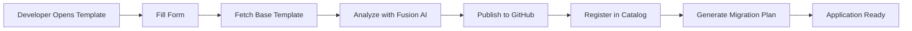

# IBM Fusion AI Templates

This directory contains Backstage Software Templates for creating applications with IBM Fusion AI capabilities.

## What are Software Templates?

Software Templates in Backstage (Red Hat Developer Hub) are self-service tools that allow developers to quickly create new projects, components, or services following organizational best practices. They provide a guided, form-based interface for generating code scaffolding.

## Available Templates

### `fusion-ai-template.yaml`

**Purpose**: Create new applications with integrated IBM Fusion AI capabilities and modernization tools.

**Use Case**: This template is used when developers want to:
- Create a new application with AI-powered features
- Modernize legacy applications to cloud-native architectures
- Generate code using IBM watsonx and Granite models
- Set up projects with built-in AI capabilities

### Template Features

#### 1. **Application Information**
- Define application name, description, and owner
- Integrates with Backstage catalog for ownership tracking

#### 2. **AI/ML Configuration**
Choose from multiple AI models:
- **WatsonX** - General purpose AI model
- **Granite Code** - Specialized for code generation
- **Granite Chat** - Conversational AI capabilities

Select AI capabilities:
- ✅ Code generation
- ✅ Code review
- ✅ Documentation generation
- ✅ Test generation
- ✅ Code refactoring

#### 3. **Application Modernization**
Transform legacy applications:
- **Source Types**: Monolith, Legacy Java, Legacy .NET, Mainframe
- **Target Platforms**: OpenShift, Kubernetes, Cloud Native Microservices
- Automatic migration plan generation

#### 4. **Repository Integration**
- Automatically creates GitHub/GitHub Enterprise repositories
- Generates `catalog-info.yaml` for Backstage catalog
- Sets up CI/CD pipelines

## How It Works

### Template Workflow



### Custom Scaffolder Actions

The template uses custom Fusion AI scaffolder actions:

1. **`fusion:analyze-application`**
   - Analyzes the application structure
   - Applies AI capabilities based on selection
   - Generates AI-powered code suggestions

2. **`fusion:generate-migration-plan`**
   - Creates modernization roadmap
   - Identifies refactoring opportunities
   - Generates deployment configurations

## Using the Template

### 1. Access in Developer Hub

Once deployed, the template appears in the Developer Hub:

1. Navigate to **Create** → **Choose a template**
2. Find **"IBM Fusion AI Application"** template
3. Click **Choose** to start

### 2. Fill Out the Form

**Step 1: Application Information**
```yaml
Name: my-fusion-app
Description: AI-powered customer service application
Owner: platform-team
```

**Step 2: AI/ML Configuration**
```yaml
Enable AI Features: ✓
AI Model: watsonx
AI Capabilities:
  ✓ code-generation
  ✓ code-review
  ✓ documentation
```

**Step 3: Application Modernization** (Optional)
```yaml
Enable Modernization Tools: ✓
Source Type: Legacy Java Application
Target Platform: Red Hat OpenShift
```

**Step 4: Repository Configuration**
```yaml
Repository: github.com/my-org/my-fusion-app
```

### 3. Template Execution

The template will:
1. ✅ Generate application scaffolding
2. ✅ Configure AI model integration
3. ✅ Create GitHub repository
4. ✅ Register component in catalog
5. ✅ Generate modernization plan (if enabled)

### 4. Access Your Application

After completion, you'll receive links to:
- 📦 **GitHub Repository** - Your new application code
- 📚 **Catalog Entry** - Component in Developer Hub catalog
- 🔄 **Migration Plan** - Modernization roadmap (if applicable)

## Deploying the Template

### Option 1: Manual Deployment

```bash
# Copy template to Developer Hub
oc create configmap fusion-ai-template \
  --from-file=template.yaml=templates/fusion-ai-template.yaml \
  -n fusion-dev-hub

# Register in catalog
# Add to app-config.yaml:
catalog:
  locations:
    - type: file
      target: /templates/fusion-ai-template.yaml
```

### Option 2: Automatic Deployment (Recommended)

The template is automatically deployed when you enable Fusion AI features in your Helm values:

```yaml
developerHub:
  fusion:
    enabled: true  # Automatically includes templates
```

## Customizing the Template

### Add Custom Parameters

Edit `fusion-ai-template.yaml` to add new parameters:

```yaml
parameters:
  - title: Custom Configuration
    properties:
      customField:
        title: My Custom Field
        type: string
        description: Custom configuration option
```

### Add Custom Actions

Define new scaffolder actions in the `steps` section:

```yaml
steps:
  - id: custom-action
    name: My Custom Action
    action: custom:my-action
    input:
      param: ${{ parameters.customField }}
```

### Modify Output Links

Customize the output links shown after template execution:

```yaml
output:
  links:
    - title: Custom Dashboard
      url: https://dashboard.example.com/${{ parameters.name }}
    - title: Documentation
      url: https://docs.example.com
```

## Template Structure

```
templates/
├── fusion-ai-template.yaml    # Main template definition
├── README.md                  # This file
└── skeleton/                  # Template scaffolding (optional)
    ├── catalog-info.yaml      # Backstage catalog metadata
    ├── src/                   # Application source code
    ├── .github/               # CI/CD workflows
    └── README.md              # Generated project README
```

## Best Practices

### 1. **Keep Templates Simple**
- Focus on common use cases
- Provide sensible defaults
- Make advanced options optional

### 2. **Use Validation**
- Add input validation for parameters
- Provide helpful error messages
- Use regex patterns for names

### 3. **Document Everything**
- Add descriptions to all parameters
- Include examples in help text
- Provide links to documentation

### 4. **Test Thoroughly**
- Test all parameter combinations
- Verify generated code compiles
- Check catalog registration works

## Troubleshooting

### Template Not Appearing

**Issue**: Template doesn't show in the Create page

**Solution**:
```bash
# Check if template is registered
oc get configmap fusion-ai-template -n fusion-dev-hub

# Check Developer Hub logs
oc logs -n fusion-dev-hub -l app.kubernetes.io/name=backstage
```

### Scaffolder Action Fails

**Issue**: Custom action `fusion:analyze-application` fails

**Solution**:
- Verify Fusion AI backend is running
- Check API credentials are configured
- Review scaffolder action logs

### Repository Creation Fails

**Issue**: GitHub repository creation fails

**Solution**:
- Verify GitHub token is configured
- Check token has `repo` scope
- Ensure organization access is granted

## Additional Resources

- [Backstage Software Templates Documentation](https://backstage.io/docs/features/software-templates/)
- [Creating Custom Scaffolder Actions](https://backstage.io/docs/features/software-templates/writing-custom-actions)
- [IBM Fusion AI Documentation](../docs/README.md)
- [Adding Self-Service Templates](../docs/adding-self-service-templates.md)

## Contributing

To add new templates:

1. Create a new YAML file in `templates/`
2. Follow the Backstage template schema
3. Test the template thoroughly
4. Update this README
5. Submit a pull request

---

**Made with Bob** 🤖