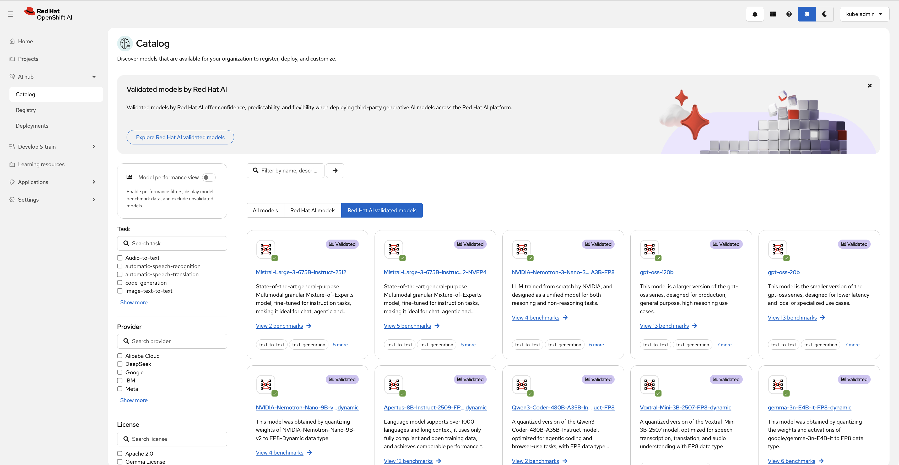
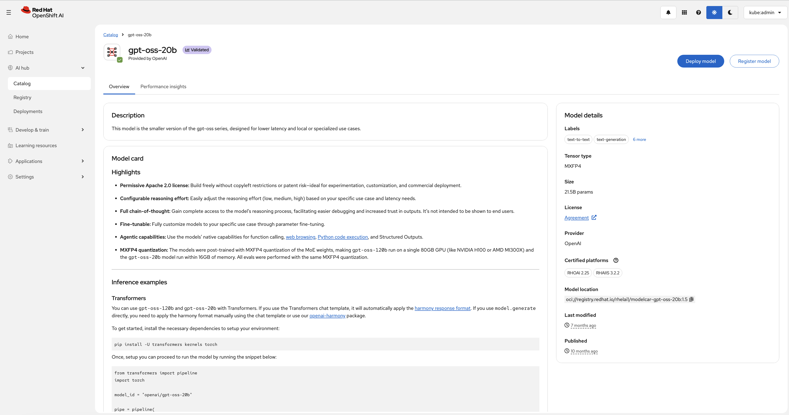
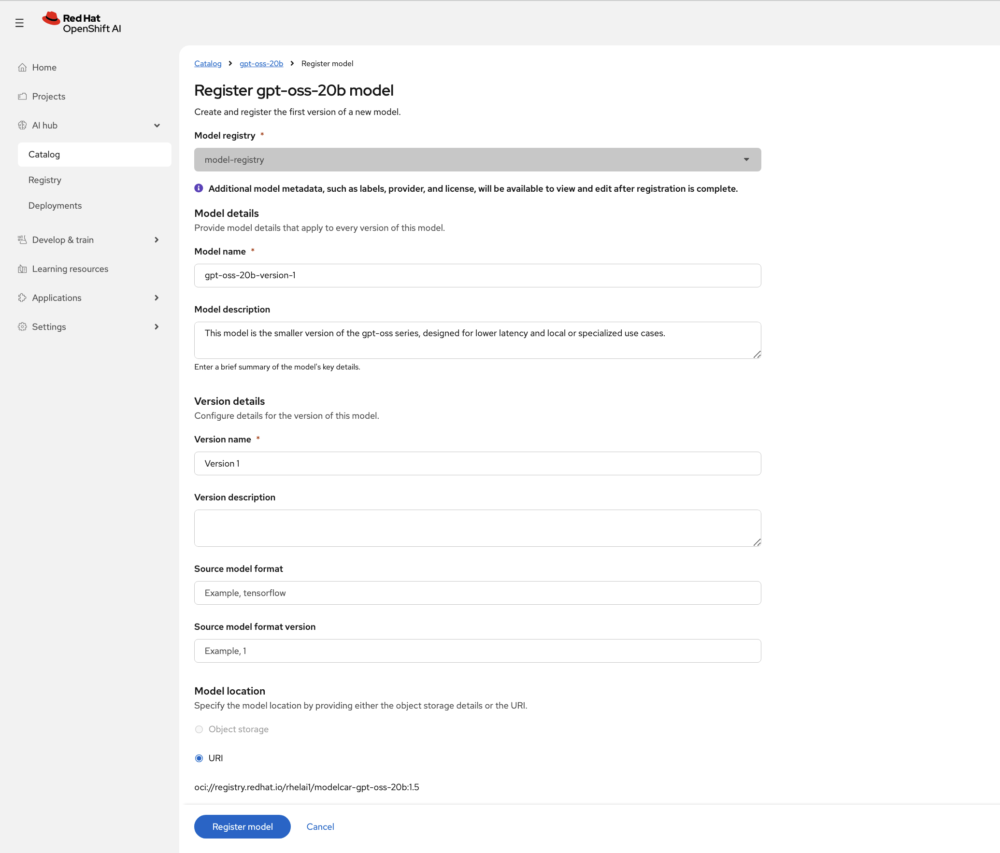
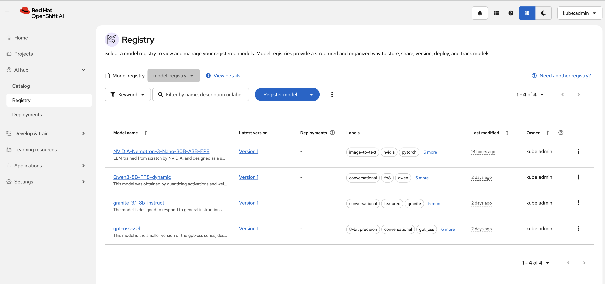

# Registering a Model from the Model Catalog

## Overview

The OpenShift AI Model Catalog provides access to curated foundation models that can be registered into a Model Registry for lifecycle management and deployment.

## Prerequisites

- OpenShift AI is installed and accessible.
- A Model Registry has been created.
- You have permissions to access the Model Catalog and Model Registry.

## Register a Model

1. From the OpenShift AI dashboard, navigate to **AI Hub → Catalog**.
2. Browse or search for the model you want to use from the different model catalogs.

3. Select the desired model to view its details, including:
   - Model description
   - Model card
   - Provider information
   - License details
   - Model location (OCI URI)
   
4. Click **Register model**.
5. In the registration form:
   - Select the target **Model Registry**.
   - Review or update the **Model Name**.
   - Optionally provide a **Model Description**.
   - Specify the **Version Name** and optional **Version Description**.
   - Optionally provide the source model format and version.
   - Verify the model URI that is automatically populated from the catalog entry.
   
6. Click **Register model** to create the model entry and its initial version in the selected registry.

## Verify Registration

1. Navigate to **AI Hub → Registry**.
2. Open the selected Model Registry.
3. Verify that the newly registered model is listed.
4. Confirm that the model version and associated metadata were created successfully.

## Example

The following example registers the **granite-8b-code-instruct** model from the Model Catalog:

| Field            | Value                                                                     |
| ---------------- | ------------------------------------------------------------------------- |
| **Model Registry** | `model-registry`                                                          |
| **Model Name**     | `granite-8b-code-instruct`                                                |
| **Version Name**   | `Version 1`                                                               |
| **Model Location** | `oci://registry.redhat.io/rhelai/modelcar-granite-8b-code-instruct:1.4.0` |

**Result:** After registration, the model becomes available in the Model Registry and can be deployed using a supported model serving runtime.

## Next Steps

Once your model is registered, you can:
- **Deploy the model as a service** - See [Deploying Model Services](../03-model-deployment/DEPLOYING_MODEL_SERVICES.md) for detailed deployment instructions
- Configure monitoring and rate limiting for the deployed model
- Manage model versions and lifecycle in the Model Registry