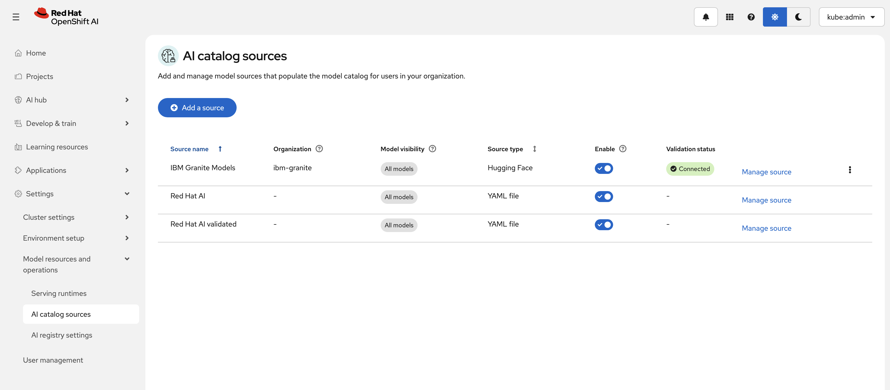

# Adding a Model Catalog Source

## Overview

Model Catalog Sources allow administrators to make additional model repositories available in the OpenShift AI Catalog. After a catalog source is added and synchronized, users can discover, evaluate, register, and deploy models directly from the Catalog UI.

## Prerequisites

- You are logged in to the OpenShift AI dashboard with administrator privileges.
- The AI Hub component is enabled.
- You have access to the catalog source location (for example, a Hugging Face organization or a custom catalog YAML file).

## Create a New Catalog Source

1. In the OpenShift AI dashboard, navigate to:
   
   **Settings → Model resources and operations → AI catalog sources**
   
   

2. Click **Add source**.

3. Select the catalog source type:
   
   **Option 1: Hugging Face Repository**
   - Enter the Hugging Face organization name (for example, `ibm-granite` or `meta-llama`).
   
   **Option 2: Custom YAML Catalog**
   - Upload a catalog YAML file or paste the YAML content directly into the editor.

4. Configure the catalog source details:
   - **Name** – Friendly name displayed in the Catalog UI.
   - **Description** (optional).
   - **Visibility settings** – Control which models from the source are available to users.
   
   

5. Click **Add**.

6. Wait for the synchronization to complete.
   

## Verify the Catalog Source

1. Navigate to **AI Hub → Catalog**.
2. Verify that the newly added catalog source appears in the list of available providers.
3. Search for models from the newly added source.
4. Open a model card to confirm the model metadata and registration options are available.

## Example

The following example adds **IBM Granite models** from Hugging Face:

| Field          | Value                     |
| -------------- | ------------------------- |
| **Source Type**  | Hugging Face Repository   |
| **Name**         | IBM Granite Models        |
| **Organization** | `ibm-granite`             |

**Result:** After synchronization, IBM Granite models become available in the AI Hub Catalog for discovery and registration.

