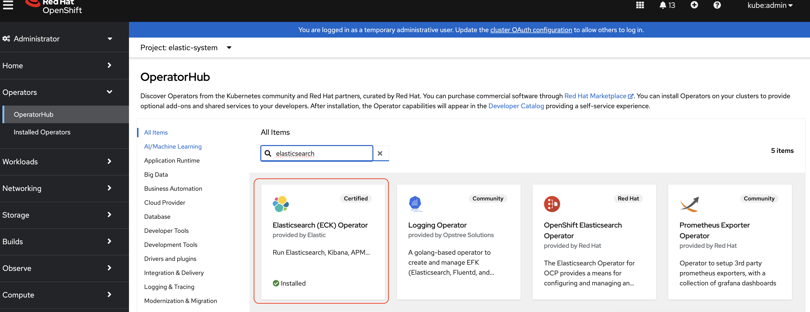

# Using Elasticsearch Fusion Recipe
Backup and restore demonstration of Elasticsearch (ECK) application using Fusion Recipes assumes
1. The Elastic Cloud on Kubernetes (ECK) operator has been installed in a specific namespace via the OperatorHub.
2. Two Custom Resources (CRs) have been created
    - An Elasticsearch Cluster
    - A Kibana instance



**Note:** This [recipe](elasticsearch-operator-based-backup-restore.yaml) is verified for 2.16.1 and 3.0.0 of elasticsearch operator.

## Backup Prerequisites
1. Install jq
    #### For Mac
    ```
        brew install jq
    ```
    #### For Linux
    ```
        sudo apt update
        sudo apt install jq
    ```
2. ECK operator is installed either on HUB or SPOKE.    


## Backup
1. Clone [this](https://github.com/IBM/storage-fusion.git) repository in you local computer to use the pre-backup script.

   cd to `elasticsearch/operator-based`

2. Run the pre-backup script on the cluster where the Elasticsearch application is present and follow along the prompts.
    ```
      ./scripts/pre-backup.sh 
    ```
3. Apply the recipe 
    ```
      oc apply -f elasticsearch-operator-based-recipe.yaml
    ```

4. On HUB cluster

    a. From Fusion Console, create backup policy (fbp) specifying the frequency for backups

    b. From Fusion Console, associate the backup policy to the Elasticsearch application. 

    c. Retrieve the Policy Assignment Name:

        `oc get fpa -n ibm-spectrum-fusion-ns -o custom-columns=NAME:.metadata.name --no-headers`

    d.  Update policy assignments (fpa) with recipe name and namespace

        `oc -n ibm-spectrum-fusion-ns patch fpa <policy-assignment-name> --type merge -p '{"spec":{"recipe":{"name":"elasticsearch-operator-based-backup-restore-recipe", "namespace":"ibm-spectrum-fusion-ns"}}}'`
        ```
        recipe:
            name: elasticsearch-operator-based-backup-restore-recipe
            namespace: ibm-spectrum-fusion-ns
        ```
    e. Start backup from Fusion Console.

## Restore Prerequisite

1. Run the pre-restore script on the target cluster
    ```
      ./scripts/pre-restore.sh 
    ```

## Restore
1. Start the restore from Fusion Console (HUB)
2. If you want to restore without PVCs, then they can use below custom restore (CR), like below
    ```
    apiVersion: data-protection.isf.ibm.com/v1alpha1
    kind: Restore
    metadata:
    name: <custom restore name>
    namespace: <restore CR namespace>
    spec:
    backup: <backup job name>
    targetCluster: [<target cluster name>]     # optional for same cluster
    skipExistingPVC: true
    ```