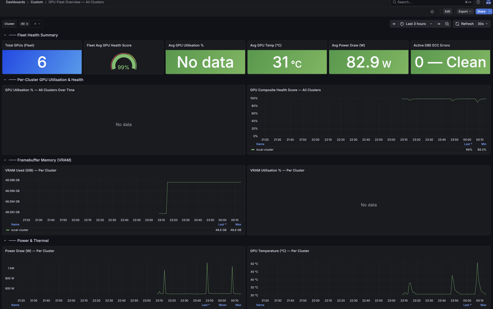

# Multi-Cluster ACM Observability Setup Guide

This guide provides concise, step-by-step instructions to enable multi-cluster observability for NVIDIA GPUs and IBM Storage Fusion across OpenShift clusters managed by **Red Hat Advanced Cluster Management (ACM)**.

For upstream reference and Fusion fleet dashboard specifications, see the [IBM Storage Fusion Multi-Cluster ACM Documentation](https://github.com/IBM/storage-fusion/blob/master/grafana-dashboards/multi-cluster/ACM/2.12.1/README.md).

---

## Architecture Overview

```
Managed Clusters (A, B, ... N)
├── NVIDIA GPU Operator (DCGM Exporter)
├── IBM Storage Fusion & ODF Services
└── OpenShift User Workload Monitoring (UWM)
         │
         ▼
endpoint-observability-operator (Managed Cluster)
         │  Pushes metrics allowed by Custom Allowlist ConfigMap
         ▼
Thanos Receive (ACM Hub Cluster: open-cluster-management-observability)
         │  Attaches cluster="<cluster-name>" label
         ▼
ACM Observability Grafana (Hub Cluster)
├── GPU Fleet Overview (gpu-fleet-acm-dashboard.yaml)
└── IBM Storage Fusion Fleet (ibm-fusion-fleet-dashboard-2.12.1.yaml)
```

---

## Dashboard Visuals

### GPU Fleet Overview — Fleet Health Summary & VRAM


### GPU Fleet Overview — ECC Memory, Compute & Predictive Risk


---

## Prerequisites

Before starting, verify the prerequisites on both the Hub and Managed clusters.

### 1. Hub Cluster Prerequisites
- **Red Hat Advanced Cluster Management (ACM)** (v2.8+ / v2.12+) installed.
- **MultiClusterObservability (MCO)** enabled and `Ready`:
  ```bash
  oc get multiclusterobservability observability -o jsonpath='{.status.conditions[*].type}'
  ```
  *(Expected: `Ready`)*
- S3/Object Storage configured for Thanos metric storage in `open-cluster-management-observability`.

### 2. Managed Cluster Prerequisites
- Managed clusters imported and in `Ready` status in ACM:
  ```bash
  oc get managedclusters
  ```
- **NVIDIA GPU Operator** running on GPU nodes:
  ```bash
  oc get pods -n nvidia-gpu-operator
  ```
- **OpenShift User Workload Monitoring (UWM)** enabled (see Step 1).

---

## Step-by-Step Setup

### Step 1: Enable User Workload Monitoring (Managed Clusters)

Run on each **managed cluster** to allow Prometheus to scrape user workloads (DCGM Exporter):

```bash
cat <<EOF | oc apply -f -
apiVersion: v1
kind: ConfigMap
metadata:
  name: cluster-monitoring-config
  namespace: openshift-monitoring
data:
  config.yaml: |
    enableUserWorkload: true
EOF
```

Verify monitoring pods are running:
```bash
oc get pods -n openshift-user-workload-monitoring
```

---

### Step 2: Apply Metrics Custom Allowlist (ACM Hub Cluster)

ACM Observability requires an allowlist to collect custom metrics from managed clusters.

Apply [`configmap-observability-metrics-custom-allowlist.yaml`](configmap-observability-metrics-custom-allowlist.yaml:1) on the **Hub cluster**:

```bash
oc apply -f configmap-observability-metrics-custom-allowlist.yaml
```

Verify allowlist deployment:
```bash
oc get configmap observability-metrics-custom-allowlist -n open-cluster-management-observability
```

> **Note:** This allowlist configures standard DCGM metrics (`DCGM_FI_*`), composite health scoring rules, IBM Storage Fusion metrics (`isf_*`), ODF/GDP health (`ceph_health_status`, `gpfs_health_status`), and network switch telemetry.

---

### Step 3: Deploy Dashboards into ACM Grafana (ACM Hub Cluster)

ACM Grafana automatically discovers and syncs dashboards labelled with `grafana-custom-dashboard: "true"`.

Deploy the GPU Fleet and Fusion Fleet dashboards on the **Hub cluster**:

```bash
# 1. Deploy GPU Fleet Overview Dashboard
oc apply -f gpu-fleet-acm-dashboard.yaml

# 2. Deploy IBM Storage Fusion Fleet Dashboard (Optional/Recommended)
oc apply -f ibm-fusion-fleet-dashboard-2.12.1.yaml
```

Verify dashboard loader sidecar sync:
```bash
oc -n open-cluster-management-observability logs \
  $(oc -n open-cluster-management-observability get pods -l app=grafana -o jsonpath='{.items[0].metadata.name}') \
  -c grafana-dashboard-loader | grep "gpu-fleet"
```

---

### Step 4: Verify Multi-Cluster Metrics Flow (ACM Hub Cluster)

Verify that metrics are being scraped and forwarded to Thanos on the **Hub cluster**:

```bash
# Verify GPU metric reception:
oc -n open-cluster-management-observability exec \
  $(oc -n open-cluster-management-observability get pods -l app.kubernetes.io/name=thanos-query -o jsonpath='{.items[0].metadata.name}') -- \
  sh -c 'curl -s "http://localhost:9090/api/v1/query?query=count(DCGM_FI_DEV_GPU_TEMP)"'

# List reporting cluster names:
oc -n open-cluster-management-observability exec \
  $(oc -n open-cluster-management-observability get pods -l app.kubernetes.io/name=thanos-query -o jsonpath='{.items[0].metadata.name}') -- \
  sh -c 'curl -s "http://localhost:9090/api/v1/label/cluster/values"'
```

---

## Adding New Clusters to the Fleet

When importing a new cluster into ACM:
1. Ensure the **NVIDIA GPU Operator** is installed.
2. Enable **User Workload Monitoring** (Step 1).
3. Import the cluster via ACM Console (**Infrastructure → Clusters → Import cluster**).
4. ACM endpoint collector automatically syncs the allowlist and streams telemetry to the Hub Thanos.
5. The new cluster appears automatically in the **Cluster** dropdown on the GPU Fleet Dashboard.

---

## Troubleshooting

| Symptom | Cause | Solution |
|---|---|---|
| **"No data"** on all panels | Allowlist missing or not applied | Re-apply [`configmap-observability-metrics-custom-allowlist.yaml`](configmap-observability-metrics-custom-allowlist.yaml:1) in `open-cluster-management-observability`. |
| Dashboard not appearing in Grafana | Missing ConfigMap label | Ensure ConfigMap has label `grafana-custom-dashboard: "true"` and check `grafana-dashboard-loader` logs. |
| Managed cluster not in dropdown | UWM disabled or DCGM not running | Ensure `enableUserWorkload: true` is set and DCGM exporter pods are running on the managed cluster. |
| Thanos returns empty result | Metric sync delay | Wait 2–5 minutes for `endpoint-observability-operator` to reconcile allowlist changes. |

---

## Reference Links
- [IBM Storage Fusion Multi-Cluster ACM Official Guide](https://github.com/IBM/storage-fusion/blob/master/grafana-dashboards/multi-cluster/ACM/2.12.1/README.md)
- [Red Hat ACM Enabling Observability Service](https://docs.redhat.com/en/documentation/red_hat_advanced_cluster_management_for_kubernetes/2.12/html/observability/enabling-observability-service)
- [NVIDIA GPU Operator on OpenShift](https://docs.nvidia.com/datacenter/cloud-native/openshift/latest/index.html)
