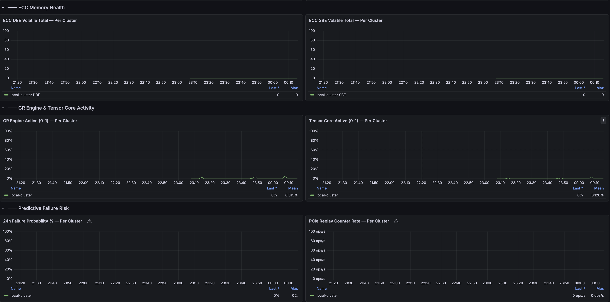
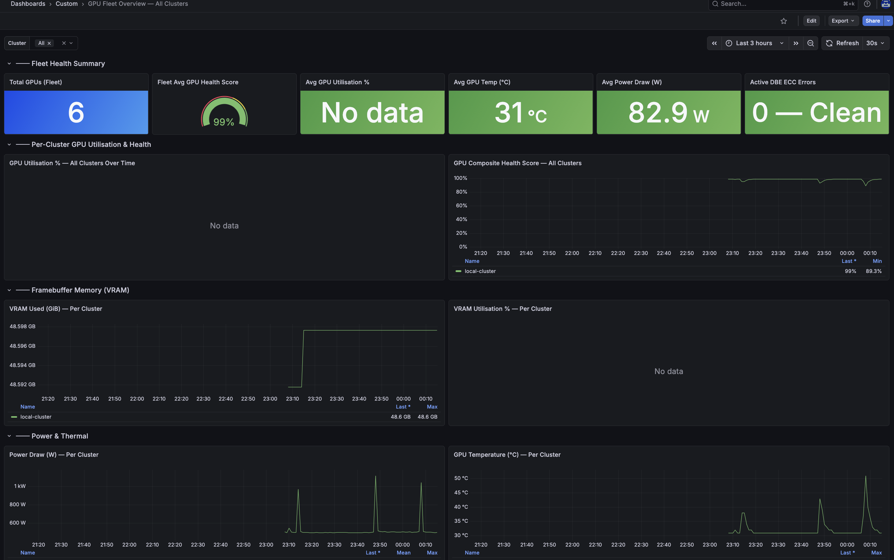

# GPU Multi-Cluster Observability — ACM 2.14

Grafana dashboard for NVIDIA GPU monitoring across all OpenShift clusters managed by **Red Hat Advanced Cluster Management (ACM)**, powered by DCGM metrics forwarded to the ACM hub via the observability stack.

---

## Architecture

```
Managed Clusters
├── NVIDIA GPU Operator (DCGM Exporter :9400)
└── OpenShift User Workload Monitoring
         │  metrics-collector pushes allowed metrics
         ▼
Thanos Receive (ACM Hub — open-cluster-management-observability)
         │  attaches cluster="<name>" label
         ▼
ACM Grafana → GPU Overview — All Clusters
```

---

## Dashboard Visuals

### Health Summary & VRAM


### ECC Memory & Predictive Risk


---

## Prerequisites

**Hub cluster:**
- ACM (v2.8+) with MultiClusterObservability enabled and `Ready`
- S3/Object Storage configured for Thanos

**Each managed cluster:**
- Cluster imported and `Available` in ACM
- NVIDIA GPU Operator running (`nvidia-dcgm-exporter` pods in `Running` state)
- User Workload Monitoring enabled (see Step 1)

---

## Setup

### Step 1 — Enable User Workload Monitoring (each managed cluster)

```bash
cat <<EOF | oc apply -f -
apiVersion: v1
kind: ConfigMap
metadata:
  name: cluster-monitoring-config
  namespace: openshift-monitoring
data:
  config.yaml: |
    enableUserWorkload: true
EOF
```

### Step 2 — Apply Metrics Allowlist (hub cluster)

```bash
oc apply -f configmap-observability-metrics-custom-allowlist.yaml
```

### Step 3 — Deploy Dashboard (hub cluster)

```bash
oc apply -f gpu-fleet-acm-dashboard.yaml
```

The dashboard appears under **Dashboards → Custom → "GPU Overview — All Clusters"** in ACM Grafana within ~60 seconds.

### Step 4 — Verify Metrics Flow (hub cluster)

```bash
# Count GPU time-series per cluster
oc -n open-cluster-management-observability exec \
  $(oc -n open-cluster-management-observability get pods \
    -l app.kubernetes.io/name=thanos-query \
    -o jsonpath='{.items[0].metadata.name}') -- \
  curl -s 'http://localhost:9090/api/v1/query?query=count+by(cluster)(DCGM_FI_DEV_GPU_TEMP)'
```

---

## Adding a New Cluster

1. Import the cluster into ACM (**Infrastructure → Clusters → Import cluster**).
2. Ensure NVIDIA GPU Operator and User Workload Monitoring are enabled (Steps 1 above).
3. ACM automatically deploys the metrics-collector and begins forwarding DCGM metrics.
4. The cluster appears in the **Cluster** dropdown automatically — no dashboard changes needed.

---

## Troubleshooting

| Symptom | Cause | Fix |
|---|---|---|
| All panels blank | Allowlist not applied | Re-apply `configmap-observability-metrics-custom-allowlist.yaml` |
| Dashboard missing in Grafana | Label missing | Confirm ConfigMap has `grafana-custom-dashboard: "true"` |
| Cluster not in dropdown | UWM disabled or DCGM not running | Enable UWM and verify `nvidia-dcgm-exporter` pods are `Running` |
| Data delay after import | Metrics sync interval | Wait 2–5 minutes for the first scrape cycle |

---

## Reference

- [ACM Observability](https://docs.redhat.com/en/documentation/red_hat_advanced_cluster_management_for_kubernetes/2.14/html-single/observability/index)
- [NVIDIA GPU Operator on OpenShift](https://docs.nvidia.com/datacenter/cloud-native/gpu-operator/latest/openshift/contents.html)
- [NVIDIA DCGM Exporter](https://github.com/NVIDIA/dcgm-exporter)
