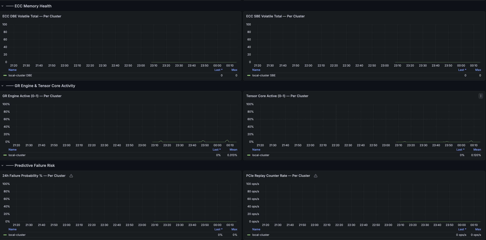

# GPU Monitoring — Grafana Dashboards

Grafana dashboards for NVIDIA GPU observability on IBM Storage Fusion and OpenShift.
They cover composite health scoring, predictive failure detection, ECC memory errors, power & thermal
telemetry, and forensic SRE deep-dive analysis — all powered by standard NVIDIA DCGM metrics scraped
through Prometheus.

There are **two deployment modes**:

| Mode | Best for | Dashboard file |
|---|---|---|
| **Single-cluster** | One OpenShift cluster, Grafana runs locally | `gpu-grafana-cluster-overview.json` / `gpu-grafana-sre-dashboard.json` |
| **ACM Fleet (multi-cluster)** | Many OpenShift clusters, central Grafana via ACM Observability | `gpu-fleet-acm-dashboard.yaml` |

---

## Table of Contents

1. [Architecture — ACM Fleet vs Single-Cluster](#architecture--acm-fleet-vs-single-cluster)
2. [Dashboards Overview](#dashboards-overview)
3. [Prerequisites](#prerequisites)
4. [Single-Cluster Setup Guide](#single-cluster-setup-guide)
5. [ACM Fleet Setup Guide](#acm-fleet-setup-guide)
6. [Adding More Clusters to the ACM Fleet](#adding-more-clusters-to-the-acm-fleet)
7. [Dashboard Variable Reference](#dashboard-variable-reference)
8. [Metrics & Documentation Reference](#metrics--documentation-reference)

---

## Architecture — ACM Fleet vs Single-Cluster

### Single-cluster flow

```
GPU Node (DCGM Exporter)
        │  scrapes every 30 s
        ▼
OpenShift Prometheus (User Workload Monitoring)
        │  queries
        ▼
Grafana (local) ──► gpu-grafana-cluster-overview.json
                └──► gpu-grafana-sre-dashboard.json
```

### ACM Fleet flow (multi-cluster)

```
Managed Cluster A                Managed Cluster B           Managed Cluster N
GPU Node (DCGM Exporter)         GPU Node (DCGM Exporter)    GPU Node (DCGM Exporter)
        │                                │                           │
OpenShift Prometheus (UWM)       OpenShift Prometheus (UWM)  OpenShift Prometheus (UWM)
        │                                │                           │
        └────────────────────────────────┴───────────────────────────┘
                                         │
                    ACM Observability Metrics Collector
                    (endpoint-observability-operator on each managed cluster)
                                         │  forwards allowed metrics
                                         ▼
                    Thanos Receive (Hub cluster)
                    namespace: open-cluster-management-observability
                                         │
                    Thanos Store + Query Frontend
                                         │  label added: cluster="<cluster-name>"
                                         │  datasource UID: 000000001 (Observatorium)
                                         ▼
                    ACM Observability Grafana (Hub cluster)
                    namespace: open-cluster-management-observability
                                         │
                                         ▼
                    gpu-fleet-acm-dashboard.yaml  (ConfigMap → auto-synced)
                    Dashboard: "GPU Fleet Overview — All Clusters"
```

**Key points about the ACM flow:**

- Metrics flow **from each managed cluster → Hub Thanos** automatically once the cluster joins ACM Observability.
- ACM Thanos attaches a **`cluster` label** to every metric, set to the managed cluster's name (e.g., `local-cluster`, `prod-gpu-east`). All dashboard queries use `{cluster=~"$cluster"}` to filter.
- The ACM Grafana uses a pre-provisioned datasource named **`Observatorium`** (hardcoded UID `000000001`). There is no user-facing datasource picker — this is by design.
- The dashboard is delivered as a **ConfigMap** and auto-synced by the `grafana-dashboard-loader` sidecar every 30 seconds. You never need to import it manually.
- The **metrics allowlist** (`configmap-observability-metrics-custom-allowlist.yaml`) controls which DCGM metrics are forwarded from managed clusters to the Hub Thanos. If a metric is missing from the allowlist, it will not appear in the Fleet dashboard.

---

## Dashboards Overview

### 1. GPU Fleet Overview — All Clusters (ACM) (`gpu-fleet-acm-dashboard.yaml`)

**Dashboard UID:** `gpu-fleet-acm-v1`
**Location in Grafana:** Dashboards → Custom → GPU Fleet Overview — All Clusters

**What it shows:**

| Section | Panels |
|---|---|
| Fleet Health Summary | Total GPUs across all clusters, Fleet Avg Health Score (gauge), Avg GPU Utilisation %, Avg GPU Temp (°C), Avg Power Draw (W), Active DBE ECC Errors |
| Per-Cluster GPU Utilisation & Health | GPU Utilisation % over time per cluster, GPU Composite Health Score per cluster |
| Framebuffer Memory (VRAM) | VRAM Used (GiB) per cluster, VRAM Utilisation % per cluster |
| Power & Thermal | Power Draw (W) per cluster, GPU Temperature (°C) per cluster |
| ECC Memory Health | DBE Volatile Total per cluster, SBE Volatile Total per cluster |
| GR Engine & Tensor Core Activity | GR Engine Active (0–1) per cluster, Tensor Core Active (0–1) per cluster |
| Predictive Failure Risk | 24h Failure Probability % per cluster, PCIe Replay Counter Rate per cluster |

The **Cluster** dropdown at the top filters all panels. It defaults to **All** (all managed clusters shown together). Select a single cluster to narrow down.

#### GPU Fleet Overview — Fleet Health Summary & VRAM



#### GPU Fleet Overview — ECC, GR Engine & Predictive Failure Risk


---

### 2. GPU Cluster Overview (`gpu-grafana-cluster-overview.json`)

**Dashboard UID:** `gpu-cluster-overview-v8`

**What it shows:**
- A fleet-wide health summary across every GPU node in your cluster
- 24-hour predictive failure risk scores for each GPU
- Active GPU alerts grouped by severity (critical, warning, node-level)
- Workload blast-radius impact — which pods are running on at-risk or failed GPU nodes
- Fleet time-series trends for utilisation, temperature, power draw, and composite health

#### GPU Cluster Overview — Fleet Health & Alert Summary


#### GPU Cluster Overview — Fleet Time-Series Trends & Workload Impact


---

### 3. GPU SRE Deep Dive (`gpu-grafana-sre-dashboard.json`)

**Dashboard UID:** `gpu-sre-dashboard-v5`

**What it shows:**
- Per-GPU composite health score and 24 h failure probability gauge
- Power draw, power instability (15-minute rolling standard deviation), and thermal throttle events
- GPU compute utilisation, GR engine activity, Tensor Core activity, and DRAM bandwidth
- VRAM used / free / utilisation percentage over time
- ECC memory health — row remap failures, uncorrectable/correctable remapped rows, SBE/DBE volatile counts
- PCIe replay counter rate and TX/RX bandwidth
- Platform health indicators: DCGM scrape success rate, exporter targets, and active alert list

#### GPU SRE Deep Dive — GPU Utilisation & VRAM Panels


#### GPU SRE Deep Dive — Power, Compute & VRAM Memory Telemetry


#### GPU SRE Deep Dive — PCIe Bus, ECC Memory Health & Platform Status


#### GPU SRE Deep Dive — Predictive Analysis & Composite Health


---

## Prerequisites

### Common prerequisites (both modes)

#### 1. NVIDIA GPU Operator and DCGM Exporter must be running

The dashboards rely on NVIDIA DCGM (Data Center GPU Manager) metrics.
The GPU Operator automatically installs DCGM Exporter on every GPU node,
which exposes hundreds of GPU counters in Prometheus format.

**Check on each cluster:**

```bash
oc get pods -n nvidia-gpu-operator
```

All pods should be `Running`. If not installed:
[NVIDIA GPU Operator on OpenShift](https://docs.nvidia.com/datacenter/cloud-native/openshift/latest/index.html)

---

#### 2. OpenShift User Workload Monitoring must be enabled

**Check:**

```bash
oc get configmap cluster-monitoring-config -n openshift-monitoring -o yaml | grep enableUserWorkload
```

**Enable if missing:**

```bash
cat <<EOF | oc apply -f -
apiVersion: v1
kind: ConfigMap
metadata:
  name: cluster-monitoring-config
  namespace: openshift-monitoring
data:
  config.yaml: |
    enableUserWorkload: true
EOF
```

---

### Additional prerequisites for ACM Fleet mode

#### 3. Red Hat Advanced Cluster Management (ACM) must be installed on the Hub cluster

ACM is what joins managed clusters together and routes their metrics to a central Thanos store.

**Check:**

```bash
oc get multiclusterhub -A
```

#### 4. ACM Observability must be enabled

ACM Observability is a separate component that must be explicitly enabled. It creates the
`open-cluster-management-observability` namespace and deploys Thanos (receive, store, query)
and a central Grafana instance.

**Check:**

```bash
oc get multiclusterobservability observability -o jsonpath='{.status.conditions[*].type}'
```

You should see `Ready`. If Observability is not enabled, follow:
[Enabling observability](https://docs.redhat.com/en/documentation/red_hat_advanced_cluster_management_for_kubernetes/2.12/html/observability/enabling-observability-service)

#### 5. The metrics allowlist ConfigMap must be applied

ACM Observability only forwards metrics that are on an allowlist. The file
`configmap-observability-metrics-custom-allowlist.yaml` in this repository adds all required
DCGM metrics to that allowlist.

**Apply it once on the Hub cluster:**

```bash
oc apply -f configmap-observability-metrics-custom-allowlist.yaml
```

**Check it was accepted:**

```bash
oc get configmap observability-metrics-custom-allowlist \
  -n open-cluster-management-observability -o yaml
```

Without this step, Thanos will have no DCGM metrics and every panel in the Fleet dashboard
will show "No data".

---

## Single-Cluster Setup Guide

Follow these steps in order on the target OpenShift cluster.

### Step 1 — Apply Prometheus alert and recording rules

```bash
oc apply -f gpu-rules.yaml -n openshift-monitoring
```

Wait 30 seconds then verify:

```bash
oc get prometheusrule gpu-alert-rules -n openshift-monitoring
```

### Step 2 — Configure a Prometheus datasource in Grafana

1. Open Grafana → **Connections** → **Data sources** → **Add data source** → **Prometheus**.
2. URL: `https://thanos-querier.openshift-monitoring.svc.cluster.local:9091`
3. Under **Auth**: enable **Skip TLS verify** (or add the cluster CA) and add a Bearer token.
4. Click **Save & test**.

### Step 3 — Import the GPU Cluster Overview dashboard

1. Grafana → **Dashboards** → **New** → **Import**.
2. Upload `gpu-grafana-cluster-overview.json`.
3. Map the `${datasource}` field to your Prometheus datasource.
4. Click **Import**.

### Step 4 — Import the GPU SRE Deep Dive dashboard

1. Grafana → **Dashboards** → **New** → **Import**.
2. Upload `gpu-grafana-sre-dashboard.json`.
3. Map the `${datasource}` field to your Prometheus datasource.
4. Click **Import**.

### Step 5 — Set time range and verify variables

- Default: **Last 3 hours**, auto-refresh **30s**.
- Use the **Node** and **GPU (UUID)** dropdowns to filter the SRE Deep Dive dashboard.
- If dropdowns are empty: check DCGM Exporter pods and wait 2–3 minutes for Prometheus to scrape.

---

## ACM Fleet Setup Guide

All steps run on the **Hub cluster** unless stated otherwise.

### Step 1 — Apply the metrics allowlist

This tells ACM Observability which DCGM metrics to forward from every managed cluster:

```bash
oc apply -f configmap-observability-metrics-custom-allowlist.yaml
```

Verify:

```bash
oc get configmap observability-metrics-custom-allowlist \
  -n open-cluster-management-observability
```

### Step 2 — Deploy the Fleet dashboard ConfigMap

The dashboard is delivered as a Kubernetes ConfigMap. The ACM Grafana sidecar
(`grafana-dashboard-loader`) automatically detects ConfigMaps with the label
`grafana-custom-dashboard: "true"` in the `open-cluster-management-observability`
namespace and syncs them into Grafana every 30 seconds.

```bash
oc apply -f gpu-fleet-acm-dashboard.yaml
```

You do **not** need to log in to Grafana or use the Import UI. The dashboard appears
automatically under **Dashboards → Custom → GPU Fleet Overview — All Clusters**.

**Verify the sync happened:**

```bash
oc -n open-cluster-management-observability logs \
  $(oc -n open-cluster-management-observability get pods -l app=grafana \
    -o jsonpath='{.items[0].metadata.name}') \
  -c grafana-dashboard-loader | grep "gpu-fleet"
```

You should see:

```
"syncing dashboard" name="gpu-fleet-acm-dashboard"
"dashboard created/updated successfully" name="gpu-fleet-acm-dashboard" uid="gpu-fleet-acm-v1"
```

### Step 3 — Verify managed clusters are sending GPU metrics

Confirm GPU metrics are arriving in Thanos from your clusters:

```bash
oc -n open-cluster-management-observability exec \
  $(oc -n open-cluster-management-observability get pods -l app.kubernetes.io/name=thanos-query \
    -o jsonpath='{.items[0].metadata.name}') -- \
  sh -c 'curl -s "http://localhost:9090/api/v1/query?query=count(DCGM_FI_DEV_GPU_TEMP)"'
```

A result with a non-zero count confirms metrics are flowing. Also check which clusters
are contributing:

```bash
oc -n open-cluster-management-observability exec \
  $(oc -n open-cluster-management-observability get pods -l app.kubernetes.io/name=thanos-query \
    -o jsonpath='{.items[0].metadata.name}') -- \
  sh -c 'curl -s "http://localhost:9090/api/v1/label/cluster/values"'
```

Each cluster name listed here will appear as a selectable option in the
**Cluster** dropdown on the Fleet dashboard.

### Step 4 — Open the Fleet dashboard in Grafana

Navigate to the ACM Grafana instance:

```
https://grafana-open-cluster-management-observability.apps.<hub-cluster-domain>/
```

Go to **Dashboards → Custom → GPU Fleet Overview — All Clusters**.

- The **Cluster** filter at the top defaults to **All** (shows data from every managed cluster).
- Select a specific cluster to isolate its panels.
- No datasource dropdown is shown — the dashboard is pre-wired to the `Observatorium`
  datasource (UID `000000001`) provisioned automatically by ACM Observability.

---

## Adding More Clusters to the ACM Fleet

When a new OpenShift cluster with GPU nodes is added to ACM, follow these steps to have
its GPU metrics appear in the Fleet dashboard automatically.

### On the new managed cluster

**Step A — Install the GPU Operator and DCGM Exporter**

```bash
# On the new managed cluster
oc get pods -n nvidia-gpu-operator
```

All pods must be `Running` before metrics will be available.

**Step B — Enable User Workload Monitoring**

```bash
cat <<EOF | oc apply -f -
apiVersion: v1
kind: ConfigMap
metadata:
  name: cluster-monitoring-config
  namespace: openshift-monitoring
data:
  config.yaml: |
    enableUserWorkload: true
EOF
```

### On the Hub cluster

**Step C — Import the new cluster into ACM**

If the cluster is not already managed by ACM, create a `ManagedCluster` resource or use
the ACM Console (**Infrastructure → Clusters → Import cluster**).

Once the cluster status shows `Ready`, the ACM Observability endpoint agent
(`endpoint-observability-operator`) is automatically deployed onto it.

**Step D — Verify the allowlist is still in place**

The allowlist ConfigMap only needs to be applied once. Confirm it is present:

```bash
oc get configmap observability-metrics-custom-allowlist \
  -n open-cluster-management-observability
```

If it is missing (e.g., after a Hub cluster rebuild), reapply:

```bash
oc apply -f configmap-observability-metrics-custom-allowlist.yaml
```

**Step E — Confirm the new cluster's metrics are flowing**

Wait 2–5 minutes after the cluster joins ACM Observability, then query Thanos:

```bash
oc -n open-cluster-management-observability exec \
  $(oc -n open-cluster-management-observability get pods -l app.kubernetes.io/name=thanos-query \
    -o jsonpath='{.items[0].metadata.name}') -- \
  sh -c 'curl -s "http://localhost:9090/api/v1/label/cluster/values"'
```

The new cluster name should appear in the returned list. As soon as it does, the
**Cluster** dropdown in the Fleet dashboard will include it — **no dashboard changes
are needed**.

### How the `cluster` label works

ACM Observability's metrics collector on each managed cluster attaches a `cluster` label
(set to the ACM cluster name) to every forwarded metric before shipping it to Hub Thanos.
The Fleet dashboard's `cluster` template variable runs:

```promql
label_values(DCGM_FI_DEV_GPU_TEMP, cluster)
```

This dynamically discovers all cluster names at dashboard load time. New clusters appear
automatically without any modification to the dashboard ConfigMap.

---

## What Was Done — Summary of Changes

This section documents the fixes applied to make the ACM Fleet dashboard work, for
anyone troubleshooting a similar "No data" issue in the future.

### Problem 1 — Wrong cluster label (`_id` instead of `cluster`)

**Symptom:** Every panel showed "No data". The `Cluster` variable dropdown was empty.

**Root cause:** ACM Observability attaches the label `cluster` (not `_id`) to all
forwarded metrics. The original dashboard used `{cluster=~"$cluster"}` correctly, but
an incorrect fix changed it to `{_id=~"$cluster"}`. The label `_id` does not exist on
DCGM metrics in this environment — confirmed by directly querying Thanos:

```bash
# Returns empty — _id label does not exist
curl "http://localhost:9090/api/v1/label/_id/values"
# {"status":"success","data":[]}

# Returns "local-cluster" — this is the correct label
curl "http://localhost:9090/api/v1/label/cluster/values"
# {"status":"success","data":["local-cluster"]}
```

**Fix:** All 19 queries in the dashboard use `{cluster=~"$cluster"}` and `by (cluster)`.

---

### Problem 2 — `${datasource}` variable not resolved (primary "No data" cause)

**Symptom:** Even with the correct `cluster` label, all panels showed "No data" and no
datasource dropdown appeared in the Grafana toolbar.

**Root cause:** The original dashboard defined a `"type": "datasource"` template variable
that generated a `${datasource}` picker. ACM Observability's Grafana deployment **suppresses
this variable type** — it never renders the dropdown and the variable value stays blank.
With `"uid": "${datasource}"` unresolved, every panel query and the `cluster` variable query
all targeted a blank datasource, returning nothing.

ACM Grafana pre-provisions exactly one datasource via the `grafana-datasources` secret:

```yaml
name: Observatorium
type: prometheus
uid: "000000001"
url: http://rbac-query-proxy.open-cluster-management-observability.svc.cluster.local:8080
isDefault: true
```

**Fix:** Removed the `datasource` template variable entirely. Every panel and the `cluster`
query variable now use `"uid": "000000001"` directly. The dashboard works immediately on
load with no user interaction.

---

### Problem 3 — Non-existent recording rules

**Symptom:** Panels for "Fleet Avg GPU Health Score", "GPU Composite Health Score", and
"24h Failure Probability %" were empty even when other panels had data.

**Root cause:** Those panels referenced recording rules (`gpu:health_score:composite`,
`gpu:failure_probability:24h`) that exist in `gpu-rules.yaml` for the single-cluster
deployment but are **not deployed in the ACM Observability environment**.

**Fix:** Both recording rules were replaced with equivalent inline PromQL expressions
using only base DCGM metrics that are confirmed present in Thanos:

```promql
# Health score (0–100): starts at 100, deducted by temperature excess and ECC errors
clamp_max(
  100
  - clamp_max(avg by (cluster) (DCGM_FI_DEV_GPU_TEMP) - 30, 70)
  - clamp_min(avg by (cluster) (DCGM_FI_DEV_ECC_DBE_VOL_TOTAL), 0) * 10
, 100)

# Failure probability (0–100%): weighted score from over-temp, ECC DBE increases, PCIe replays
clamp_max(clamp_min(
  clamp_min(avg by (cluster) (DCGM_FI_DEV_GPU_TEMP) - 80, 0) * 2
  + clamp_min(avg by (cluster) (increase(DCGM_FI_DEV_ECC_DBE_VOL_TOTAL[24h])), 0) * 5
  + clamp_min(avg by (cluster) (rate(DCGM_FI_DEV_PCIE_REPLAY_COUNTER[1h])) * 3600, 0)
, 0), 100)
```

---

## Dashboard Variable Reference

### ACM Fleet dashboard variables

| Variable | Type | Purpose |
|---|---|---|
| `cluster` | Query | Lists all cluster names from `label_values(DCGM_FI_DEV_GPU_TEMP, cluster)`. Populated automatically as clusters join ACM. Multi-select with **All** default. |

The datasource is **not** a variable — it is hardcoded to UID `000000001` (`Observatorium`).

### Single-cluster dashboard variables

| Variable | Type | Purpose |
|---|---|---|
| `datasource` | Datasource picker | Selects the Prometheus source for all queries |
| `hostname` | Query | Lists all GPU node hostnames scraped by DCGM |
| `UUID` | Query | Lists all GPU UUIDs on the selected node |
| `ocp_console` | Constant | Base URL of the OpenShift Console (used for deep-link icons) |

To set `ocp_console`: Dashboard **Settings** → **Variables** → **ocp_console** → set to
`https://console-openshift-console.apps.<your-cluster-domain>` → **Update** → **Save dashboard**.

---

## Metrics & Documentation Reference

All telemetry is collected from standard NVIDIA DCGM metrics (`DCGM_FI_DEV_*` and `DCGM_FI_PROF_*`).

| Metric | What it measures |
|---|---|
| `DCGM_FI_DEV_GPU_UTIL` | GPU compute utilisation (%) |
| `DCGM_FI_DEV_GPU_TEMP` | GPU die temperature (°C) |
| `DCGM_FI_DEV_POWER_USAGE` | Instantaneous power draw (W) |
| `DCGM_FI_DEV_FB_USED` | Framebuffer (VRAM) used (MiB) |
| `DCGM_FI_DEV_FB_TOTAL` | Total framebuffer capacity (MiB) |
| `DCGM_FI_DEV_ECC_DBE_VOL_TOTAL` | Double-bit ECC errors (volatile, since last reset) |
| `DCGM_FI_DEV_ECC_SBE_VOL_TOTAL` | Single-bit ECC errors (volatile, since last reset) |
| `DCGM_FI_DEV_PCIE_REPLAY_COUNTER` | PCIe replay counter (indicates bus errors) |
| `DCGM_FI_PROF_GR_ENGINE_ACTIVE` | Graphics/compute engine activity (0–1) |
| `DCGM_FI_PROF_PIPE_TENSOR_ACTIVE` | Tensor core pipeline activity (0–1) |
| `DCGM_FI_PROF_DRAM_ACTIVE` | DRAM memory interface activity (0–1) |

For full metric descriptions and IBM Storage Fusion runbooks, refer to the
[IBM Storage Fusion Documentation](https://www.ibm.com/docs/en/storage-fusion).
