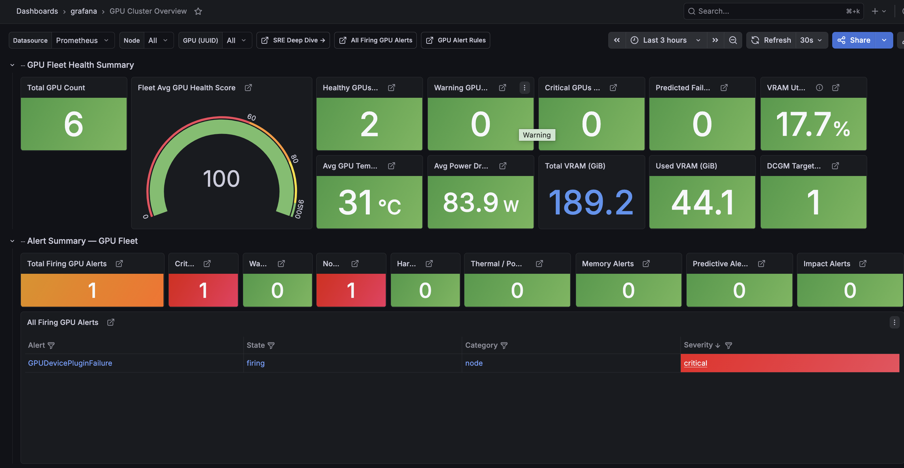
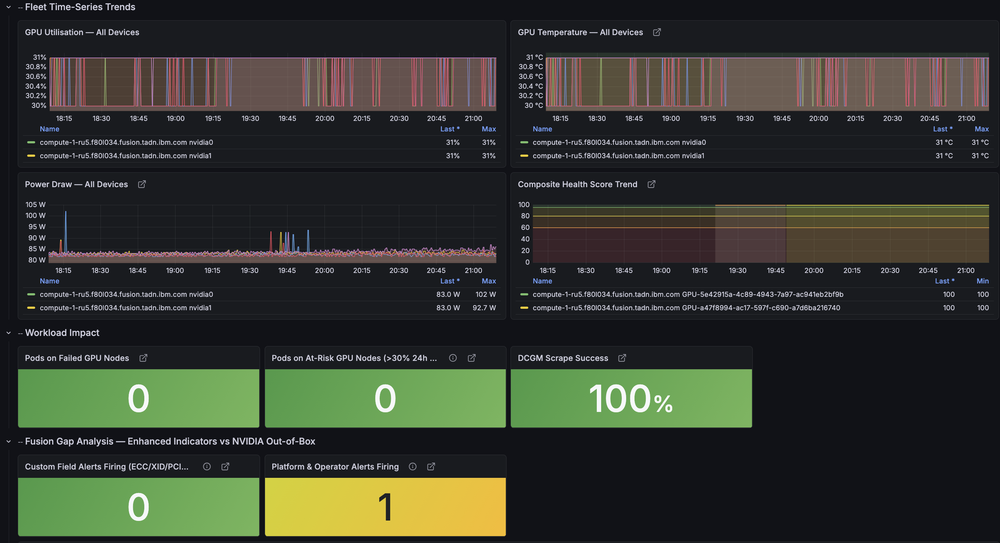
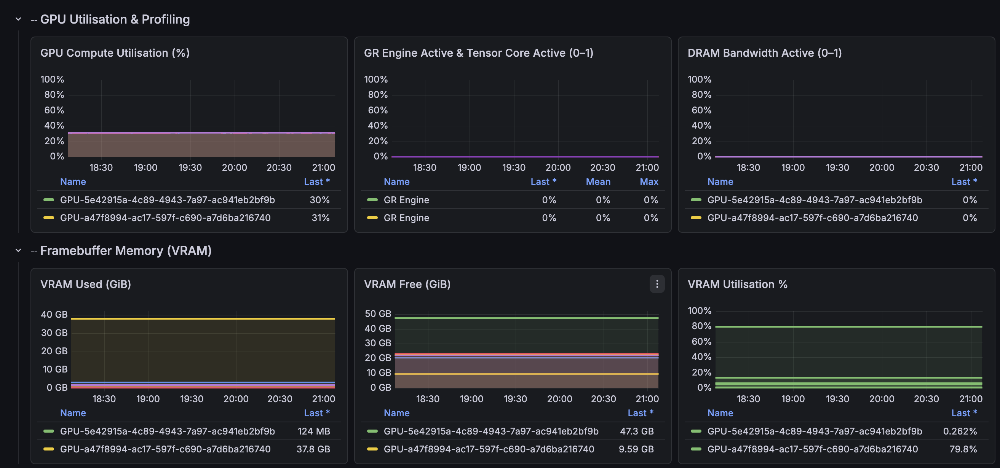
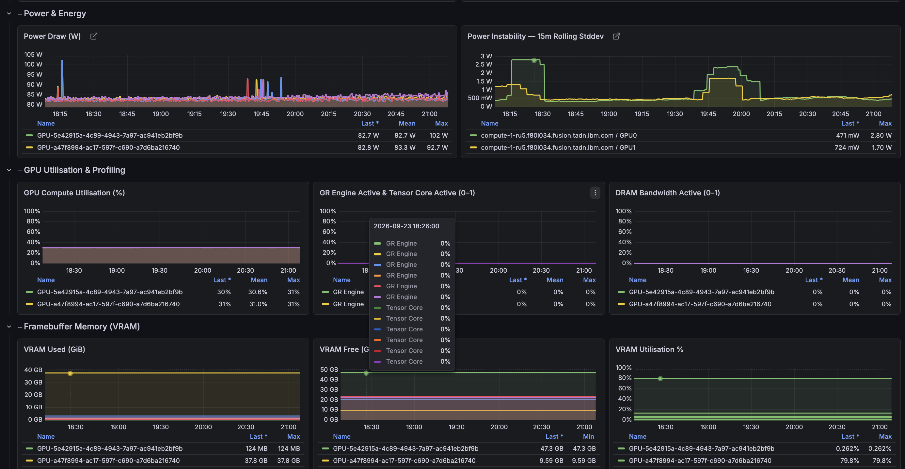
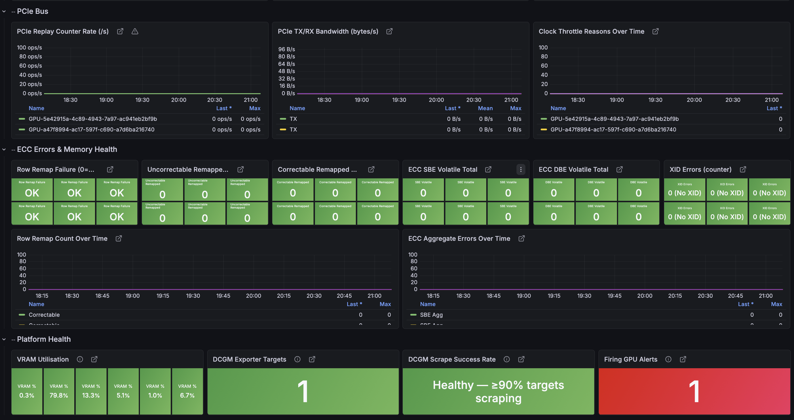
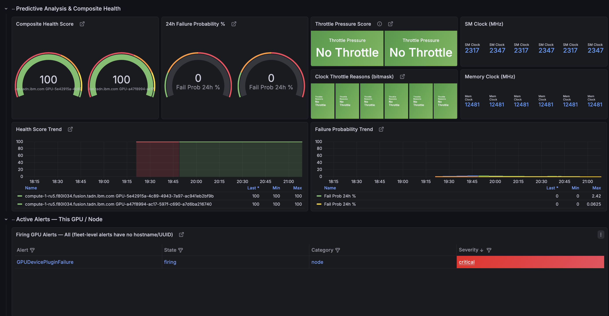

# GPU Monitoring — Single-Cluster Grafana Dashboards

Grafana dashboards for NVIDIA GPU observability on OpenShift and IBM Storage Fusion within a single cluster. Powered by standard NVIDIA DCGM metrics scraped via Prometheus and User Workload Monitoring (UWM).

For multi-cluster setups using Red Hat Advanced Cluster Management (ACM), refer to [README-MULTI-CLUSTER-ACM.md](README-MULTI-CLUSTER-ACM.md).

---

## Architecture Overview

```
GPU Node (NVIDIA DCGM Exporter)
        │
        │ Scraped every 30s
        ▼
OpenShift User Workload Monitoring (UWM / Thanos Querier)
Namespace: openshift-user-workload-monitoring / openshift-monitoring
        │
        ├── Prometheus Alert & Recording Rules (gpu-rules.yaml)
        │
        ▼
Grafana (Local OpenShift Instance)
        ├── GPU Cluster Overview (gpu-cluster-overview-cr.yaml / .json)
        └── GPU SRE Deep Dive (gpu-sre-deep-dive-cr.yaml / .json)
```

---

## Dashboards & Visuals

### 1. GPU Cluster Overview
Provides high-level health summaries, predictive failure risk, active alerts, workload attribution (blast radius), and time-series trends across all GPU nodes in the cluster.

**Files:** `gpu-cluster-overview-cr.yaml` (Grafana Operator) / `gpu-grafana-cluster-overview.json` (UI Import)  
**Dashboard UID:** `gpu-cluster-overview-v8`

#### Fleet Health & Alert Summary


#### Fleet Time-Series Trends & Workload Impact


---

### 2. GPU SRE Deep Dive
Provides granular per-GPU forensic telemetry: power instability (15-min rolling standard deviation), thermal throttle events, Tensor/GR engine activity, VRAM utilization, ECC memory row remapping, and PCIe replay counters.

**Files:** `gpu-sre-deep-dive-cr.yaml` (Grafana Operator) / `gpu-grafana-sre-dashboard.json` (UI Import)  
**Dashboard UID:** `gpu-sre-dashboard-v5`

#### GPU Utilisation & VRAM Telemetry


#### Power, Compute & Memory Telemetry


#### PCIe Bus, ECC Memory Health & Platform Status


#### Predictive Analysis & Composite Health


---

## Prerequisites

Before deploying the dashboards, ensure the following components are configured:

### 1. NVIDIA GPU Operator & DCGM Exporter
The NVIDIA GPU Operator must be installed and running on GPU-equipped worker nodes.

Verify:
```bash
oc get pods -n nvidia-gpu-operator
```
*(All pods including `nvidia-dcgm-exporter` must be in `Running` status.)*

### 2. OpenShift User Workload Monitoring (UWM)
User Workload Monitoring must be enabled to allow Prometheus to scrape DCGM exporter metrics.

Verify:
```bash
oc get configmap cluster-monitoring-config -n openshift-monitoring -o yaml | grep enableUserWorkload
```

Enable if not present:
```bash
cat <<EOF | oc apply -f -
apiVersion: v1
kind: ConfigMap
metadata:
  name: cluster-monitoring-config
  namespace: openshift-monitoring
data:
  config.yaml: |
    enableUserWorkload: true
EOF
```

### 3. Grafana Instance
Ensure either:
- **Grafana Operator** is installed with an active `Grafana` CR instance (recommended for CR deployment), OR
- A standalone Grafana instance is accessible (for JSON manual import).

---

## Step-by-Step Setup Guide

### Step 1: Apply Prometheus Alert and Recording Rules

Apply the recording rules for composite health scoring, failure probability, and GPU alerting:

```bash
oc apply -f gpu-rules.yaml -n openshift-monitoring
```

Verify that the `PrometheusRule` resource is loaded:
```bash
oc get prometheusrule gpu-alert-rules -n openshift-monitoring
```

---

### Step 2: Deploy Dashboards

Choose **Option A** (Grafana Operator CR) or **Option B** (Manual JSON Import).

#### Option A: Deploy via Grafana Operator CR (Recommended)

1. **Verify Grafana instance selector label:**
   ```bash
   oc get grafana -n grafana -o jsonpath='{.items[0].metadata.labels}'
   ```
   *(Ensure `dashboards: grafana-a` matches `spec.instanceSelector.matchLabels` in the CR files).*

2. **Apply Custom Resources:**
   ```bash
   oc apply -f gpu-cluster-overview-cr.yaml
   oc apply -f gpu-sre-deep-dive-cr.yaml
   ```

3. **Verify dashboard creation:**
   ```bash
   oc get grafanadashboard -n grafana
   ```

#### Option B: Manual Import via Grafana UI (JSON)

1. Open Grafana → **Connections** → **Data sources** → **Add data source** → **Prometheus**.
   - **URL:** `https://thanos-querier.openshift-monitoring.svc.cluster.local:9091`
   - **Auth:** Enable **Skip TLS Verify** and configure Bearer Token / OpenShift ServiceAccount token.
   - Click **Save & test**.
2. Go to **Dashboards** → **New** → **Import**.
3. Upload `gpu-grafana-cluster-overview.json` and `gpu-grafana-sre-dashboard.json`.
4. Map `${datasource}` to your Prometheus data source and click **Import**.

---

### Step 3: Configure OpenShift Console Deep-Links (Optional)

Both dashboards support direct links (↗) to OpenShift node and pod console pages:

- **Via CR File:** Update `"query"` and `"current.value"` for the `ocp_console` variable in `gpu-cluster-overview-cr.yaml` and `gpu-sre-deep-dive-cr.yaml` with your cluster URL:
  ```json
  "query": "https://console-openshift-console.apps.<your-cluster-domain>"
  ```
- **Via Grafana UI:** Dashboard **Settings** → **Variables** → `ocp_console` → Set value → **Save dashboard**.

---

## Dashboard Variable Reference

| Variable | Type | Description |
|---|---|---|
| `datasource` | Datasource | Prometheus / Thanos Querier datasource. |
| `hostname` | Query | Filters by GPU worker node hostname (`label_values(DCGM_FI_DEV_GPU_TEMP, hostname)`). |
| `UUID` | Query | Filters by specific GPU UUID on the selected host (`label_values(DCGM_FI_DEV_GPU_TEMP{hostname=~"$hostname"}, UUID)`). |
| `ocp_console` | Constant | Base URL of the OpenShift Web Console for deep links. |

---

## Key Metrics Reference

| Metric | Description |
|---|---|
| `DCGM_FI_DEV_GPU_UTIL` | GPU compute utilization percentage (0–100%). |
| `DCGM_FI_DEV_GPU_TEMP` | GPU core die temperature in Celsius (°C). |
| `DCGM_FI_DEV_POWER_USAGE` | Instantaneous power consumption in Watts (W). |
| `DCGM_FI_DEV_FB_USED` / `DCGM_FI_DEV_FB_FREE` | VRAM Framebuffer memory used / free in MiB. |
| `DCGM_FI_DEV_ECC_DBE_VOL_TOTAL` | Double-bit ECC uncorrectable errors (volatile). |
| `DCGM_FI_DEV_ECC_SBE_VOL_TOTAL` | Single-bit ECC correctable errors (volatile). |
| `DCGM_FI_DEV_PCIE_REPLAY_COUNTER` | PCIe replay counter for tracking bus errors and degraded links. |
| `DCGM_FI_PROF_GR_ENGINE_ACTIVE` | Graphics / compute engine active ratio (0–1). |
| `DCGM_FI_PROF_PIPE_TENSOR_ACTIVE` | Tensor Core pipeline utilization ratio (0–1). |
| `gpu:health_score:composite` | Composite health score (0–100) computed from temperature, throttling, and ECC events. |
| `gpu:failure_probability:24h` | 24-hour predictive failure risk score (0–100%). |
