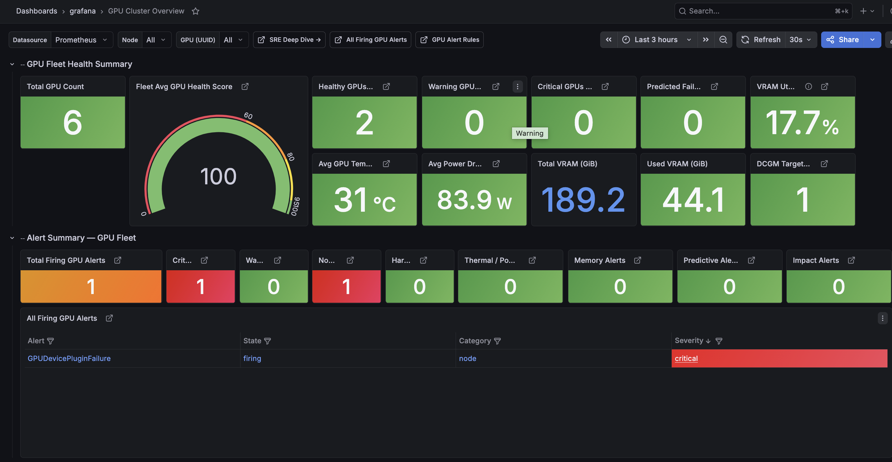
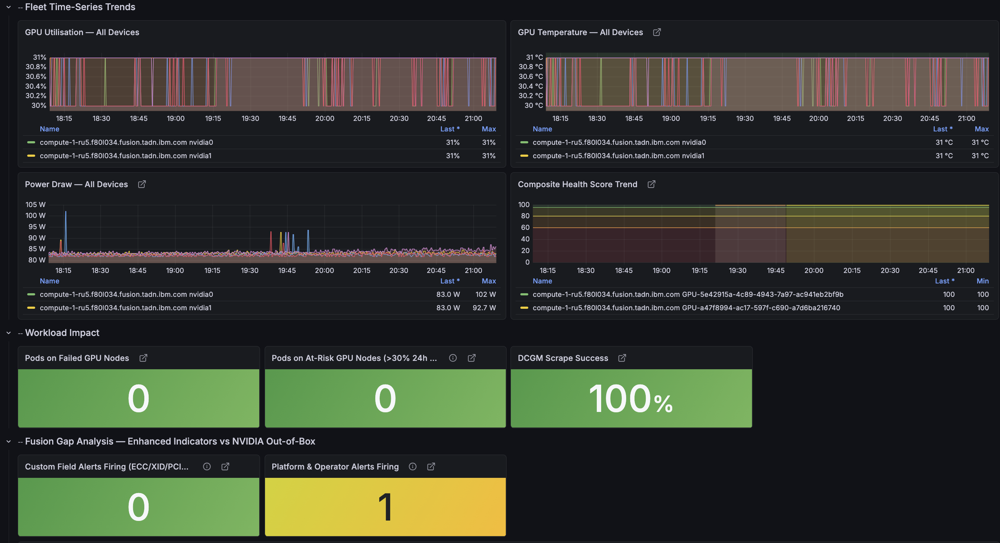
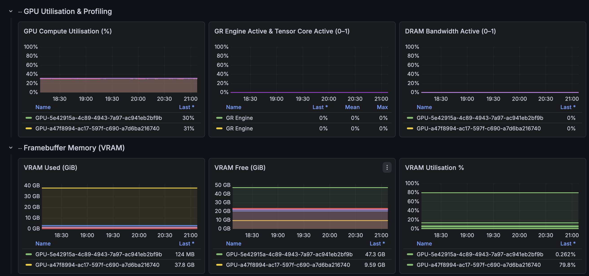
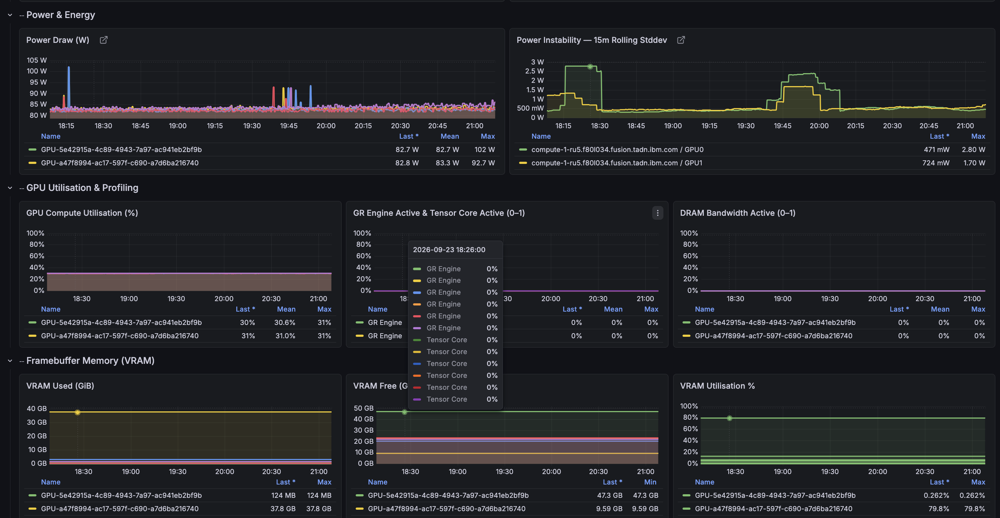
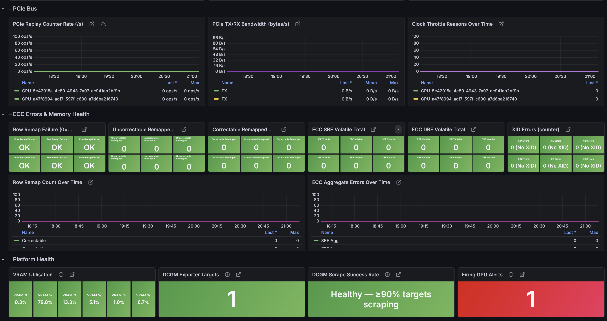
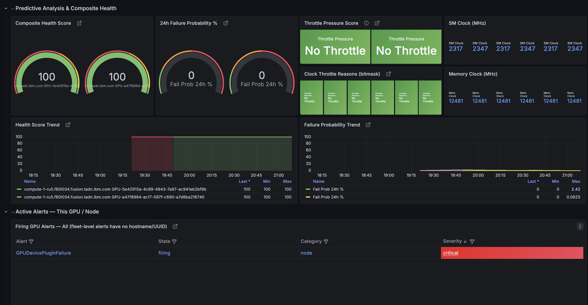

# GPU Monitoring — Single-Cluster Grafana Dashboards

Grafana dashboards for NVIDIA GPU observability on OpenShift within a single cluster, powered by DCGM metrics scraped via Prometheus and User Workload Monitoring (UWM).

For multi-cluster setups using ACM, see [`grafana-dashboards/multi-cluster/ACM/2.14/GPU/README-MULTI-CLUSTER-ACM.md`](../../multi-cluster/ACM/2.14/GPU/README-MULTI-CLUSTER-ACM.md).

---

## Dashboards

### 1. GPU Cluster Overview
High-level health summaries, predictive failure risk, workload attribution, and time-series trends.

**File:** `gpu-grafana-cluster-overview.json`




---

### 2. GPU SRE Deep Dive
Per-GPU forensic telemetry: power instability, thermal throttle, Tensor/GR engine activity, VRAM, ECC row remapping, and PCIe replay counters.

**File:** `gpu-grafana-sre-dashboard.json`






---

## Prerequisites

1. **NVIDIA GPU Operator** (`gpu-operator-certified` v26.7.1+) installed and running on GPU-equipped worker nodes to manage NVIDIA drivers, device plugins, and the DCGM Exporter. See [NVIDIA GPU Operator on OpenShift](https://docs.nvidia.com/datacenter/cloud-native/gpu-operator/latest/openshift/contents.html).
   ```bash
   # Check GPU Operator CSV installation
   oc get csv -n nvidia-gpu-operator -l operators.coreos.com/gpu-operator-certified.nvidia-gpu-operator

   # Check GPU Operator pods and DCGM Exporter daemons
   oc get pods -n nvidia-gpu-operator
   ```
   *(All pods including `nvidia-dcgm-exporter` must be in `Running` status.)*

2. **User Workload Monitoring** enabled to allow Prometheus to scrape DCGM metrics.

   Verify:
   ```bash
   oc get configmap cluster-monitoring-config -n openshift-monitoring -o yaml | grep enableUserWorkload
   ```

   Enable if not present:
   ```bash
   cat <<EOF | oc apply -f -
   apiVersion: v1
   kind: ConfigMap
   metadata:
     name: cluster-monitoring-config
     namespace: openshift-monitoring
   data:
     config.yaml: |
       enableUserWorkload: true
   EOF
   ```

3. **Grafana Operator** installed with an active `Grafana` CR instance, or a standalone Grafana instance accessible with a Prometheus data source pointed at the Thanos Querier:
   - URL: `https://thanos-querier.openshift-monitoring.svc.cluster.local:9091`

---

## Setup

1. Go to **Dashboards → New → Import** in Grafana.
2. Upload `gpu-grafana-cluster-overview.json` and `gpu-grafana-sre-dashboard.json`.
3. Map `${datasource}` to your Prometheus/Thanos data source and click **Import**.

---

## Reference

- [IBM Storage Fusion documentation](https://www.ibm.com/docs/en/storage-fusion)
- [NVIDIA GPU Operator on OpenShift](https://docs.nvidia.com/datacenter/cloud-native/gpu-operator/latest/openshift/contents.html)
- [NVIDIA DCGM Exporter](https://github.com/NVIDIA/dcgm-exporter)
- [NVIDIA DCGM Metrics & Architecture](https://docs.nvidia.com/datacenter/dcgm/latest/dcgm-user-guide/feature-overview.html)
- [Grafana Operator on OpenShift](https://grafana-operator.github.io/grafana-operator/)
- [OpenShift User Workload Monitoring](https://docs.openshift.com/container-platform/latest/monitoring/enabling-monitoring-for-user-defined-projects.html)
