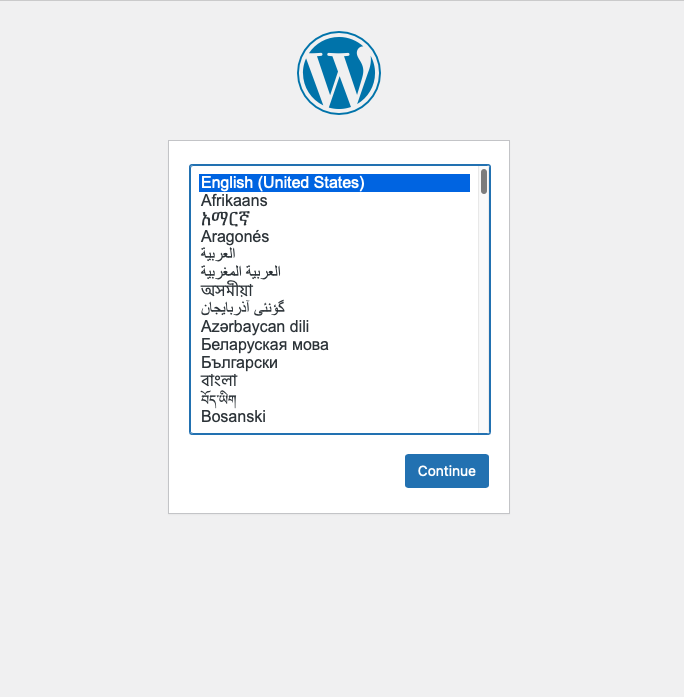
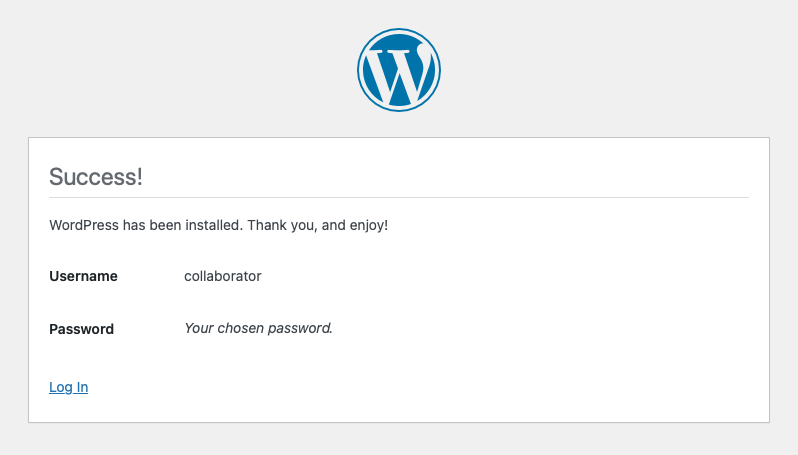
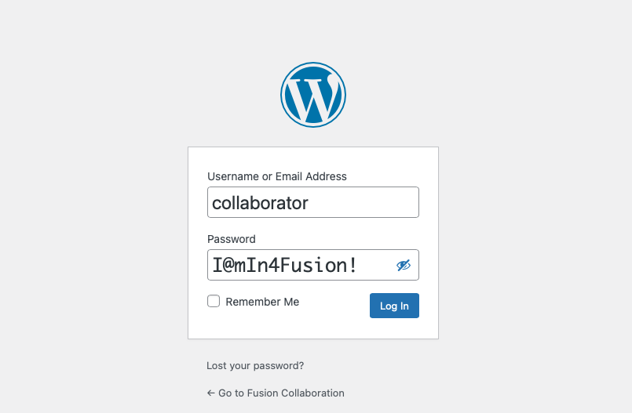
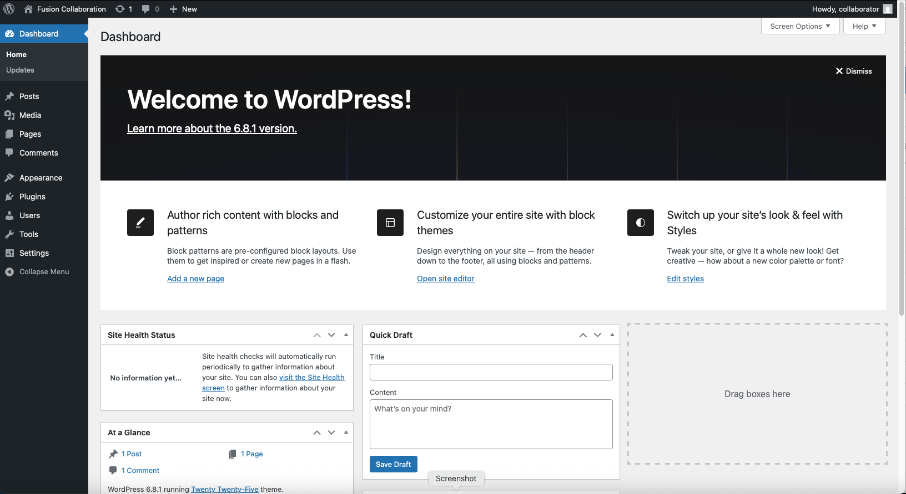
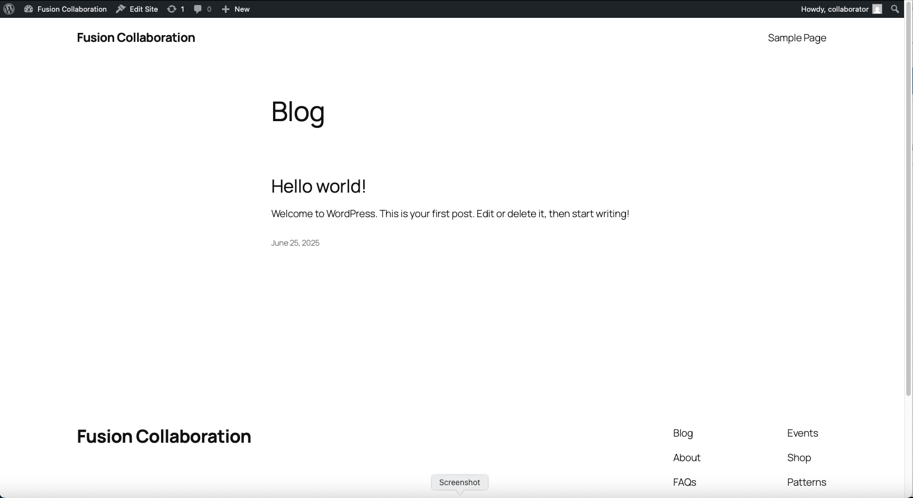

<!-- This should be the location of the title of the repository, normally the short name -->
# Fusion Collaboration Reference Application
The Fusion Collaboration reference application is a container-native application built on [WordPress](https://wordpress.org) that provides a common, extendible, multiple tier, multiple volume kubernetes application that can/should be leveraged to demostrate and highlight [IBM Fusion](https://www.ibm.com/docs/en/fusion-software/2.10.0) storage and resiliency capabilities and value.

## Architecture and Roadmap
The Fusion Collaboration reference application is essentially a default/out of the box [WordPress 6.8.1](https://github.com/docker-library/wordpress) instance that consists of a UI/API frontend and SQL backend.

The UI/API frontend includes the following Kubernetes resources:
- `wordpress-pvc` PersistentVolumeClaim: Volume to persist wordpress content files
- `fusion-collab` Deployment: `wordpress` image which manages and hosts web interface content 
- `fusion-collab` Service: internal interface to the `fusion-collab` Deployment pod endpoint(s)
- `fusion-collab` Route: external interface to the `fusion-collab` Service

The SQL backend includes the following Kubernetes resources:
- `mysql-pass` Secret: configured credentials to enable the to `fusion-collab` Deployment pod(s) to access the mysql database instance
- `mysql-pvc` PersistentVolumeClaim: Volume to persist `wordpress` database instance and associated tables
- `mysql` Deployment: `mysql` image which provides the `wordpress` database instance implementation 
- `mysql` Service: internal interface to the `mysql` Deployment pod endpoint(s) accessed by the `fusion-collab` Deployment pod(s)

The current architecture is quickly [deployed](#deployment) yet complex enough with the multiple tiers and volumes that it encompasses and requires storage and resiliency orchestration features that begin to mirror customer application requirements.  Additionally, the user interface allows users to generate and validate application functionality and content directly without requiring additional tooling and/or interfaces.

Looking forward, the Fusion Collaboration reference application is highly extendible and scalable.  The [WordPress](https://wordpress.org) editor dashboard, themes and extensive plugin community enables an administrator to quickly generate, manage and/or import an entire web site.  Ideally, future versions of the Fusion Collaboration reference application would be pre-published with [IBM Fusion](https://www.ibm.com/docs/en/fusion-software/2.10.0) Collaboration content, potentially including:
- Details, Tutorials, Links and Status on:
    - Storage and Resiliency Operator Subscriptions
    - Storage Configuration
    - Backup & Restore
    - Regional Disaster Recovery
    - Metro Disaster Recovery
    - Content Aware Storage
- IBM Fusion Blogs
- IBM Fusion Chat

## Deployment
### Scope/Prerequisites/Assertions
The documentation and instructions that follow are scoped to deployment, interaction, validation and resiliency of the Fusion Collaboration reference application.  The consumer must have cluster level/kubeadmin access credentials to the target cluster.  Additionally the consumer must of access to a cluster infrastructure node or workstation with access to the target cluster with `kubectl`/`oc` and `git` installed and be relatively comfortable interacting with the IBM Fusion Hub user interface and executing `kubectl`/`oc` and `git` commands.  

The following Openshift cluster requirements are asserted to have been completed following official Kubernetes and [IBM Fusion](https://www.ibm.com/docs/en/fusion-software/2.10.0) documentation:
- Required ODF/FDF and/or Scale Operator Subscriptions are deployed to the target cluster
- ODF/FDF and/or Scale StorageClasses are configured on/available to the target cluster
- Required IBM Fusion Operator Subscriptions are deployed on the target and hub cluster
- Required IBM Fusion Hub and Agent are deployed, connected and configured with Backup Storage Location and Backup Policy
- Image repository is available or global pull secret is configured with credentials to access/pull the following images from docker image repository
    - `docker.io/library/wordpress:6.8.1-apache`
    - `docker.io/library/mysql:8.0`

### Prepare Target Cluster
Perform the following from a cluster infrastructure node or workstation with access to the target cluster.
**NOTE:** The subsequent sections build upon/leverage the values defined in previous sections.

- Login into target cluster
    ```bash
    CLUSTER_HOST_DOMAIN=<host-domain>
    KUBE_USER=kubeadmin
    KUBE_CREDENTIAL=<kubeadmin-password>
    oc login https://${CLUSTER_HOST_DOMAIN}:6443 -u ${KUBE_USER} -p ${KUBE_CREDENTIAL} --insecure-skip-tls-verify
    ```
- Create target Fusion Collaboration project/namespace
    ```bash
    APPLICATION_NAMESPACE=fusion-collab
    oc new-project ${APPLICATION_NAMESPACE}
    ```
- Retrieve and set block storage class environment variable
    ```bash
    oc get storageclasses 
    ```
    Sample output:
    ```bash
    NAME                                    PROVISIONER                             RECLAIMPOLICY   VOLUMEBINDINGMODE      ALLOWVOLUMEEXPANSION   AGE
    ibm-spectrum-fusion-mgmt-sc             openshift-storage.cephfs.csi.ceph.com   Delete          Immediate              true                   119d
    local-block-sc                          kubernetes.io/no-provisioner            Delete          WaitForFirstConsumer   false                  196d
    ocs-storagecluster-ceph-rbd (default)   openshift-storage.rbd.csi.ceph.com      Delete          Immediate              true                   196d
    ocs-storagecluster-ceph-rgw             openshift-storage.ceph.rook.io/bucket   Delete          Immediate              false                  196d
    ocs-storagecluster-cephfs               openshift-storage.cephfs.csi.ceph.com   Delete          Immediate              true                   196d
    ocs-storagecluster-cephfs-vrg           openshift-storage.cephfs.csi.ceph.com   Delete          Immediate              false                  134d
    openshift-storage.noobaa.io             openshift-storage.noobaa.io/obc         Delete          Immediate              false                  196d
    ```
    Typically choose block storage class defined as `ocs-storagecluster-ceph-rbd` or `ibm-spectrum-fusion-mgmt-sc`
    ```bash
    BLOCK_STORAGE_CLASS=<block-storage-class>
    ```

### Deploy Fusion Collaboration Application
Perform the following from the cluster infrastructure node or workstation with access to the target cluster.
**NOTE:** Create a *working directory* to clone into

- Clone Directory of `storage-fusion` github repository
    ```bash
    WORKING_DIRECTORY=~/github.com
    GIT_BRANCH=master
    mkdir -p ${WORKING_DIRECTORY}
    cd ${WORKING_DIRECTORY}
    git init storage-fusion
    cd storage-fusion
    git remote add -f origin https://github.com/IBM/storage-fusion.git
    git config core.sparseCheckout true
    echo "reference-appilcations/fusion-collab/" >> .git/info/sparse-checkout
    git pull origin ${GIT_BRANCH}
    cd reference-applications/fusion-collab
    ```
- Create kustomization.yaml file

    The following environment variables should be defined in the previous steps before running the following:
    - CLUSTER_HOST_DOMAIN
    - BLOCK_STORAGE_CLASS
    - WORKING_DIRECTORY
    ```bash
    SQL_PASSWORD=mypassword
    cd ${WORKING_DIRECTORY}/storage-fusion/reference-applications/fusion-collab
    envsubst < kustomization-template.yaml > kustomization.yaml
    ```
    If the Linux utility `envsubst` is not available the above environment variables (and SQL_PASSWORD) can be manually substituted by copying the `kustomization-template.yaml` to a new `kustomization.yaml` and directly editing the values in the `kustomization.yaml` file.
- Apply kustomization to the target cluster
    ```bash
    oc kustomize ${WORKING_DIRECTORY}/storage-fusion/reference-applications/fusion-collab | oc apply -f -
    ```
    Expected output:
    ```bash
    secret/mysql-pass-7t7g9k6f85 created
    service/fusion-collab created
    service/mysql created
    persistentvolumeclaim/mysql-pvc created
    persistentvolumeclaim/wordpress-pvc created
    deployment.apps/fusion-collab created
    deployment.apps/mysql created
    route.route.openshift.io/fusion-collab created
    recipe.spp-data-protection.isf.ibm.com/fusion-collab-bnr-recipe created
    ```

**NOTE:** From a kubernetes perspective, the reference application is deployed.  The `wordpress` image/container can take a minute or two to connect to the mysql image/container and create the required `wordpress` database instance and associated tables.  Once complete the `fusion-collab` Route is accessible via browser and additional web content can be generated/managed/reviewed.

- Retrieve the `fusion-collab` Route
    ```bash
    oc get route -n ${APPLICATION_NAMESPACE} fusion-collab
    ```
    Expected output:
    ```bash
    NAME            HOST/PORT                PATH   SERVICES        PORT   TERMINATION   WILDCARD
    fusion-collab   <cluster-host-domain>           fusion-collab   80                   None
    ```

### Manage Content
Perform the following steps from a workstation browser to complete the initialization of the Fusion Collaboration reference application.

- Open browser tab to Fusion Collaboration route
- Select prefered language

    
- Complete and confirm *Welcome* form to initialize Fusion Collaboration

    

    

- Log into Fusion Collaboration

    

- (Optionally) Manage Content via Fusion Collaboration dashboard

    

- (Optionally) Review Content via Fusion Collaboration site

    

## Backup and Restore
The following steps are provided as a guide to documenting [IBM Fusion Backup & Restore](https://www.ibm.com/docs/en/fusion-software/2.10.0?topic=services-backup-restore) of the Fusion Collaboration reference application which requires [Custom Backup and Restore Workflows](https://www.ibm.com/docs/en/fusion-software/2.10.0?topic=restore-custom-backup-workflows) via Recipe orchestration.  The details are minimal for most steps that are fully documented either in external documentation or associated tutorials.

**NOTE:** These steps are performed primarily from the IBM Fusion Hub user interface, however some steps require command access to the hub cluster via a cluster infrastructure node or workstation with access to the hub cluster.

### Backup with Recipe

**Configure Fusion Collaboration namespace/application for Backup**
- Open a browser tab to IBM Fusion Hub route
    - Can be launched from the hub cluster Redhat Openshift console
- Navigate to Applications
    - Located in the left hand naviation menu
- Select Fusion Collaboration namespace/application
    - Locate `fusion-collab` in the `Applications` table
- Select Assign policies
    - Click on the menu drop down for the `fusion-collab` item and click on `Assign policies`
- Assign Backup Policy
    - Select a Backup Policy from the `Assign policies` table
    - Do not select to `Back up now`
    - Click on `Save`

**Add Recipe Reference Policy Assignment**
- Login into target cluster
    ```bash
    CLUSTER_HOST_DOMAIN=<host-domain>
    KUBE_USER=kubeadmin
    KUBE_CREDENTIAL=<kubeadmin-password>
    oc login https://${CLUSTER_HOST_DOMAIN}:6443 -u ${KUBE_USER} -p ${KUBE_CREDENTIAL} --insecure-skip-tls-verify
    ```
- Retrieve Fusion Collaboration application Policy Assignment
    ```bash
    oc get policyassignments.data-protection.isf.ibm.com -A | grep 'fusion-collab'
    ```
- Add Fusion Collaboration Recipe to Fusion Collaboration Policy Assignment
    ```bash
    POLICY_ASSIGNMENT_NAME=fusion-collab-wlp-automated-backup-policy-apps.rdr-blue-site-svl-1.cp.fyre.ibm.com
    oc -n ibm-spectrum-fusion-ns patch policyassignment ${POLICY_ASSIGNMENT_NAME} --type merge -p '{"spec":{"recipe":{"name":"fusion-collab-bnr-recipe", "namespace":"fusion-collab", "apiVersion":"spp-data-protection.isf.ibm.com/v1alpha1"}}}'
    ```

**Take a Fusion Collaboration namespace/application Backup**
- Navigate to Backup & Restore/Backed up applications
    - Located in the left hand naviation menu
- Select Fusion Collaboration namespace/application (fusion-collab)
    - Locate `fusion-collab` in the `Backed up Applications` table
- Submit Back up
    - Click on the menu drop down for the `fusion-collab` item and click on `Back up now`
    - Click on `Back up now` confirmation
- Navigate to Jobs/Backups tab
    - Located in the left hand naviation menu
- Select active/recent Fusion Collaboration backup
    - Select most recent/top Fusion Collaboration backup in `Backups` table
- Monitor/Review Fusion Collaboration backup job until completed
    - Review `Inventory`, `Sequence` and `Data transfer` dropdown and status

### Simulate Disaster 

- Login into target cluster
    ```bash
    CLUSTER_HOST_DOMAIN=<host-domain>
    KUBE_USER=kubeadmin
    KUBE_CREDENTIAL=<kubeadmin-password>
    oc login https://${CLUSTER_HOST_DOMAIN}:6443 -u ${KUBE_USER} -p ${KUBE_CREDENTIAL} --insecure-skip-tls-verify
    ```
- Delete Fusion Collaboration namespace (fusion-collab)
    ```bash
    APPLICATION_NAMESPACE=fusion-collab
    oc delete project ${APPLICATION_NAMESPACE}
    ```
- Validate Fusion Collaboration route is no longer accessible
    - Open Fusion Collaboration route in a browser tab
    - Confirm `Application not available (503)

### Restore to Same Cluster/Same Namespace

- Open a browser tab to IBM Fusion Hub route
    - Can be launched from the hub cluster Redhat Openshift console
- Navigate to Backup & Restore/Backed up applications
    - Located in the left hand naviation menu
- Submit Restore
    - Locate `fusion-collab` in the `Backed up Applications` table
    - Click on the menu drop down for the `fusion-collab` item and click on `Restore`
    - Select `Same Cluster`
    - Select `Use the same project the application is already using`, then `Next`
    - Select most recent Fusion Collaboration backup, then `Next`, then `Restore` and confirm `Restore`
- Navigate to Jobs/Restores tab
    - Located in the left hand naviation menu
- Select active/recent Fusion Collaboration restore
    - Select most recent/top Fusion Collaboration restore in `Restores` table
- Monitor/Review Fusion Collaboration restore job until completed
    - Review `Inventory`, `Sequence` and `Data transfer` dropdown and status

### Validate Restored Content

- Open browser to Fusion Collaboration route
- Validate Fusion Collaboration Content has been restored

    

    

## Usage
* [LICENSE](LICENSE)
* [README.md](README.md)
* [CONTRIBUTING.md](CONTRIBUTING.md)
* [MAINTAINERS.md](MAINTAINERS.md)
<!-- A Changelog allows you to track major changes and things that happen, https://github.com/github-changelog-generator/github-changelog-generator can help automate the process -->
* [CHANGELOG.md](CHANGELOG.md)

### Reporting Issues and Feedback
<!-- Questions can be useful but optional, this gives you a place to say, "This is how to contact this project maintainers or create PRs -->
If you have any questions or issues you can create a new [issue here](https://github.com/IBM/storage-fusion/issues)

### Disclaimer

Please note: All templates / modules / resources in this repo are released for use "AS IS" without any warranties of
any kind, including, but not limited to their installation, use, or performance. We are not responsible for any damage,
data loss or charges incurred with their use. You are responsible for reviewing and testing any scripts you run
thoroughly before use in any production environment. This content is subject to change without notice.

Pull requests are very welcome! Make sure your patches are well tested.
Ideally create a topic branch for every separate change you make. For
example:

1. Fork the repo
2. Create your feature branch (`git checkout -b my-new-feature`)
3. Commit your changes (`git commit -am 'Added some feature'`)
4. Push to the branch (`git push origin my-new-feature`)
5. Create new Pull Request
