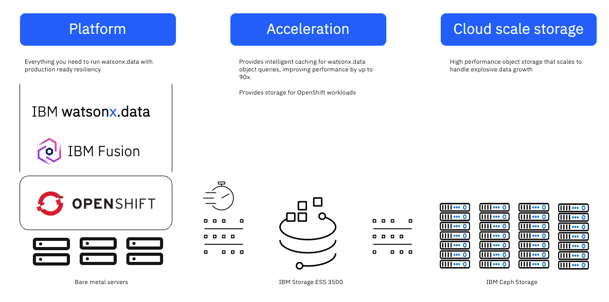
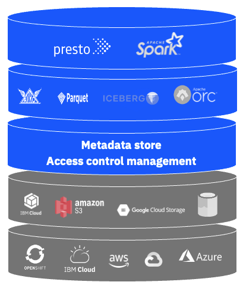
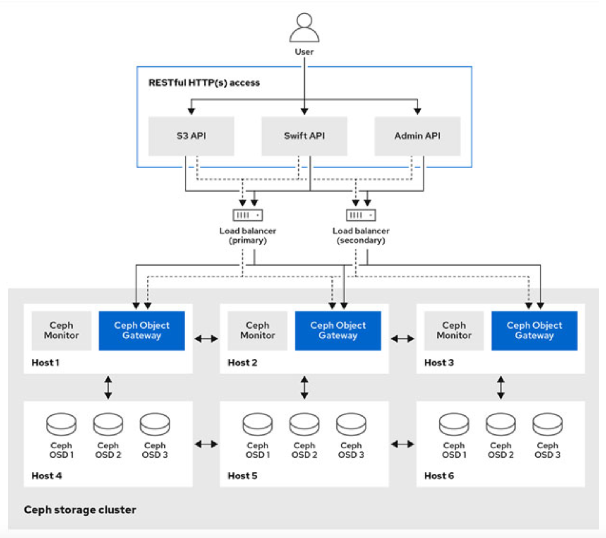
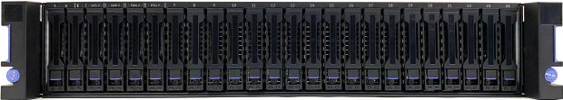
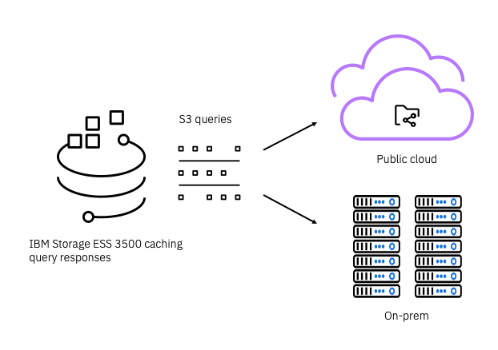
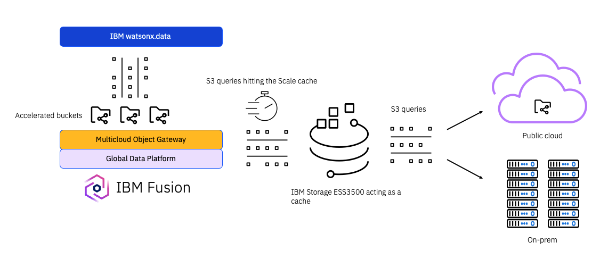

# Solution overview
Organizations that are expanding from AI pilot projects to full-scale production systems typically need a set of tools for building and deploying data lakehouses. These solutions require infrastructure for cloud scale object storage and for a container-based application platform to host query engines such as Presto and Spark.  This document describes the IBM solution for running IBM watsonx.data on-premise, with Red Hat Openshift providing an appliance-based hosting platform, IBM Storage Ceph providing cloud-scale object storage, and IBM Storage Fusion providing storage for the application platform, and IBM ESS 3500 providing significant query acceleration.

This paper is targeted toward technical professionals (consultants, technical support staff, IT Architects, and IT specialists) who are responsible for delivering data lakehouse solutions optimized for data, analytics, and AI workloads.

## From Data Warehouse to Data Lake
Over the past 20 years, large organizations have changed the way they aggregate data for analytics and business intelligence (BI) purposes. The original approach was to build a single monolithic database, or data warehouse, and then analyze specific subsets of the data through an extract/ transform/load (ETL) process based on queries using SQL (structured query language).

Data warehouses are often used for repeatable reporting and analysis workloads such as monthly sales reports, tracking of sales per region, or website traffic. But building and maintaining a data warehouse is a costly, time-consuming process, and they only work with structured data.
Moving data warehouses to the cloud doesn't solve the problem - in some cases it makes them even more expensive, and they're still not well suited to machine learning/AI applications.

These limitations led to the concept of the data lake - a centralized repository that can store massive volumes of data in its original form so that it's consolidated, integrated, secure, and accessible. Data lakes are designed to accommodate all types of data from many different sources:
- structured data, such as database tables and Excel sheets
- semi-structured data, such as herbages and XML files
- unstructured data, such as images, video, audio, and social media posts

Because data lakes are massively scalable and can handle all types of data, they're ideal for real-time analytics, predictive analytics, and machine learning/AI. They are also typically less costly than data warehouses.

## Data Lakehouse Architecture
The data lakehouse is an emerging architecture that offers the flexibility of a data lake with the performance and structure of a data warehouse. Lakehouse solutions typically provide a high-performance query engine over low-cost object storage in conjunction with a meditate governance layer. Data lakehouses are based around open-standard object storage and enable multiple analytics/AI workloads to operate simultaneously on top of the data lake without requiring that the data be duplicated and converted.

A key benefit of data lakehouses is that they address the needs both of traditional data warehouse analysts who curate and publish data for business intelligence and reporting purposes as well as those of data scientists and engineers who run more complex data analysis and processing workloads.

# Solution architecture
This integrated solution consists of IBM watsonx.data deployed on Red Hat OpenShift running on bare metal x86 servers.  IBM Storage Ceph provides the S3 object storage that hosts the data that watsonx.data queries, although this could be complimented with other existing on-prem object storage, or even object storage hosted by a public cloud provider.  watsonx.data is then configured to attach to the S3 endpoints provided by the object storage, allowing queries to be run across multiple collections of structured and unstructured data.

The solution is enhanced by the introduction of IBM Fusion and IBM ESS 3500, which provide query acceleration using intelligent caching of object queries.  IBM Storage ESS 3500 connects to the S3 endpoints and acts as a cache for both meta data and data.  IBM Fusion acts as a bridge between watsonx.data and the ESS 3500 cache, allowing container workloads to access the accelerated buckets.

## IBM watsonx.data
IBM watsonx.data an open, hybrid and governed data lakehouse optimized for all data and AI workloads. It combines the high performance and usability of a data warehouse with the flexibility and scalability of data lakes. watsonx.data is a unique solution that allows co-existence of open source technologies and proprietary products. It offers a single point of entry where you can store the data or attach data sources for managing and analyzing your enterprise data (structured, semi-structured, and unstructured), enabling access to all data across cloud and on-premise environments.

The following key components provide the foundation of watsonx.data's architecture:
- Open table formats (i.e., Apache Iceberg) provide structure and deliver the reliability of SQL with big data. They allow different engines to access the same data at the same time, and enable data sharing across multiple repositories (i.e., data warehouses and data lakes).
- Query engines access data in an open table format. watsonx.data query engines are fully modular and can be dynamically scaled to meet workload demands and concurrency.
- The technical metadata service enables the query engine to know the location, format, and read capabilities of the data.
- Data catalogs assist with finding the correct data and deliver semantic information for policies and rules.
- The policy engine enables users to define and enforce data protection.

watsonx.data is provided as part of IBM Cloud Pak for Data, which is a modular set of integrated software components for data analysis, organization and management. Cloud Pak for Data is installed in OpenShift Container Platform, which provides the container platform for the application to run.

## Red Hat OpenShift Container Platform
Red Hat OpenShift Container Platform (OCP) provides a container run time for watsonx.data.  OCP is the most widely adopted kubernetes platform in the field, and brings with it an ecosystem of tools that enable enterprise production-grade operations.

## Bare metal infrastructure
For this reference architecture, OpenShift Container Platform (OCP) is hosted on bare metal x86 servers.  The use of bare metal has several advantages over hosting OCP on virtual machines:
- No performance, capacity, and power overhead of an additional hypervisor layer.
- No additional licensing for a virtual machine platform.
- Consolidation of operations to a single team focused on OpenShift.

## IBM Storage Ceph
IBM Storage Ceph is a software defined storage platform based upon an open source development model and deploys on industry-standard x86 hardware. It provides non-disruptive, horizontal scaling of object, block, and file storage to thousands of clients accessing large capacities of data (petabytes to exabytes), ideal for modern AI frameworks that require data lake capabilities.

Storage Ceph provides an external S3 object store for watsonx.data. This S3 object store can be the main S3 object store for IBM watsonx.data, or suppliment other on-premise or public cloud object stores. The Storage Ceph object storage interface (Ceph Object Gateway) is compatible with a large subset of the Amazon S3 and S3 adjacent RESTful APIs (ie. IAM, STS).

Multiple watsonx.data instances can share storage from the same Ceph S3 object store.

## IBM Storage ESS 3500
IBM Storage ESS 3500 is an appliance form factor of IBM Storage Scale. It provides an extreme high-performance tier of
file and object storage, including a turbo tier with up to 126GB/s of throughput and up to 1.2M IOPs.

As part of this solution, Storage Scale acts as a storage accelerator for object buckets hosted by Ceph or other S3 providers, both on-prem and in the public cloud.  Storage Scale attaches to the S3 endpoints, and caches both meta-data and data that is queried by watsonx.data.  Because data lakehouse workloads often reuse columns across queries, the caching provided by Storage Scale significantly improves query times.  Query acceleration of up to 90x has been observed with real customer workloads.

Additional information about ESS 3500 [can be found here](https://www.ibm.com/downloads/cas/R0Q1DV1X).

## IBM Storage Fusion
IBM Storage Fusion is an operator that provides data services to applications running in OpenShift.  Data services include acting as a persistent storage provider, providing backup and restore capabilities, and providing application resiliency.

As part of this solution, Fusion acts as a storage provider for the IBM Cloud Pak for Data platform that hosts watsonx.data.  Fusion exposes storage classes that are used to provide RWO and RWX persistent volumes that Cloud Pak for Data needs in order to run.  Fusion obtains storage by remotely mounting the ESS 3500 file system using the Global Data Platform service.  When Container Storage Interface (CSI) requests are made, the Global Data Platform provisions storage from the ESS 3500 file system and provides persistent volumes to the container workload.

Additional information about Storage Fusion's Global Data Platform capabilities [can be found here](https://www.ibm.com/docs/en/storage-fusion-software/2.7.x?topic=accessing-remote-spectrum-scale-storage-cluster-in-storage-fusion).

Fusion also provides watsonx.data with S3 access to the storage acceleration cache on the ESS 3500.  Fusion's Global Data Platform creates a statically provisioned volume that maps to the ESS 3500 fileset that acts as a cache for an accelerated object bucket.  Fusion then uses a technology called the Multi-cloud Gateway to expose the cache via S3 protocols.  watsonx.data attaches to the S3 bucket provided by the Multi-cloud Gateway, enabling query engines to take advantage of the storage acceleration cache.

# Sizing the solution

## Bare metal servers
The reference architecture uses x86 nodes for both control and worker nodes.

Control nodes are sized to balance cost and OpenShift requirements.
- 1x 16 core
- 16x16 GB RAM, totalling 256 GB of memory per node

Worker nodes are sized to optimize performance with a 1 vCPU : 16 GB memory ratio.
- 2x 32 cores, providing 128 vCPUs per node
- 16x128 GB RAM, totalling 2,048 GB of memory per node

Worker nodes are configured with two 7.68 TB NVMe drives each, which are used by watsonx.data for RaptorX caching.

The cluster consists of three control nodes, along with a number of worker nodes based on the desired t-shirt size.
| watsonx.data t-shirt size | Worker nodes needed |
|---------------------------|---------------------|
| Small                     | 3                   |
| Medium                    | 3                   |
| Large                     | 4                   |
| X-Large                   | 10                  |
| XX-Large                  | 28                  |

## IBM Storage Ready Nodes for Ceph

IBM Storage Ready Nodes for Ceph make sizing a data lake for watsonx.data much simpler. The table below includes data lake t-shirt sizing to index off of based on the usable capacity required for tables and other data. These are starting points, IBM Storage Ceph supports incremental (N+1) scaling.

| T-shirt size | Node count | Model      | HDD Feature Code | Erasure | Usable capacity | Subscriptions |
|--------------|------------|------------|------------------|---------|-----------------|---------------|
| Minimum      | 4          |    X2D     |       AJD1       |   2+2   | 192 TB          | 175 TiB       |
| Starter      | 8          |    X2D     |       AJD1       |   4+2   | 512 TB          | 700 TiB       |
| Medium       | 8          |    X2D     |       AJD4       |   4+2   | 1280 TB         | 1750 TiB      |
| Large        | 12         |    X2D     |       AJD4       |   8+3   | 1920 TB         | 2625 TiB      |

## IBM Storage ESS 3500
A single Storage ESS 3500 enclosure with a minimum drive configuration will yield 48.37 TiB of usable capacity.  This configuration uses 24 drives of 3.84 TB NVMe, configured with 8 + 2p erasure coding.  48.37 TiB provides a significant amount of meta-data and data caching for watsonx.data, and is used in this reference architecture.
